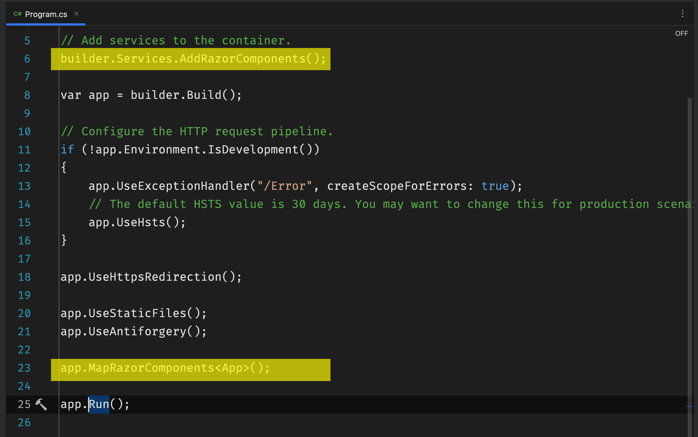
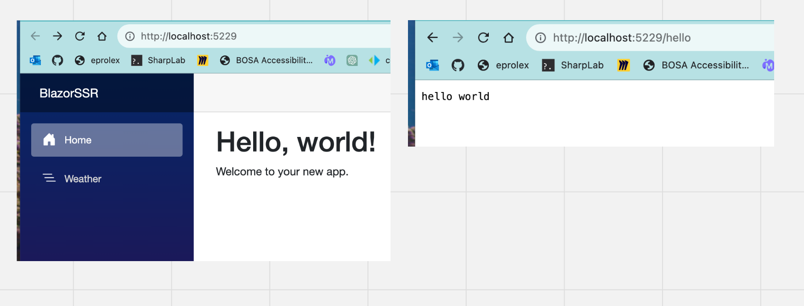
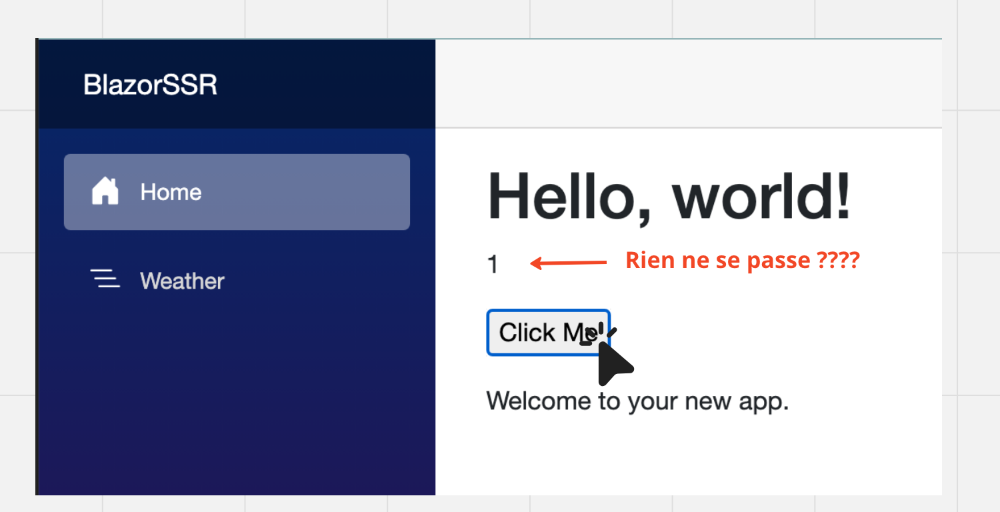

# 02 `SSR` Server Side Rendering

## Créer un projet

En `CLI`

```bash
dotnet new blazor -o BlazorApp -int none
```

`-int` : interactivity Si à `none` on est en `SSR`.



### `builder.Services.AddRazorComponents();`

### `app.MapRazorComponents<App>();`

C'est une application `Web .Net` et on peut très bien y ajouter un `endpoint` par exemple :

```cs
// ...
app.MapGet("/hello", () => "hello world");

app.MapRazorComponents<App>();

app.Run();
```




## `Interctivity`

L'`interactivity` étant mise sur `none`, un simple bouton ne fonctionne pas.

```ruby
<p>@_clickNumber</p>
<p>
    <button @onclick="HandleClick">Click Me</button>
</p>

@code {
    private int _clickNumber = 1;
    
    private void HandleClick() => _clickNumber += 1; 
}
```



Comme attendu rien ne se passe.
