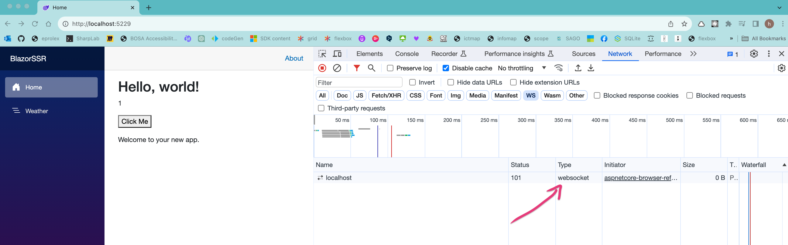
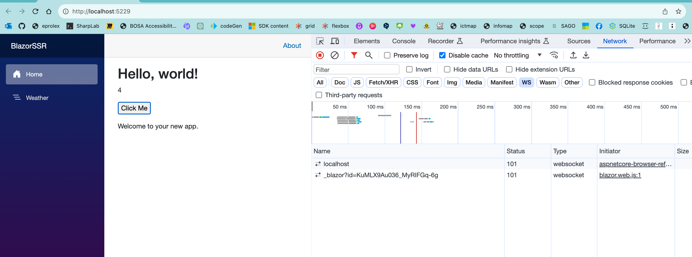

# 03 Serveur `Interactivity`

## `-int server`

On peut dès le départ choisir entre `none`, `server`, `webassembly` et `auto` pour l'`interactivity` d'une application `Blazor`.

Par défaut c'est `server`.

```bash
dotnet new blazor
## équivaut à
dotnet new blazor -int server
```

> ## `-ai` `--all-interactive`
>
>  Indique s'il faut rendre chaque page interactive en appliquant un mode de rendu interactif au niveau supérieur. 
>  Si la réponse est "false", les pages utiliseront par défaut un rendu statique sur le serveur,  et peuvent être marquées comme interactives par page ou par composant.
> Activé si : (`InteractivityPlatform != "None"`)
> Type : `bool`
> Valeur par défaut : `false`


## Sur une application déjà existante

On doit ajouter `AddInteractiveServerComponents` au `components` et `AddInteractiveServerRenderMode` au routage (`Map`) dans `Program.cs` :

avant

```cs
// Add services to the container.
builder.Services.AddRazorComponents();

// ...
app.MapRazorComponents<App>();
```

après

```cs
// Add services to the container.
builder.Services.AddRazorComponents()
    .AddInteractiveServerComponents();

// ...
app.MapRazorComponents<App>()
    .AddInteractiveServerRenderMode();
```

On voit alors qu'un `WebSocket` est créé :




## Spécifier le mode de rendu

Si on prends un composant `ClickIncrement` :

`ClickIncrement.razor`

```ruby
<p>@_clickNumber</p>

<p>
    <button @onclick="HandleClick">Click Me</button>
</p>

@code {
    private int _clickNumber = 1;
    
    private void HandleClick() => _clickNumber += 1; 
}
```

On peut spécifier son mode de rendu de deux manières :

### Dans le composant

```ruby
@rendermode InteractiveServer

<p>@_clickNumber</p>

<p>
    // ...
```


### Dans la balise représentant le composant

C'est ce qui est conseillé par Microsoft.

Avec l'attribut `@rendermode`

```ruby
@page "/"

<PageTitle>Home</PageTitle>

<h1>Hello, world!</h1>

<ClickIncrement @rendermode="InteractiveServer" />
```



On a maintenant le compteur qui fonctionne et on remarque deux `WebSockets` (`channel`) ouverts.


## Rendre une page `interactive`

ici on n'a pas le choix, on utilise l'attribut `@rendermode` directement dans le composant page.

```ruby
@page "/counter"
@rendermode InteractiveServer

<PageTitle>Counter</PageTitle>
```

ou ([voire fiche 4](./04-webassembly-interactivity.md))

```ruby
@page "/counter"
@rendermode InteractiveWebAssembly

<PageTitle>Counter</PageTitle>
```

