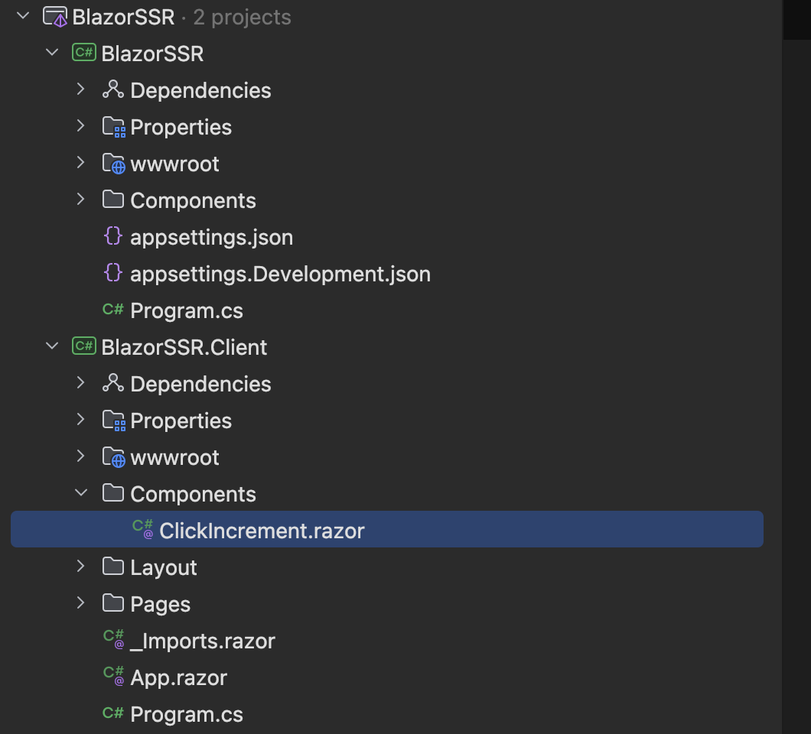
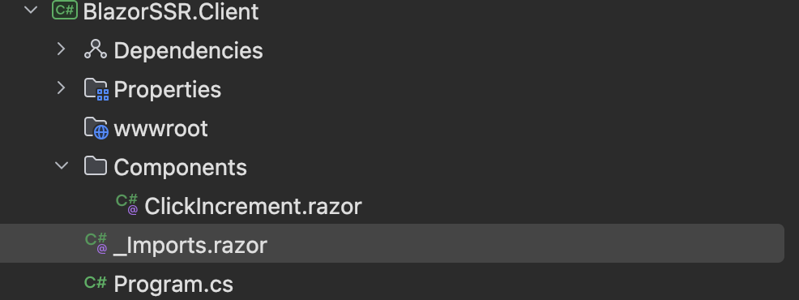
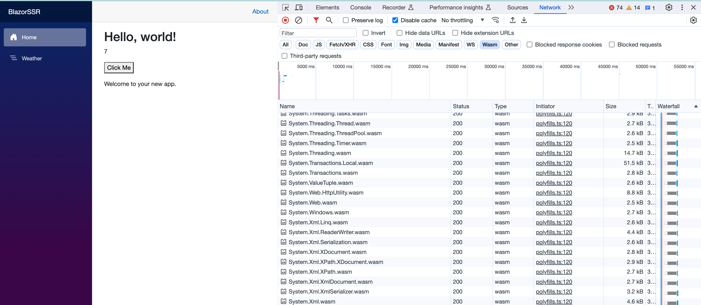

# 04 `Webassembly` Interactivity

## Création

Dans un projet `Blazor Web App`, les `components` utilisants `wasm` doivent être placé dans un projet à part.


## Projet `Client`

Créons d'abord un projet `wasm` :

```bash
dotnet new blazorwasm -o BlazorSSR.Client
```


### Modification dans `BlazorSSR.Client.csproj`

Ondoit ajouter deux lignes :

```ruby
<Project Sdk="Microsoft.NET.Sdk.BlazorWebAssembly">

  <PropertyGroup>
    <TargetFramework>net8.0</TargetFramework>
    <Nullable>enable</Nullable>
    <ImplicitUsings>enable</ImplicitUsings>
    <NoDefaultLaunchSettingsFile>true</NoDefaultLaunchSettingsFile> // <- ici
    <StaticWebAssetProjectMode>Default</StaticWebAssetProjectMode> // <- là
  </PropertyGroup>
```


### simplification dans `Program.cs` :

```cs
using Microsoft.AspNetCore.Components.WebAssembly.Hosting;

var builder = WebAssemblyHostBuilder.CreateDefault(args);

await builder.Build().RunAsync();
```

On va maintenant créer un dossier `Components` et y mettre notre composant `ClickIncrement` :



On doit aussi faire un peu de ménage au niveau des dossiers :




## Dans le projet `Server`

### Référence vers `BlazorSSR.Client`

On ajoute maintenant une référence vers ce projet dans le projet `server` :

```bash
dotnet add BlazorSSR reference BlazorSSR.Client
```


### Ajout d'un `nuget`

Dans le projet parent (`server`) on ajoute le package :

```bash
dotnet add package Microsoft.AspNetCore.Components.WebAssembly.Server
```


### Ajouter un `scan` des composant `wasm` dans `Program.cs`

`BlazorSSR/Program.cs`

```cs
app.MapRazorComponents<App>()
    .AddInteractiveWebAssemblyRenderMode()
    .AddAdditionalAssemblies(typeof(ClickIncrement).Assembly);
```


## Utilisation du `composant`

On peut continuer de l'utiliser en `mode` : `InteractiveServer`

```ruby
<h1>Hello, world!</h1>

<ClickIncrement @rendermode="InteractiveServer" />
```

Ici le `composant` ranger dans le projet `BlazorSSR.Client` (`wasm`) et rendu comme un composant serveur et un `chanel` est ouvert (`Web Socket`).


### Changement pour utiliser le composant en `mode webassembly`

D'abord dans `Program.cs`

```cs
// Add services to the container.
builder.Services.AddRazorComponents()
    .AddInteractiveWebAssemblyComponents() // <- ici
    .AddInteractiveServerComponents();
```

et

```cs
app.MapRazorComponents<App>()
    .AddInteractiveServerRenderMode()
    .AddInteractiveWebAssemblyRenderMode() // <- ici
    .AddAdditionalAssemblies(typeof(ClickIncrement).Assembly);
```

On doit aussi changer le mode de rendu du `composant` :

```ruby
<ClickIncrement @rendermode="InteractiveWebAssembly" />
```



Les librairies `dll` nécessaire sont alors chargées pour que ce composant s'exécute dans le navigateur.

Le même composant peut-être utilisé une fois dans un mode et une fois dans l'autre dans la même page. Un utilise un `Web Socket` et l'autre `Webassembly`.

```cs
<ClickIncrement @rendermode="InteractiveWebAssembly" />
    
<ClickIncrement @rendermode="InteractiveServer" />
```


