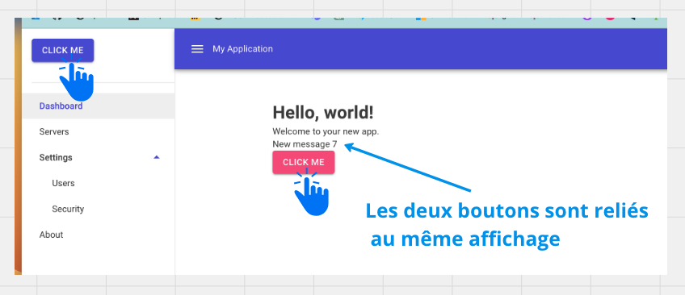

# 06 Les `sections`

## `SectionOutlet`

On avait déjà auparavant `HeadOutlet` qui permet par exemple d'ajouter le titre d'une `page` avec `PageTitle` :

`App.razor`

```ruby
	<HeadOutlet />
</head>
```

`Home.razor`

```ruby
@page "/"

<PageTitle>Home</PageTitle>
```

Maintenant on peut utiliser `SectionOutlet` pour injecter du contenu d'un composant dans un autre.


### Ajouter `Microsoft.AspNetCore.Components.Sections`

`_Imports.razor`

```cs
@using Microsoft.AspNetCore.Components.Sections
```


### Utiliser `SectionOutlet` dans un composant parent

Dans le `Layout` par exemple :

```ruby
<MudLayout>
    <MudAppBar>
        <MudIconButton Icon="@Icons.Material.Filled.Menu" Color="Color.Inherit" Edge="Edge.Start" OnClick="@((e) => DrawerToggle())" />
        My Application
    </MudAppBar>
    <MudDrawer @bind-Open="@_drawerOpen">
        <SectionOutlet SectionName="button-behaviour" /> <- ici
    </MudDrawer>
```


### Utiliser `SectionContent` dans un composant enfant

Dans une `page` par exemple :

```ruby
<SectionContent SectionName="button-behaviour">

    <MudButton 
		Class="ma-4" 
		Variant="Variant.Filled" 
		Color="Color.Primary" 
		OnClick="ChangeMessage">Click Me</MudButton>
    
</SectionContent>
```



Les deux boutons modifie le même compteur, pour réaliser cela par avant il fallait soit un `state system` soit un `event`.