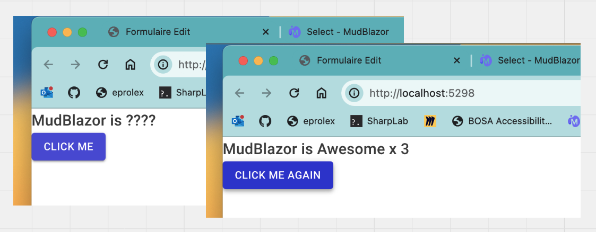

# AA `Mudblazor` et `Blazor Web App`


## Installation `Blazor Server` avec `MudBlazor`

D'abord on créé une application uniquement `server`.

```bash
dotnet new blazor -e -o BlazorMudblazorNet8

cd BlazorMudblazorNet8

dotnet new sln
dotnet sln add **/*.csproj

dotnet add package mudblazor
```


### `_Imports.razor`

```ruby
@using MudBlazor
```


### `MainLayout.razor`

```ruby
@inherits LayoutComponentBase

<MudThemeProvider/>
<MudDialogProvider/>
<MudSnackbarProvider/>

@Body
```


### `App.razor`

```ruby
<head>
    // ...
    
    <link href="https://fonts.googleapis.com/css?family=Roboto:300,400,500,700&display=swap" rel="stylesheet" /> <- ici
    <link href="_content/MudBlazor/MudBlazor.min.css" rel="stylesheet" /> <- ici

    <HeadOutlet />
</head>

<body>
    <Routes />
    <script src="_framework/blazor.web.js"></script>
    
    <script src="_content/MudBlazor/MudBlazor.min.js"></script> <- ici
</body>
```


### `Program.cs`

```cs
using MudBlazor.Services;

builder.Services.AddMudServices();
```


### Utilisation dans une page `Home.razor`

```ruby
@page "/"

@rendermode InteractiveServer

<PageTitle>Home</PageTitle>

<MudText Typo="Typo.h6">MudBlazor is @Text</MudText>
<MudButton Variant="Variant.Filled" Color="Color.Primary" OnClick="ButtonOnClick">@ButtonText</MudButton>

@code {
  public string Text { get; set; } = "????";
  public string ButtonText { get; set; } = "Click Me";
  public int ButtonClicked { get; set; }

  void ButtonOnClick()
  {
      ButtonClicked += 1;
      Text = $"Awesome x {ButtonClicked}";
      ButtonText = "Click Me Again";
  }
}
```

Fonctionne avec un `rendermode` `interactive` (`server` ou `webassembly`).




## Erreur avec `@rendermode InteractiveServer`

Si on souhaite ajouter le `template` de base de `MudBlazor`, il faudrai ajouter `@rendermode InteractiveServer` pour avoir le `drawer` qui fonctionne :


Hélas on obtient une erreur :

```bash
System.InvalidOperationException: Cannot pass the parameter 'Body' to component 'MainLayout' with rendermode 'InteractiveServerRenderMode'. This is because the parameter is of the delegate type 'Microsoft.AspNetCore.Components.RenderFragment', which is arbitrary code and cannot be serialized.
```

Dans ce post https://github.com/dotnet/aspnetcore/issues/50518 et dans celui-ci https://github.com/dotnet/aspnetcore/discussions/51491 on comprend que c'est le fonctionnement attendu par design.

La solution est de rendre l'application globalement `server`, on perd le choix du rendu par `page` et par `composant` mais on peut utiliser `MudBlazor`.

`App.razor`

```ruby
<!DOCTYPE html>
<html lang="en">

<head>
    <meta charset="utf-8" />
    <meta name="viewport" content="width=device-width, initial-scale=1.0" />
    <base href="/" />
    <link rel="stylesheet" href="app.css" />
    <link rel="stylesheet" href="BlazorServerTestMudBlazor.styles.css" />
    <link href="https://fonts.googleapis.com/css?family=Roboto:300,400,500,700&display=swap" rel="stylesheet" />
    <link href="_content/MudBlazor/MudBlazor.min.css" rel="stylesheet" />
    <HeadOutlet @rendermode="@InteractiveServer" /> <- ici
</head>

<body>
    <Routes @rendermode="@InteractiveServer" /> <- et là
    <script src="_framework/blazor.web.js"></script>
    <script src="_content/MudBlazor/MudBlazor.min.js"></script>
</body>

</html>
```


> À suivre dans les prochaines versions de `MudBlazor` ...