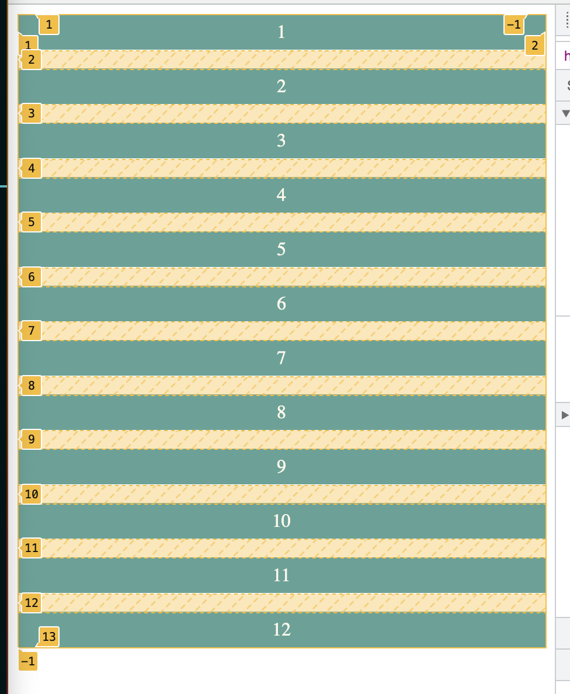
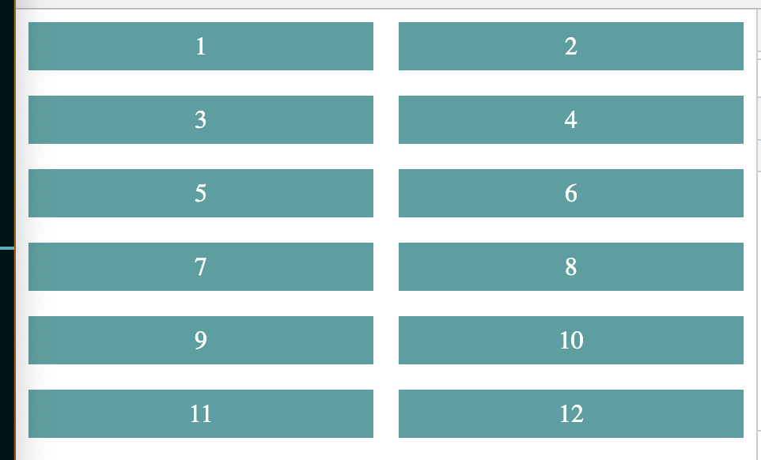
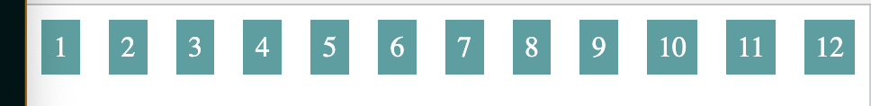
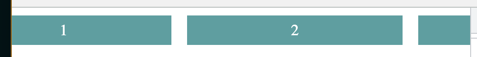
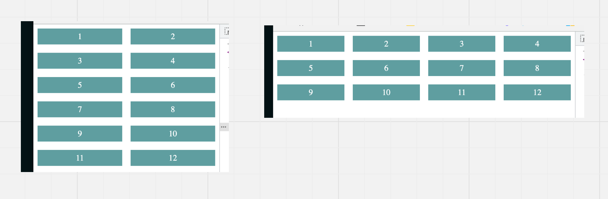
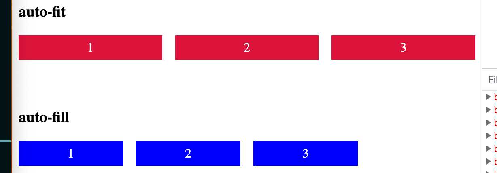
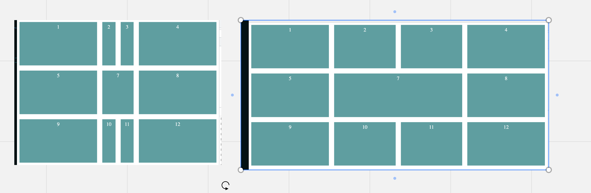

# 01 Grid

## `gap`

Crée une marge entre les éléments.

```css
.basic-grid {
    display: grid;
    gap: 1rem;
}
```




## `fr` : Fractionnel Unit

Défini des fractions de l'espace disponible. : `2fr`


## `grid-template-column`

Va définir le nombre de colonnes.

```css
.basic-grid {
    display: grid;
    gap: 1rem;
    grid-template-columns: 1fr 1fr;
}
```

Les `grid-items` n'ont pas de `css` définit pour l'instant.




### `repeat()`

Si on veut douze colonnes on a le code suivant:

```css
grid-template-columns: 1fr 1fr 1fr 1fr 1fr 1fr 1fr 1fr 1fr 1fr 1fr 1fr;
```



On peut simplier l'écrite avec `repeat(nbOccurences, size)`

```css
grid-template-columns: repeat(12, 1fr);
```


### `minmax()`

On veut maintenant gérer le côté `responsive` pour les colonnes ne descendent en dessous d'une certaine taille:

```css
 grid-template-columns: repeat(12, minmax(220px,1fr));
```



On a maintenant un problème d'`overflow`.


### `auto-fit`

Pour résoudre le problème suivant on utilise `auto-fit` qui va calculer le nombre de lignes pour que la grille tienne dans l'affichage:

```css
grid-template-columns: repeat(auto-fit, minmax(120px,1fr));
```




### `auto-fill`

Se comporte comme `auto-fit` sauf s'il y a plus de place disponible. `auto-fill` utilise seulement la place nécessaire alors que `auto-fit` prend toute la place:

```css
grid-template-columns: repeat(auto-fill, minmax(120px, 1fr));
```




## `grid-template-areas`

On peut nommer les parties de la grille avec `grid-template-areas`:

```css
grid-template-areas:
        'a b c d'
        'e 🤖 🤖 f'
        'g h i j';
```

Puis les enfants on utilise `grid-area` :

```css
// ...

.card:nth-child(4) {
    grid-area: d;
}
.card:nth-child(5) {
    grid-area: e;
}
.card:nth-child(6) {
    grid-area: 🤖;
}
.card:nth-child(7) {
    grid-area: 🤖;
}
```

En ajoutant quelque réglages on obtient un layout `responsive`:

```css
.basic-grid {
    // ...
	grid-template-rows: repeat(3,33%);
    grid-template-columns: 240px auto auto 240px;
```



`auto` permet de redimensionner en fonction du `viewport`.


