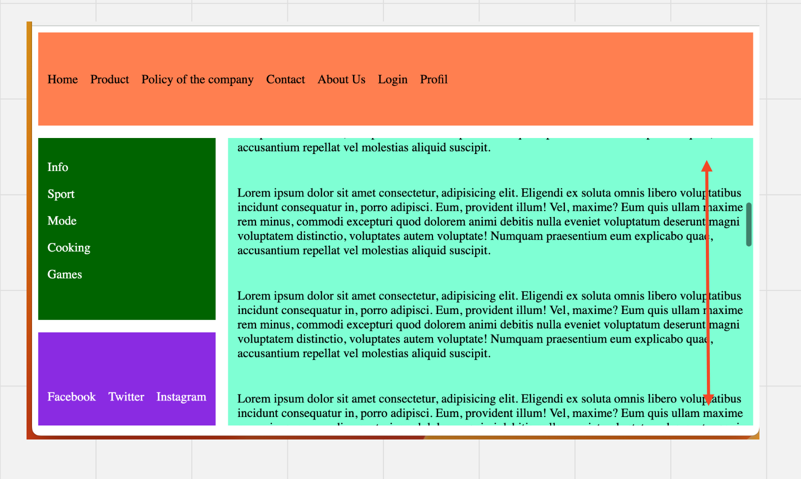

# 02 Exemple d'un Template avec `flexbox` et `grid`



L'ensemble reste fixe, le contenu au centre est `responsive` et on peut scroller à l'intérieur.

## `HTML`

```html
<style>
	@import url('./grid.css');
</style>

<section class="basic-grid">
    <header>
        <ul>
            <li>Home</li>
            <li>Product</li>
            <li>Policy of the company</li>
            <li>Contact</li>
            <li>About Us</li>
            <li>Login</li>
            <li>Profil</li>
        </ul>
    </header>
    <aside>
        <ul>
            <li>Info</li>
            <li>Sport</li>
            <li>Mode</li>
            <li>Cooking</li>
            <li>Games</li>
        </ul>
    </aside>
    <Article>
        <p>
            // ...
        </p>
        <p>
            // ...
    </Article>
    <footer>
        <ul>
            <li>Facebook</li>
            <li>Twitter</li>
            <li>Instagram</li>
        </ul>
    </footer>
</section>
```


## `CSS`

```css
.basic-grid {
    height: 96vh;
    display: grid;
    gap: 1rem;
    grid-template-rows: minmax(120px, 1fr) 6fr minmax(120px, 1fr);
    grid-template-areas: 
    "header header"
    "aside main"
    "footer main";  
}

p {
    padding: 12px;
}

ul {
    list-style: none;
    display: flex;
    gap: 1em;
    padding: 0;
}

aside > ul {
    flex-direction: column;
}

header {
    background: coral;
    grid-area: header;
    display: flex;
    padding: 12px;
    align-items: center;
}


aside {
    background: darkgreen;
    color: white;
    grid-area: aside;
    padding: 12px;
}

article {
    background: aquamarine;
    grid-area: main;
    overflow: scroll;
}

footer {
    background: blueviolet;
    color: white;
    grid-area: footer;
    padding: 12px;
    display: flex;
    align-items: end;
}
```


## Centrer des éléments verticalement

Pour centrer des éléments verticalement, le plus simple est d'utiliser les `flexbox`:

```css
display: flex;
align-items: end;
```


## Garder le contenu dans la grille (`grid`) avec un `scroll`

Pour garder la `grid` fixe avec le contenu principal scrollant à l'intérieur on utilise `overflow: scroll`.