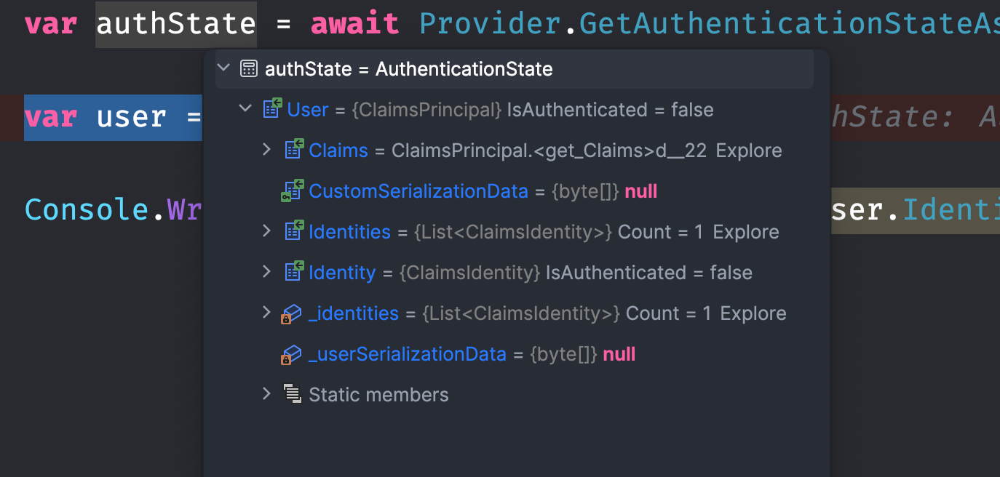

# 01 Vue d'ensemble

Résumé de la documentation officielle.

## `Anti Forgery`

Un jeton `AntiforgeryToken` est automatiquement ajouté aux `EditForm` en temps que champ masqué.


## `Authentication`

Elle peut être réalisée avec un `Cookie` ou un `Bearer Token` (jeton porteur).

Elle est gérée dans le `hub SignalR`.


## `HttpContext`

Il obtient ses données de `HttpContext.User`.

Ne s'utilise généralement pas directement.

`HttpContext` n'est accessible que sur le composant racine et statique `App.razor`.

Il vaut `null` dans les composants intéractifs, en fait cela semble plus complexe que ça dans mes tests :

#### `Chargement et navigation d'une application`

```
App component
HttpContext n'est pas nul

Router
HttpContext n'est pas nul

Page Counter
HttpContext n'est pas nul

Router
HttpContext est nul

Page Counter
HttpContext est nul

Page Home
HttpContext est nul
```

On voit que dans un premier temps `HttpContext` a une valeur dans le composant `Router` et le composant (page) `Counter`, puis il passe à `null`.


## État partagé

### Les `circuits`

Un processus `Blazor Server` peut contenir de nombreuses `sessions`, elles sont séparées les unes des autres (`scoped`) et se nomme `circuits`.

> Les services singletons d'état ne sont pas conseillé avec `Blazor Server`.


## `<AuthorizeRouteView>`

Pour que l'authentification fonctionne correctement dans une application Blazor Serveur, il faut modifier le composant `Routes.razor` :

Ceci

```cs
<RouteView RouteData="routeData" DefaultLayout="typeof(Layout.MainLayout)"/>
```

en cela

```cs
<AuthorizeRouteView RouteData="routeData" DefaultLayout="typeof(Layout.MainLayout)"/>
```


## Service `AuthenticationStateProvider`

C'est le service utilisé par le composant `AuthorizeView`.

On peut récupérer notre `User` grâce à ce service :

```cs
@page "/"
@using Microsoft.AspNetCore.Components.Authorization

@inject AuthenticationStateProvider Provider

<PageTitle>Home</PageTitle>


<button class="btn btn-primary" @onclick="GetAuthState">Get Auth State</button>

@code {

    [CascadingParameter] public HttpContext? HttpContext { get; set; }


    async Task GetAuthState()
    {
        var authState = await Provider.GetAuthenticationStateAsync();

        var user = authState.User;
        var isAuthenticated = user.Identity.IsAuthenticated;

        Console.WriteLine($"user is authenticated: {isAuthenticated}");
    }

}
```

`authState` contient uniquement le `User`:



Le problème d'utilisation avec `AuthenticationStateProvider`, c'est que le composant n'est pas prévenu en cas de changement des données d'authentification sous-jacent.

Il est préférable d'utiliser `AuthorizeView` et `Task<AuthenticationState>`.


## `Task<AuthenticationState>`

Au lieu d'utiliser `AuthenticationStateProvider`, on le remplase par `Task<AuthenticationState>` :

```cs
@using Microsoft.AspNetCore.Components.Authorization
```

```cs
<button class="btn btn-primary" @onclick="GetAuthState">Get Auth State</button>

@code {

    [CascadingParameter] Task<AuthenticationState>? AuthState { get; set; }

    async Task GetAuthState()
    {
        var authState = await AuthState;

        var user = authState.User;

        var isAuthenticated = user.Identity.IsAuthenticated;

        Console.WriteLine($"user is authenticated: {isAuthenticated}");
    }

}
```

```
user is authenticated: False
```


## `Autorisation`

Accord ou refus des accès suivant :

- Qu'un utilisateur soit authentifié
- Qu'un utilisateur possède un rôle particulier
- Qu'un utilisateur possède un `claim` particulier
- Qu'une stratégie soit satisfaite

Les concepts d'`authorization` sont les mêmes que dans `asp.net mvc`.


## Le composant `<AuthorizeView>`

Ce composant expose une variable `context` de type `AuthenticationState`.

```cs
<AuthorizeView>  
        Utilisateur autorisé seulement: @context.User.Identity.IsAuthenticated
</AuthorizeView>
```

Ou our gérer aussi les utilisateurs non autorisés:

```cs
<AuthorizeView>
    <Authorized>
        Utilisateur autorisé: @context.User.Identity.IsAuthenticated
    </Authorized>
    <NotAuthorized>
        Utilisateur non autorisé: @context.User.Identity.IsAuthenticated
    </NotAuthorized>
</AuthorizeView>
```

### startégie par défaut de `<AuthorizeView>`

Les utilisateurs authentifiés sont autorisés.

Les utilisatuers non authentifiés ne sont pas autorisés.


Il peut être intéressant d'utilisé `<AuthorizeView>` avec les `NavLink`, il faudra aussi sécuriser les `pages` en questions.

```cs
    <div class="nav-item px-3">
        <AuthorizeView>

        <NavLink class="nav-link" href="secret">
            Secret
        </NavLink>

        </AuthorizeView>
    </div>
</nav>
```

Le lien n'apparaitra que pour les personne authentifiées.


### `AuthorizeView` basé sur les rôles

```cs
<AuthorizeView Roles="Admin, Superuser">
    // ...
</AuthorizeView>
```

On peut imbriquer les `AuthorizeView`, dans ce cas `context` devient `innerContext` dans un `AuthorizeView` imbriqué.

```cs
<AuthorizeView Roles="Admin">
    // ...
    @context.User
    <AuthorizeView Roles="Superuser">
    // ...
    @innerContext.User
	</AuthorizeView>
</AuthorizeView>
```


### `AuthorizeView` basé sur les stratégie : `Policy`

```cs
<AuthorizeView Policy="Over18">
    // ...
</AuthorizeView>
```

Pour gérer le cas où l'utilisateur doit satisfaire plusieurs `Policies` :

1.  Créer une `Policy` ayant comme critère d'en satisfaire plusieurs autres.

2. ```cs
   <AuthorizeView Policy="Over18">
       <AuthorizeView Policy="LivesInBxl">
      	    // ...
   	</AuthorizeView>  
   </AuthorizeView>
   ```

Pour les autorisations basées sur les `claims`, c'est un cas particulier des autorisation basées sur les `Policies`, c'est la `Policy` qui définira la statégie basée sur les `claims`.

> #### ! `Roles` et `Policies` sont pour leurs noms sensible à la casse.


## Authentification asynchrone

