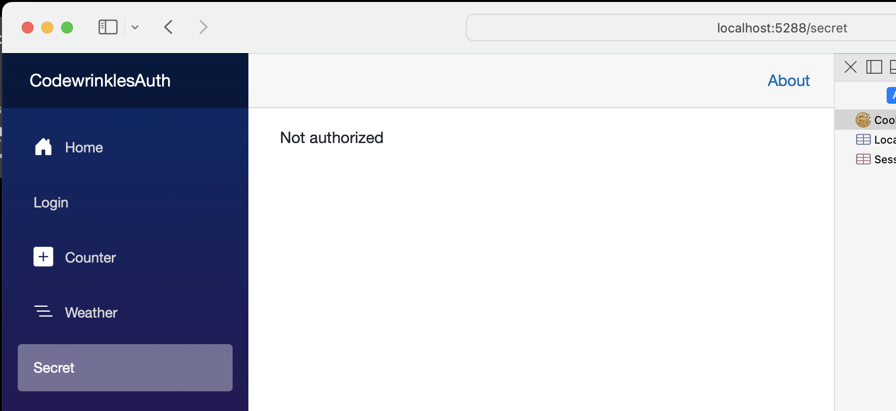
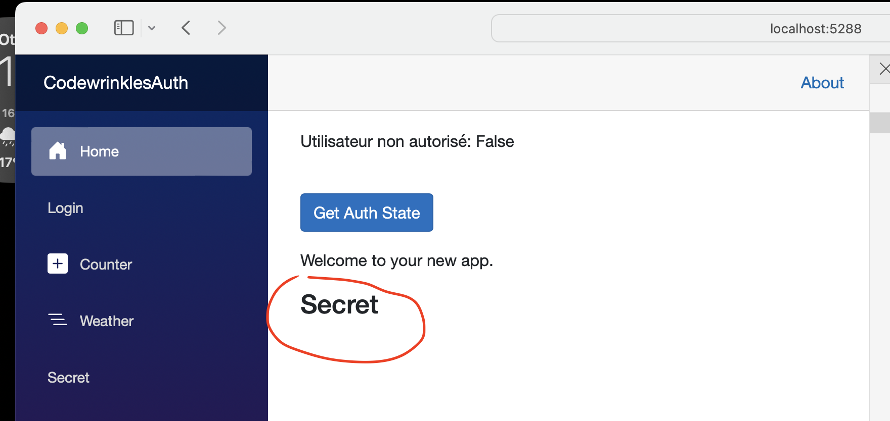
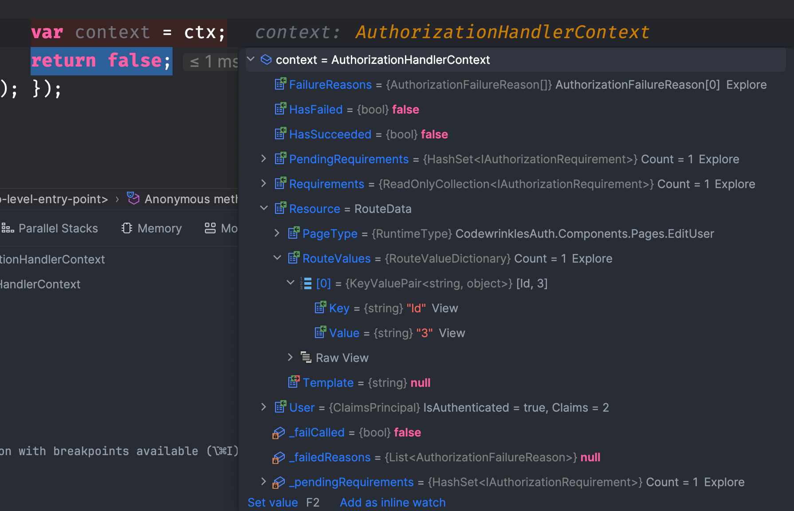
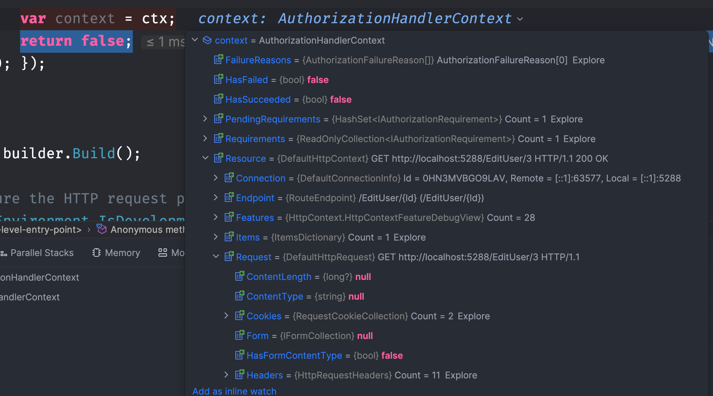
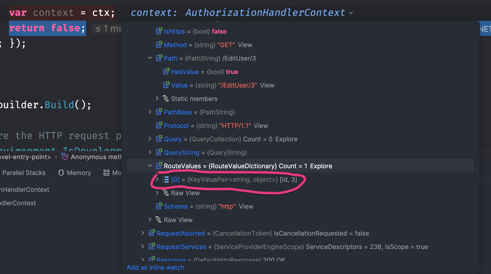
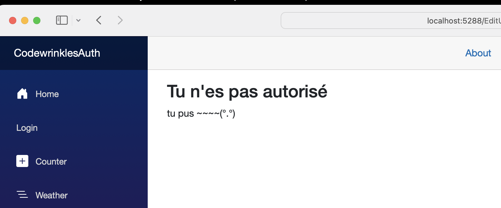

# 01 Vue d'ensemble

Résumé de la documentation officielle.

## `Anti Forgery`

Un jeton `AntiforgeryToken` est automatiquement ajouté aux `EditForm` en temps que champ masqué.


## `Authentication`

Elle peut être réalisée avec un `Cookie` ou un `Bearer Token` (jeton porteur).

Elle est gérée dans le `hub SignalR`.


## `HttpContext`

Il obtient ses données de `HttpContext.User`.

Ne s'utilise généralement pas directement.

`HttpContext` n'est accessible que sur le composant racine et statique `App.razor`.

Il vaut `null` dans les composants intéractifs, en fait cela semble plus complexe que ça dans mes tests :

#### `Chargement et navigation d'une application`

```
App component
HttpContext n'est pas nul

Router
HttpContext n'est pas nul

Page Counter
HttpContext n'est pas nul

Router
HttpContext est nul

Page Counter
HttpContext est nul

Page Home
HttpContext est nul
```

On voit que dans un premier temps `HttpContext` a une valeur dans le composant `Router` et le composant (page) `Counter`, puis il passe à `null`.


## État partagé

### Les `circuits`

Un processus `Blazor Server` peut contenir de nombreuses `sessions`, elles sont séparées les unes des autres (`scoped`) et se nomme `circuits`.

> Les services singletons d'état ne sont pas conseillé avec `Blazor Server`.


## `<AuthorizeRouteView>`

Pour que l'authentification fonctionne correctement dans une application Blazor Serveur, il faut modifier le composant `Routes.razor` :

Ceci

```cs
<RouteView RouteData="routeData" DefaultLayout="typeof(Layout.MainLayout)"/>
```

en cela

```cs
<AuthorizeRouteView RouteData="routeData" DefaultLayout="typeof(Layout.MainLayout)"/>
```


## Service `AuthenticationStateProvider`

C'est le service utilisé par le composant `AuthorizeView`.

On peut récupérer notre `User` grâce à ce service :

```cs
@page "/"
@using Microsoft.AspNetCore.Components.Authorization

@inject AuthenticationStateProvider Provider

<PageTitle>Home</PageTitle>


<button class="btn btn-primary" @onclick="GetAuthState">Get Auth State</button>

@code {

    async Task GetAuthState()
    {
        var authState = await Provider.GetAuthenticationStateAsync();

        var user = authState.User;
        var isAuthenticated = user.Identity.IsAuthenticated;

        Console.WriteLine($"user is authenticated: {isAuthenticated}");
    }
}
```

`authState` contient uniquement le `User`:


Le problème d'utilisation avec `AuthenticationStateProvider`, c'est que le composant n'est pas prévenu en cas de changement des données d'authentification sous-jacent.

Il est préférable d'utiliser `AuthorizeView` et `Task<AuthenticationState>`.


## Logique procédural : `Task<AuthenticationState>`

Au lieu d'utiliser `AuthenticationStateProvider`, on le remplase par `Task<AuthenticationState>` :

```cs
@using Microsoft.AspNetCore.Components.Authorization
```

```cs
<button class="btn btn-primary" @onclick="GetAuthState">Get Auth State</button>

@code {
    
    [CascadingParameter] private Task<AuthenticationState>? authenticationState { get; set; }

    async Task GetAuthState()
    {
       if (authenticationState is not null)
        {
            var authState = await authenticationState;
            var user = authState?.User;

            if (user?.Identity is not null && user.Identity.IsAuthenticated)
            {
                authMessage = $"{user.Identity.Name} is authenticated.";
            }
        }
    }
}
```

```
user is authenticated: False
```


## Récupérer proprement un `claim` : `FindFirstValue`

### 🥇 **Best practice :**

```csharp
var surname = user.FindFirstValue(ClaimTypes.Surname);
```

### 🥈 Alternative acceptable :

```csharp
var surname = user.FindFirst(ClaimTypes.Surname)?.Value;
```

### 🥉 Correct mais moins élégant :

```csharp
var surname = user.Claims.FirstOrDefault(c => c.Type == ClaimTypes.Surname)?.Value;
```


## Utilisation avec `IAuthorizationService`

On utilise `Task<AuthenticationState>` pour récupérer le `ClaimPrincipal` et on peut le combiner avec `IAuthorizationService` pour évaluer les `Policy`.

Par exemple :

- `user.Identity.IsAuthenticated` exécute du code pour les utilisateurs authentifiés.
- `user.IsInRole("admin")` exécute du code pour les `admin`
- `(await AuthorizationService.AuthorizeAsync(user, "content-editor")).Succeeded` test la `Policy` `"content-editor"` sur le `user`. 

### Définir le `User`

Dans un endpoint on va générer le user (avec un `Cookie`) :

```cs
app.MapGet("/signin/{name}/{role}", async (string name, string role, HttpContext context) =>
{
   List<Claim> claims = [new Claim("name", name), new Claim("appRole", role)];

    var identity = new ClaimsIdentity(
        claims,
        authenticationType: "MyCookie",
        nameType: null,
        roleType: "appRole"
    );

    var user = new ClaimsPrincipal(identity);

    await context.SignInAsync("MyCookie", user);

    return Results.LocalRedirect("/");
});
```

On défini un rôle simplement en spécifiant le paramètre `roleType`.


### Définir l'`authentication` et l'`authorization`

```cs
builder.Services.AddAuthentication("MyCookie")
    .AddCookie("MyCookie");
```

```cs
builder.Services.AddAuthorizationBuilder()
    .AddPolicy("EditUser", cpb =>
        {
            cpb.RequireAssertion(ctx =>
            {
                var random = new Random();
                var id = random.Next(1, 4);

                Console.WriteLine($"Id = {id}");
                return id == 3;
            });
        });
```

`AddAuthorizationBuilder` permet une écriture un peu plus concise que `AddAuthorization`.


### Utilisation dans un `Component`

```cs
@page "/ProceduralAuthentication"
@using System.Security.Claims
@using Microsoft.AspNetCore.Authorization

@inject IAuthorizationService AuthService

<h3>Procedural Authentication</h3>
<p>@message</p>

<p>
    <button @onclick="IsAuthenticated">Is Authenticated</button>
    <button @onclick="IsAdmin">Is Admin</button>
    <button @onclick="VerifyEditUser">Verify EditUser Policy</button>
</p>
```

```cs
@code {
    [CascadingParameter] 
    public Task<AuthenticationState>? AuthState { get; set; }

    private ClaimsPrincipal? user;
    private string message = "";

    protected override async Task OnInitializedAsync()
    {
        user = (await AuthState!).User;
    }

    private void IsAuthenticated()
    {
        message = $"User is authenticated : {user?.Identity?.IsAuthenticated}";
    }

    private void IsAdmin()
    {
        message = $"User is admin : {user.IsInRole("admin")}";
    }

    private async Task VerifyEditUser()
    {
        var result = await AuthService.AuthorizeAsync(user, "EditUser");
        message = $"user verify [UseEdit] policy : {result.Succeeded}";
    }
}
```


## `Autorisation`

Accord ou refus des accès suivant :

- Qu'un utilisateur soit authentifié
- Qu'un utilisateur possède un rôle particulier
- Qu'un utilisateur possède un `claim` particulier
- Qu'une stratégie soit satisfaite

Les concepts d'`authorization` sont les mêmes que dans `asp.net mvc`.


## Le composant `<AuthorizeView>`

Ce composant expose une variable `context` de type `AuthenticationState`.

```cs
<AuthorizeView>  
        Utilisateur autorisé seulement: @context.User.Identity.IsAuthenticated
</AuthorizeView>
```

Ou our gérer aussi les utilisateurs non autorisés:

```cs
<AuthorizeView>
    <Authorized>
        Utilisateur autorisé: @context.User.Identity.IsAuthenticated
    </Authorized>
    <NotAuthorized>
        Utilisateur non autorisé: @context.User.Identity.IsAuthenticated
    </NotAuthorized>
</AuthorizeView>
```

### startégie par défaut de `<AuthorizeView>`

Les utilisateurs authentifiés sont autorisés.

Les utilisatuers non authentifiés ne sont pas autorisés.


Il peut être intéressant d'utilisé `<AuthorizeView>` avec les `NavLink`, il faudra aussi sécuriser les `pages` en questions.

```cs
    <div class="nav-item px-3">
        <AuthorizeView>

        <NavLink class="nav-link" href="secret">
            Secret
        </NavLink>

        </AuthorizeView>
    </div>
</nav>
```

Le lien n'apparaitra que pour les personne authentifiées.


### `AuthorizeView` basé sur les rôles

```cs
<AuthorizeView Roles="Admin, Superuser">
    // ...
</AuthorizeView>
```

On peut imbriquer les `AuthorizeView`, dans ce cas `context` devient `innerContext` dans un `AuthorizeView` imbriqué.

```cs
<AuthorizeView Roles="Admin">
    // ...
    @context.User
    <AuthorizeView Roles="Superuser">
    // ...
    @innerContext.User
	</AuthorizeView>
</AuthorizeView>
```


### `AuthorizeView` basé sur les stratégie : `Policy`

```cs
<AuthorizeView Policy="Over18">
    // ...
</AuthorizeView>
```

Pour gérer le cas où l'utilisateur doit satisfaire plusieurs `Policies` :

1.  Créer une `Policy` ayant comme critère d'en satisfaire plusieurs autres.

2. ```cs
   <AuthorizeView Policy="Over18">
       <AuthorizeView Policy="LivesInBxl">
      	    // ...
   	</AuthorizeView>  
   </AuthorizeView>
   ```

Pour les autorisations basées sur les `claims`, c'est un cas particulier des autorisation basées sur les `Policies`, c'est la `Policy` qui définira la statégie basée sur les `claims`.

> #### ! `Roles` et `Policies` sont pour leurs noms sensible à la casse.


### Exemple d'imbrication d'`AuthorizeView`

```csharp
<AuthorizeView>

    <Authorized>
        <p>Utilisateur autorisé: @context.User.Identity.IsAuthenticated</p>
        <p>Name: @context.User.FindFirst("name").Value</p>
        
        <AuthorizeView Policy="EyesColorSegregation">
            <NotAuthorized>
                <p>Je te merde j'ai pas les yeux olive</p>
            </NotAuthorized>
        </AuthorizeView>
    </Authorized>
    
    <NotAuthorized>
        <p>Utilisateur non autorisé: @context.User.Identity.IsAuthenticated</p>
    </NotAuthorized>
    
</AuthorizeView>
```


## Attribut `[Authorize]`

```cs
@page "/Secret"
@using Microsoft.AspNetCore.Authorization

@attribute [Authorize]

<h3>Secret</h3>
```

Si on essaye d'aller directement sur cette page au démarage de l'application on est redirigé :

```url
localhost:5288/Account/Login?ReturnUrl=%2Fsecret
```

vers `Account/Login` par défaut, on obtient l'`url` de retour en `query parameter` : `/secret`.

Si cette `url` est accéder sans que personne ne soit aurthentifié depuis l'application `Blazor` en train de tourner, on obtient un message `Not authorized` :

 

> L'attribut `[Authorize]` ne peut être utilisé que sur des composants `page`.
> Si j'utilise ma `page` protégé comme composant dans la `home page` :
>
> ```cs
> @page "/"
> 
> 
> <PageTitle>Home</PageTitle>
> 
> // ...
> 
> <p>Welcome to your new app.</p>
> 
> <Secret />
> 
> @code {
> 	// ...
> ```
>
> Celle-ci n'est plus protégé et apparaît :
> 
>
> Dans un composant il faut utiliser `<AuthorizeView>`.

On peut aussi spécifier des `Roles` ou une `Policy` :

```cs
@attribute [Authorize(Roles = "user-secret")]

<h3>Secret</h3>
```

ou

```cs
@attribute [Authorize(Policy = "EyesColorSegregation")]

<h3>Secret</h3>
```


## Protéger une `route` : `Resource` Authorization

> ### ! Je n'arrive pas à faire fonctionner la démo

On peut envoyer les données de routage au `context` d'autorisation grâce à l'attribut `Resource` de `AuthorizeRouteView` :

```cs  
<Router AppAssembly="typeof(Program).Assembly">
    <Found Context="routeData">
        <AuthorizeRouteView Resource="routeData" RouteData="routeData" DefaultLayout="typeof(Layout.MainLayout)"/>
        <FocusOnNavigate RouteData="routeData" Selector="h1"/>
    </Found>
</Router>
```

### `Resource="routeData"`

On passe les données de la `route` à `Resource`.

Maintenant si j'observe le `context` d'une `policy` :

```cs
builder.Services.AddAuthorization(cfg =>
    {
        cfg.AddPolicy("EditUser", cpb => { cpb.RequireAssertion(ctx =>
        {
            var context = ctx;
            return false;
        }); });
    }
);
```



On retrouve notre attribut `Resource` et dedans l'`Id` passé à la route.

Si je ne passe pas les `RouteData` à `Resource` celui-ci contient un plus grand nombre d'information dans lesquelles on retrouve quand même cet `id`.





### `Policy` restreignant l'accès à l'`Id = 3`

```cs 
builder.Services.AddAuthorizationCore(cfg =>
    {
        cfg.AddPolicy("EditUser", cpb =>
        {
            cpb.RequireAssertion(ctx =>
            {
                if (ctx.Resource is RouteData rd)
                {
                    rd.Values.TryGetValue("id", out var value);
                    var id = Convert.ToInt32(value);
                    return id == 3;
                }

                return false;
            });
        });
    }
);
```
On peut aussi écrire comme ceci (cela évite une imbrication) :
```cs
builder.Services.AddAuthorizationBuilder()
    .AddPolicy("EditUser", cpb =>
        {
            cpb.RequireAssertion(ctx =>
            {
               // ...
            });
        });
```

> ### ! ça ne fonctionne pas !


## Personnalisé l'affichage de `Not Authorized`

```cs
<Router AppAssembly="typeof(Program).Assembly">
    <Found Context="routeData">
        <AuthorizeRouteView Resource="routeData" RouteData="routeData" DefaultLayout="typeof(Layout.MainLayout)">
            <NotAuthorized>
                <h2>Tu n'es pas autorisé</h2>
                <p> tu pus ~~~~(°.°)</p>
            </NotAuthorized>
        </AuthorizeRouteView>
        <FocusOnNavigate RouteData="routeData" Selector="h1"/>
    </Found>
</Router>
```

On utilise `<NotAuthorized>`.




