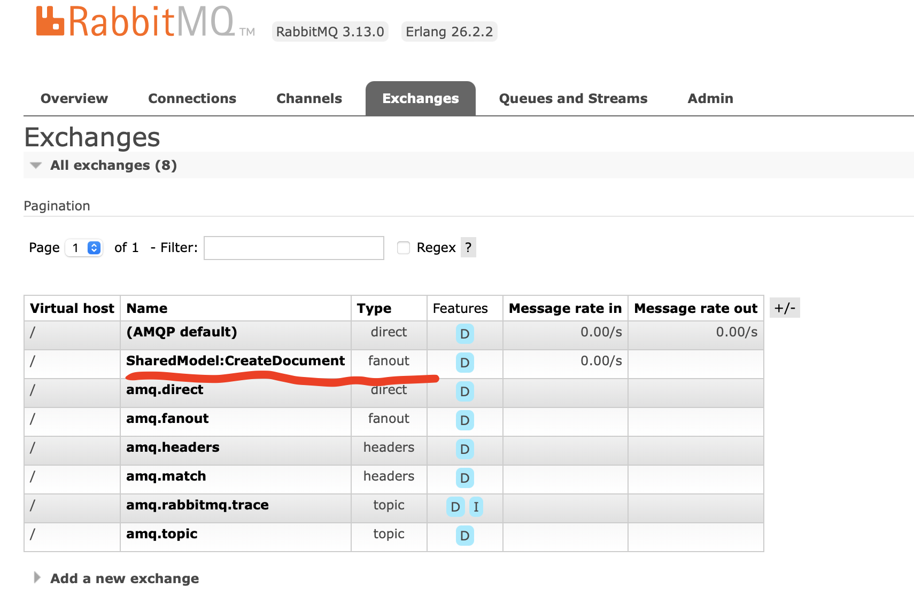

# 01 `Mass Transit` : `API` + `Worker`

> ## Concept de `endpoint`
>
> Dans `MassTransit` les `endpoints` représente une origine ou une destination.
>
> ### `Endpoint` d'envoie
>
> `Producer` : ils publient (`Publish`) ou envoie (`sent`) des messages.
>
> `Exchange` : les `messages` y sont dirigés vers les `Queues`.
>
> Ils ne nécessitent pas de configuration spécifique.
>
> 
>
> ### `Endpoint` de réception
>
> `Consumer` : ils traitent les `messages`.
>
> `Queues` : Les `messages` y sont stockés avant traitement.


## Installation

> ```cs
> dotnet add package MassTransit // pas obligatoire car inclus dans ci-dessous
> ```

```cs
dotnet add package MassTransit.RabbitMQ
```


# Implémentation (dans une `web API`)

## Côté `API`

Ajouter le service `MassTransit RabbitMQ` :

### Configuration de `MassTransit`

```cs
builder.Services.AddMassTransit(x =>
{
    x.UsingRabbitMq((context, cfg) =>
    {
        cfg.Host("localhost", "/", h =>
        {
            h.Username("guest");
            h.Password("guest");
        });

    });
});
```

> Dans une situation de production le `host` doit venir de `Appsettings` et le `Username` et le `Password` sont par exemple des variables d'environnement.

### Création d'un `API Endpoint`

```cs
app.MapPost("/document-created", async (IBus bus) =>
{
    var message = new CreateDocument { 
        Id = Guid.NewGuid(),
        SentDate = DateTime.Now,
        DemandeAvisId = 12,
        Type = "Annexe"
    };

    await bus.Publish(message);

    return Created($"/document/{message.Id}", message);
})
```

> Les `messages` doivent avoir une structure bien particulière pour fonctionner avec `MassTransit`. Ici c'est un `record` avec les propriétés explicitées en `get; init;` :
> ```cs
> namespace SharedModel;
> 
> public record CreateDocument
> {
>     public Guid Id { get; init; }
>     public DateTime SentDate { get; init; }
>     public int DemandeAvisId { get; init; }
>     public string Type { get; init; }
> }
> ```
>
> Cela pourrait aussi être une `class` ou une `interface`. Ne pas utiliser d'héritage pour les `messages`.

À ce niveau `MassTransit` va automatiquement créer un `exchange` :



Le nom est le `namespace` plus le nom de la `class` du `message` : `SharedModel:CreateDocument`.

Par contre à ce niveau aucune `queue` n'est créée et les `messages` envoyés sont perdu.


## Côté `Worker Service`

Le `worker` à proprement parlé est laissé tel quel. Une boucle infini avec un `log` toutes les secondes.

### Création du `Consumer`

```cs
public class CreateDocumentConsumer(ILogger<CreateDocumentConsumer> logger) : IConsumer<CreateDocument>
{
    public Task Consume(ConsumeContext<CreateDocument> context)
    {
        var jsonOptions = new JsonSerializerOptions
        {
            WriteIndented = true,
            ReferenceHandler = ReferenceHandler.IgnoreCycles
        };

        var message = JsonSerializer.Serialize(context.Message, jsonOptions);
            
        logger.LogInformation("{consumer} : {message}", nameof(CreateDocumentConsumer), message);
        
        return Task.CompletedTask;
    }
}
```


### Configuration et ajout du `Consumer`  dans `Program.cs`

```cs
builder.Services.AddMassTransit(configure =>
{
    configure.AddConsumer<CreateDocumentConsumer>();
    
    configure.UsingRabbitMq((context, cfg) =>
    {
        cfg.Host("localhost", "/", h =>
        {
            h.Username("guest");
            h.Password("guest");
        });

        cfg.ConfigureEndpoints(context);
    });
});
```

Si je n'ajoute pas la ligne `cfg.ConfigureEndpoints(context)`, aucun `Consumer`, aucune `Queue` n'est créé.


Si la `Queue` existais déjà, je n'aurai alors pas de `Consumer` :


Sinon j'obtiens un `Consumer` et une `Queue` :


Un nouvel `exchange` portant le nom de `CreateDocument` est créé.


Il est `bindé` au précédent :


## résultat d'un appel `POST`

```
info: Consumer.Worker[0]
      Worker running at: 05/31/2024 10:28:10 +02:00
info: Consumer.Worker[0]
      Worker running at: 05/31/2024 10:28:11 +02:00
info: Consumer.CreateDocumentConsumer[0]
      CreateDocumentConsumer : {
        "Id": "b5510916-5892-4e93-8216-f52b05aafbb4",
        "SentDate": "2024-05-31T10:28:11.715454+02:00",
        "DemandeAvisId": 12,
        "Type": "Annexe"
      }
```


