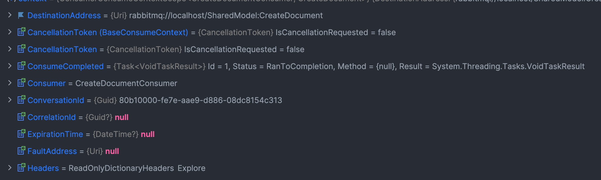
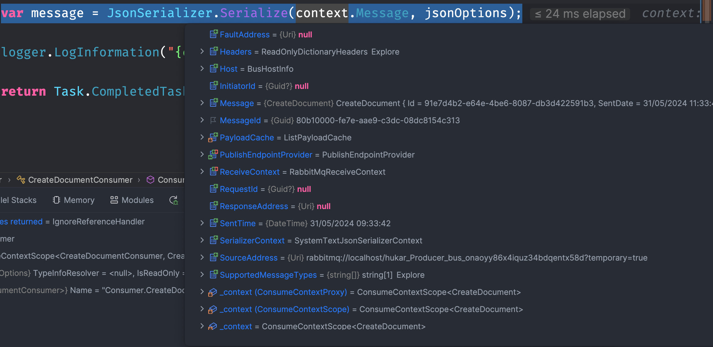
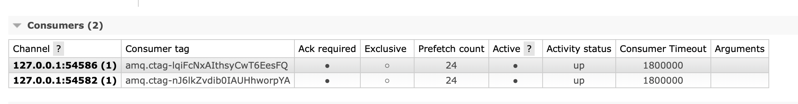
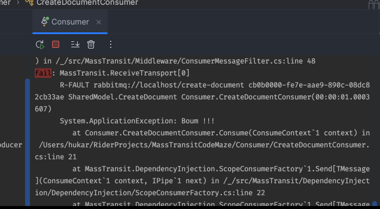
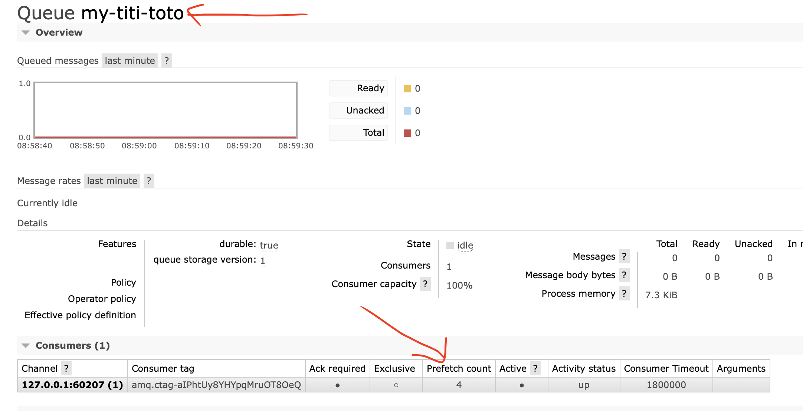

# 02 `Consumer`

## Anatomie

```cs
class SubmitOrderConsumer :
    IConsumer<SubmitOrder>
{
    public async Task Consume(ConsumeContext<SubmitOrder> context)
    {
        // ...
    }
}
```

Pour automatiquement mettre en place un `Receive Endpoint` :

```cs
builder.Services.AddMassTransit(configure =>
{
    configure.AddConsumer<CreateDocumentConsumer>();
    
    configure.UsingRabbitMq((context, cfg) =>
    {
        cfg.Host("localhost", "/", h =>
        {
            h.Username("guest");
            h.Password("guest");
        });

        cfg.ConfigureEndpoints(context);
    });
});
```


## Le `ConsumeContext`

Il contient principalement le `message` ainsi que tout un tas d'information :





On a l'heure d'envoie : `SentTime`. On voit qu'un `guid` automatique est attribué au message, pas besoin d'en ajouter un.

La `DestinationAddress` dans notre cas étant l'adresse de la `queue`.


## Concurrence dans un `Worker`

48 `messages` envoyés et traités chacun en `1 seconde,` cela donne un traitement en `4 secondes`.

Par défaut il semble bien que le nombre de `Consumer` concurrent est bien réglé sur `12` , le nombre de coeur de mon processeur (`ConsumerDispatchConcurrency = Environment.ProcessorCount` avec `RabbitMQ.Client`).


## Concurrence entre plusieurs `Worker`

Par défaut `Prefetch Count` est de `24`.

Le `Worker` le plus rapide (deux fois plus rapide) traite bien plus de `message`, mais sur plusieurs essais la différence ne semble pas suivre une règle précise.

Au final en envoyant plusieurs salves de `message` le `worker a` a traité `209` messages et le `worker b` (censé être deux fois plus lent) en a traité `150`.




## Essai avec `RabbitMQ.Client`

> ## `Interlocked`
>
> En `C#`, nous pouvons utiliser `Interlocked` pour effectuer des opérations atomiques sur des variables partagées. Voici comment on peut  utiliser `Interlocked.Increment` afin de garantir la sécurité des threads :
>
> ```cs
> consumer.Received += async (_, ea) =>
> {
>     // ...
> 
>     var newCount = Interlocked.Increment(ref counter);
>     Console.WriteLine($"Finish: C[{newCount}] M[{message}] {DateTime.Now.Second}:{DateTime.Now.Millisecond}");
>     // ...
> };
> ```
>
> 
>
> ### **`Interlocked.Increment`** :
>
> La méthode `Interlocked.Increment` incrémente de manière atomique une valeur entière spécifiée et stocke le résultat. Cela garantit que même si plusieurs threads essaient d'incrémenter la variable en même temps, chaque incrément sera traité correctement sans conflits ni incohérences.
>
> 

On obtient des résultat similaire quoique un peu moin performant (?).


## Implémentation d'un `worker consumer`

`Program.cs`

```cs
builder.Services.AddMassTransit(configure =>
{
    configure.SetKebabCaseEndpointNameFormatter();

    configure.AddConsumer<CreateDocumentConsumer>();
    
    configure.UsingRabbitMq((context, cfg) =>
    {
        cfg.Host("localhost", "/", h =>
        {
            h.Username("guest");
            h.Password("guest");
        });

        cfg.ConfigureEndpoints(context);
    });
});
```

`CreateDocumentConsumer.cs`

```cs
public class CreateDocumentConsumer(ILogger<CreateDocumentConsumer> logger) : IConsumer<CreateDocument>
{
    public static int Counter = 0;
    
    public async Task Consume(ConsumeContext<CreateDocument> context)
    {
        var jsonOptions = new JsonSerializerOptions
        {
            ReferenceHandler = ReferenceHandler.IgnoreCycles
        };

        await Task.Run(() => Thread.Sleep(1000));

        var message = JsonSerializer.Serialize(context.Message, jsonOptions);
            
        var newCounter = Interlocked.Increment(ref Counter);
        
        logger.LogInformation("T {time} M {message} C {newCounter}", DateTime.Now.ToLongTimeString(), message, newCounter);
    }
}
```

`Worker.cs`

```cs
namespace Consumer;

public class Worker(ILogger<Worker> logger) : BackgroundService
{
    protected override async Task ExecuteAsync(CancellationToken stoppingToken)
    {
        var lastCount = 0;

        while (!stoppingToken.IsCancellationRequested)
        {
            if (CreateDocumentConsumer.Counter != lastCount)
            {
                lastCount = CreateDocumentConsumer.Counter;
                logger.LogInformation("counter: {counter}", lastCount);
            }

            await Task.Delay(4000, stoppingToken);
        }
    }
}
```


## Gestion des crash

Si un des deux worker crash (s'arrête), l'autre prend automatiqument le relai.

Je n'observe pas de perte de message.

## Gestion des `Exception`

Si je déclenche une exception dans la méthode `Consume` :

```cs
public async Task Consume(ConsumeContext<CreateDocument> context)
{
    if (context.Message.Id > 10) throw new ApplicationException("Boum !!!");
```

J'observe que l'exception est remonté vers le `Thread` principal :



> Avec le client `RabbitMQ.Client` une `exception` dans le `Consumer` n'est pas remonté vers le `trhead` principal.

Une `queue-error` est créée automatiquement et les `messages` posant problème y sont stockés :


On récupère alors aussi l'erreur dans les propriétés du `messages` :


Dans le `payload` on récupère tout un tas d'infos dont le `message` :

```json
{
  "messageId": "cb0b0000-fe7e-aae9-a216-08dc82cb3377",
  "requestId": null,
  "correlationId": null,
  "conversationId": "cb0b0000-fe7e-aae9-a270-08dc82cb3377",
  "initiatorId": null,
  "sourceAddress": "rabbitmq://localhost/hukar_Producer_bus_3cfoyy86x4iquxx4bdqef13tnn?temporary=true",
  "destinationAddress": "rabbitmq://localhost/SharedModel:CreateDocument",
  "responseAddress": null,
  "faultAddress": null,
  "messageType": [
    "urn:message:SharedModel:CreateDocument"
  ],
  "message": {
    "id": 23
  },
  "expirationTime": null,
  "sentTime": "2024-06-02T06:14:03.321807Z",
  "headers": {},
  "host": {
    "machineName": "hukar",
    "processName": "Producer",
    "processId": 68555,
    "assembly": "Producer",
    "assemblyVersion": "1.0.0.0",
    "frameworkVersion": "8.0.2",
    "massTransitVersion": "8.2.2.0",
    "operatingSystemVersion": "Unix 14.4.1"
  }
}
```


## Configurer le `Consumer` : `ConsumerDefinition`

On va créer une `class` de configuration pour notre `CreateDocumentConsumer` :

`CreateDocumentConsumerDefinition.cs`

```cs
using MassTransit;

namespace Consumer;

public class CreateDocumentConsumerDefinition : ConsumerDefinition<CreateDocumentConsumer>
{
    public CreateDocumentConsumerDefinition()
    {
        EndpointName = "my-titi-toto";
        // ConcurrentMessageLimit = 4;
    }

    protected override void ConfigureConsumer(IReceiveEndpointConfigurator endpointConfigurator, IConsumerConfigurator<CreateDocumentConsumer> consumerConfigurator,
        IRegistrationContext context)
    {
        endpointConfigurator.PrefetchCount = 4;
    }
}
```

On l'enregistre dans `Program.cs` :

```cs
builder.Services.AddMassTransit(configure =>
{
    configure.SetKebabCaseEndpointNameFormatter();

    configure.AddConsumer<CreateDocumentConsumer, CreateDocumentConsumerDefinition>();
```

`EndpointName` change le nom de la queue à laquelle le `Consumer` est relié.

`ConcurrentMessageLimit` et `PrefetchCount` font la même chose et modifie la propriété `PrefetchCount` dans `RabbitMQ` :




## Message sauté

Si un message n'est pas traité jusqu'au bout, une `queue` nommée `my-queue_skipped` est créée et le `message` est placé dedans. Je n'ai pas pu constater ce comportement car un mecanisme d'arrêt propre fini de traiter le `message` lorsque je coupe manuellement un `worker`.


