# 03 `Producer` : `Send`


## `Sent`/`Published`

Un `message` peut être envoyé (`sent`) ou publié (`published`).

Quand un `message` est envoyé, il est expédié vers un `endpoint` particulier via une adresse de destination.

Si un `message` est publié, il est diffusé (`broadcasté`) sans adresse spécifique vers tous les `Consumer` abonnés à ce type de `message`.

On parle de `message` envoyé comme une `command` et de `message` publié comme `event`.


## `Send`

```cs
app.MapPost("send-message", async (IBus bus) =>
{
    var endpoint = await bus.GetSendEndpoint(new Uri("exchange:auto"));

    await endpoint.Send(new CreateDocument { Id = 678 });
});
```

Je défini ici clairement l'`Exchange`, si celui-ci n'existe pas il sera créé :

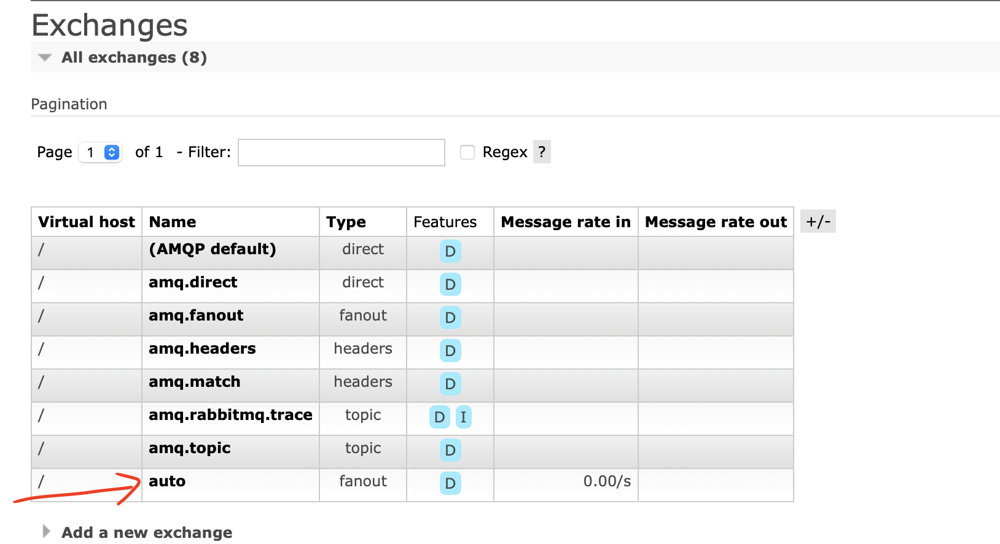

C'est un `fanout exchange`.

Si l'`exchange` est détruit pendant le cycle de vie du `Producer`, une nouvelle requête lancera une `Exception` :

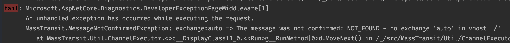

Si maintenant je ré-envoie de nouveau (une deuxième fois) un `message`, l'`exchange` est automatiquement recréé.


Je peux aussi spécifier une `Queue` :

```cs
var endpoint = await bus.GetSendEndpoint(new Uri("queue:auto"));
```

Une `queue` du même nom que l'`exchange` est créée :

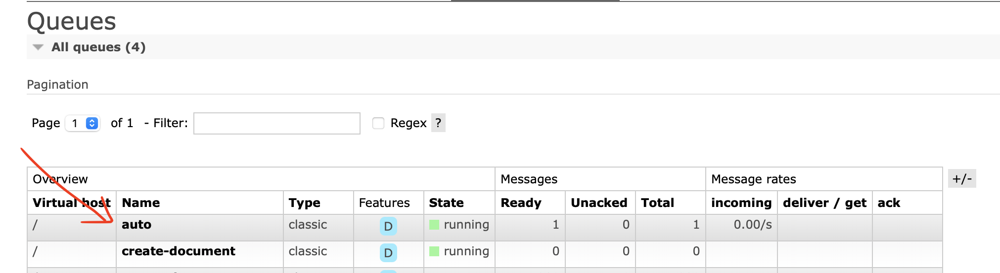

L'`exchange` s'il n'existe pas est aussi créé.

Même sans `Consumer`, les `messages` sont stockés dans la `Queue` :

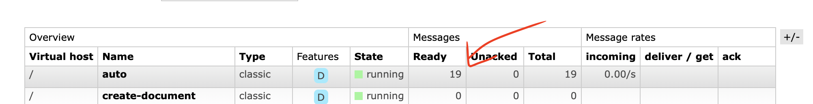


## Réglé la durée de vie de la queue `Durable` : `Temporary`

Dans `MassTransit` la notion de `durable` se traduit par `temporary`.

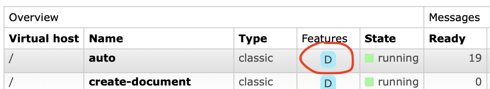

On voit que par défaut la `queue` créée est `durable` c'est à dire `temporary = false`.

Je peux aussi configurer cette valeur dans le `Consumer` :

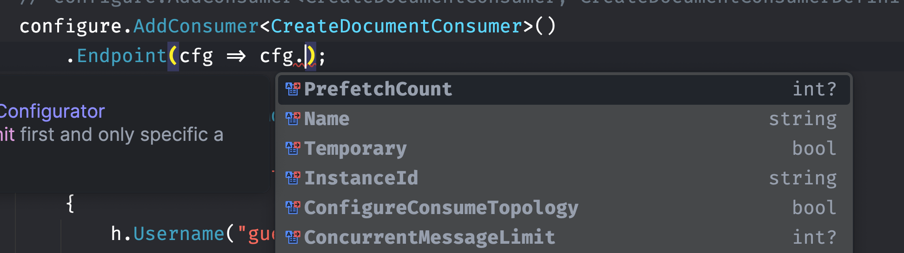

```cs
configure.AddConsumer<CreateDocumentConsumer>()
        .Endpoint(cfg =>
        {
            cfg.Name = "auto";
            cfg.Temporary = true;
        });
```


J'obtiens une exception car il y a contradiction :

#### `inequivalent arg 'durable' for queue 'auto'`

Je peux régler cette propriété aussi dans mon Producer en utilisant les `Query Parameters` :

```cs
var endpoint = await bus.GetSendEndpoint(new Uri("queue:auto?temporary=true"));
```

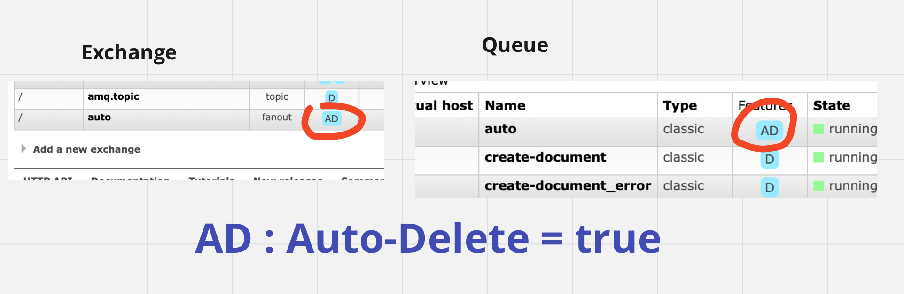

Cette fois quand je lance mon `Consumer`, il n'y a plus d'erreur et il consomme le `message` envoyé

```bash
info: Consumer.CreateDocumentConsumer[0]
      T 11:00:37 M {"Id":678} C 1
info: Consumer.Worker[0]
      counter: 1
```


## `ConfigureConsumeTopology`

Si le lance le `Consumer`, il va créer un `Exchange SharedModel:CreateDocument`  alors que je n'en ai plus (pas!) besoin.

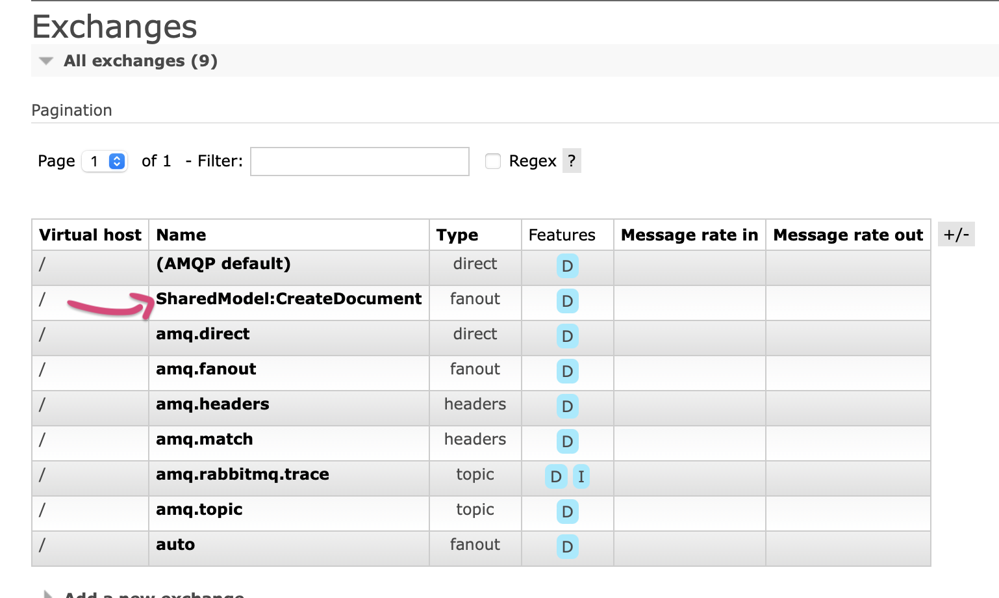

Je peut régler cela dans le fichier de définition du `Consumer`

`CreateDocumentConsumerDefinition.cs`

```cs
using MassTransit;

namespace Consumer;

public class CreateDocumentConsumerDefinition : ConsumerDefinition<CreateDocumentConsumer>
{
    public CreateDocumentConsumerDefinition()
    {
        // ...
    }

    protected override void ConfigureConsumer(IReceiveEndpointConfigurator endpointConfigurator, IConsumerConfigurator<CreateDocumentConsumer> consumerConfigurator,
        IRegistrationContext context)
    {
        // ...
        endpointConfigurator.ConfigureConsumeTopology = false;
    }
}
```

Ainsi le `Consumer` ne créé pas d'`Exchange` supplémentaire :

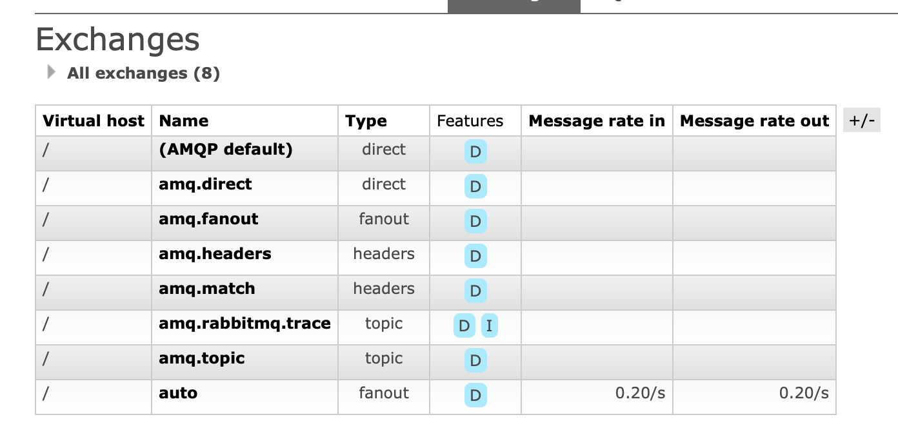


## Fournisseur de `ISendEndpoint`

> ### ! `GetSendEndpoint` est `async`, il faut utiliser `await` !

1. ### Dans un `Consumer` : le `ConsumeContext`

   ```cs
   public async Task Consume(ConsumeContext<CreateDocument> context)
   {
       var endpoint = await context.GetSendEndpoint(new Uri("queue:one-one"));
   
       await endpoint.Send(new CreateDocument { Id = 1111 });
   	// ...
   ```

   On envoie ici par exemple un `message` à une autre `queue`.
   

2. ### Par injection de dépendance avec `ISendEndpointProvider`

   ```cs
   app.MapPost("endpoint-provider", async (ISendEndpointProvider provider) =>
   {
       var endpoint = await provider.GetSendEndpoint(new Uri("queue:auto"));
   
       await endpoint.Send(new CreateDocument { Id = 9911 });
   });
   ```

   C'est la méthode à privilégier.

3. ### Avec `IBus`

   C'est le dernier recours (seulement pour les `messages` issus d'un `inititor` ??)
   ```cs
   app.MapPost("send-message", async (IBus bus) =>
   {
       var endpoint = await bus.GetSendEndpoint(new Uri("queue:auto"));
   
       await endpoint.Send(new CreateDocument { Id = 678 });
   });
   ```

Dans tous les cas `IBus` ne doit pas être utilisé dans un `Consumer` même s'il permet de récupérer un `ISendEndpoint`. Il faut lui préférer le `context` du `Consumer`.

Rechercher un `ISendEndpoint` dans le `scope` le plus proche permet de garder un maximum de meta données sur le `message`.


## Envoie avec `Timeout`

S'il y a une perte de connexion avec `RabbitMQ`, la méthode `Send` réessaye jusqu'à ce que la connexion soit rétabli.

La `Task` de retour est bloquée jusqu'au succés de l'opération.

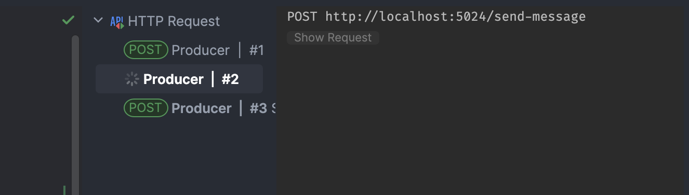

Si le serveur `RabbitMQ` ne redémarre pas , la requête ne termine jamais.

On peut alors vouloir passer un `Timeout` pour annuler la `Task`.

```cs
app.MapPost("endpoint-provider", async (ISendEndpointProvider provider) =>
{
    var endpoint = await provider.GetSendEndpoint(new Uri("queue:auto"));

    var timeout = TimeSpan.FromSeconds(10);
    using var source = new CancellationTokenSource(timeout);

    await endpoint.Send(new CreateDocument { Id = 9911 }, source.Token);
});
```

J'ai maintenant un bloquage de `10s` seulement :

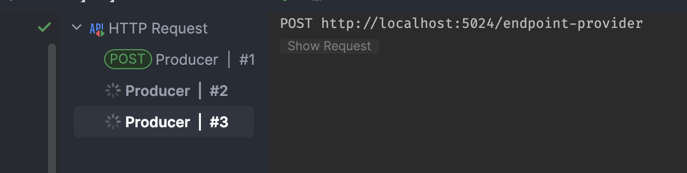

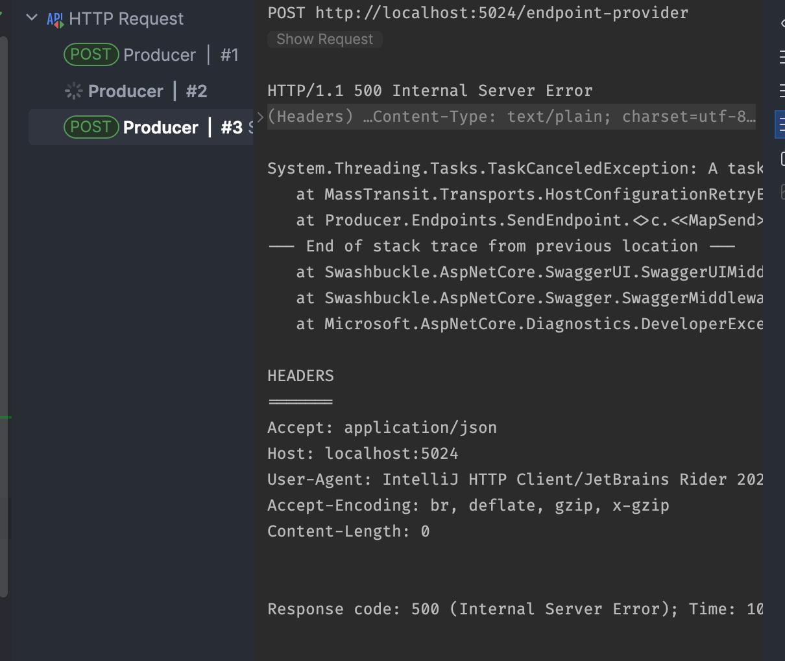

Cela permet de finir une `Task` mais le `message` est perdu.

Dans le cas de la `Task` qui continu de tourner, le `message` est finalement envoyé lorsque le serveur `RabbitMQ` redémarre.

