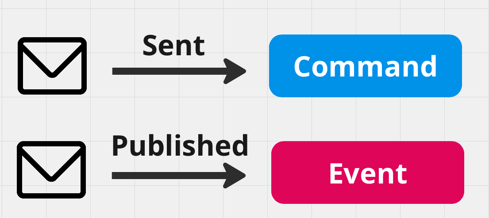

# 03 `Producer`

## `Sent`/`Published`

Un `message` peut être envoyé (`sent`) ou publié (`published`).

Quand un `message` est envoyé, il est expédié vers un `endpoint` particulier via une adresse de destination.

Si un `message` est publié, il est diffusé (`broadcasté`) sans adresse spécifique vers tous les `Consumer` abonnés à ce type de `message`.

On parle de `message` envoyé comme une `command` et de `message` publié comme `event`.

## `Send`

