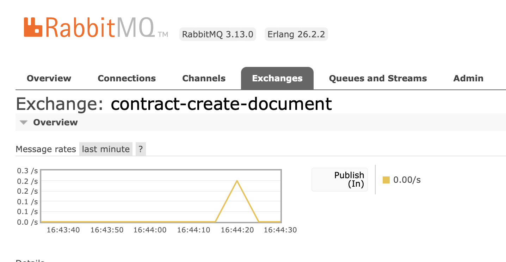
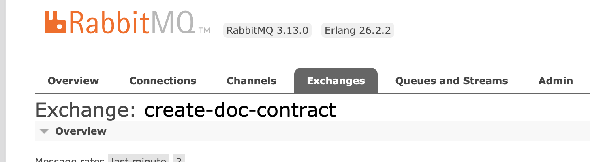
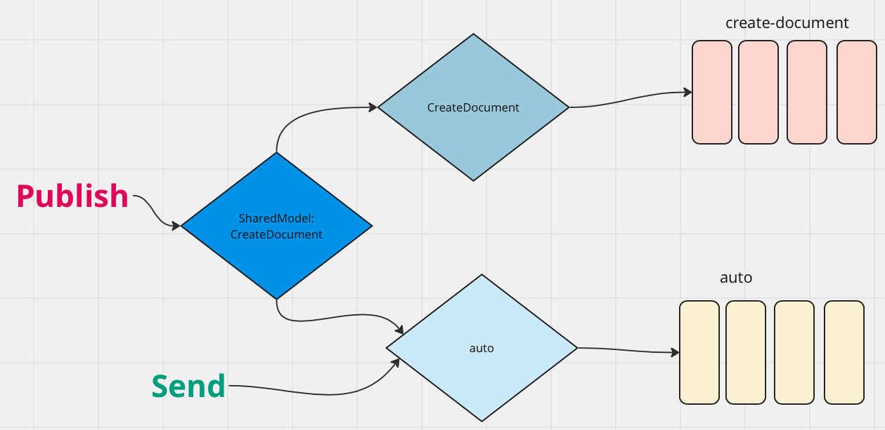

# 04 `Producer` : `Publish`

## `Publish`

Les `messages` sont `publish` de la même manière qu'ils sont `send`. On utilise un `IPublishEndpoint`.

Les mêmes règles sont appliquées et on doit obtenir une instance au plus proche du point de terminaison :

- `ConsumeContext` pour un `Consumer`
- `IBus` en dehors d'un `Consumer`

Une copie du `message` est remise à chaque `abonné`.

On peut aussi passer par `DI` un `IPublishEndpoint` :

```cs
app.MapPost("publish-endpoint", async (IPublishEndpoint endpoint) =>
{
    await endpoint.Publish(new CreateDocument { Id = 222 });
});
```

> Par contre on ne peut pas passer directement un `ISendEndpoint` par `DI` :
> ```cs
> app.MapPost("send-endpoint", async (ISendEndpoint endpoint) =>
> {
>     await endpoint.Send(new CreateDocument { Id = 222 });
> });
> ```
>
> On obtient une `exception` car le service n'est pas trouvé.
> Dans le cas de `Send` comme on précise une adresse, on doit utiliser `ISendEndpointProvider` pour pouvoir la configurer.


## Exchange

Si j'effectue un `publish`, s'il n'existe pas un `exchange` est créé `SharedModel:CreateDocument`.

Pour changer ce nom, je peux utiliser un attribut sur ma `class` de contrat :

```cs
using MassTransit;

namespace SharedModel;

[EntityName("contract-create-document")]
public record CreateDocument
{
    public int Id { get; init; }
}
```



Il faut alors installer `MassTransit` dans la `class lib` contenant mon `Model`.

On peut aussi configurer cela directement dans la configuration du `Bus` :

```cs
builder.Services.AddMassTransit(x =>
{
    x.UsingRabbitMq((context, cfg) =>
    {
        cfg.Host("localhost", "/", h =>
        {
            h.Username("guest");
            h.Password("guest");
        });

        cfg.Message<CreateDocument>(
            m => m.SetEntityName("create-doc-contract")
        );
```




## Différence avec `Send`

- `Publish` ne créé pas de `queue` alors que `Send` en créé une même en l'absence d'un `Consumer`.

- `Send` permet de spécifier une destination précise en passant une `URI` :

  ```cs
  var endpoint = await bus.GetSendEndpoint(new Uri("queue:auto"));
  
  await endpoint.Send(new CreateDocument { Id = 678 });
  ```

- `Publish` envoie à tous les `Consumers` lié par le contrat (le `message`)




