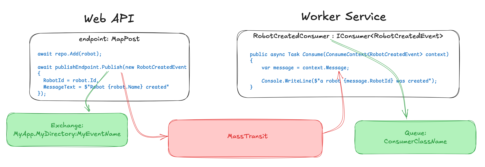
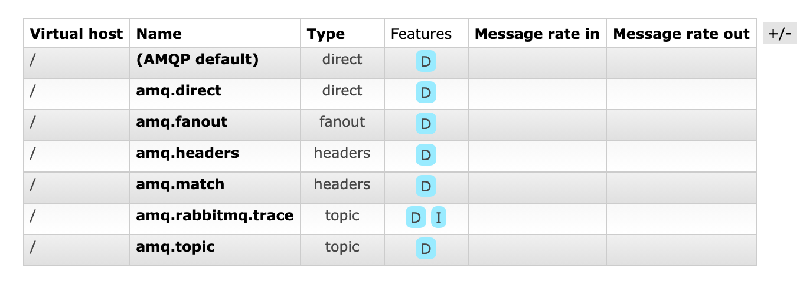
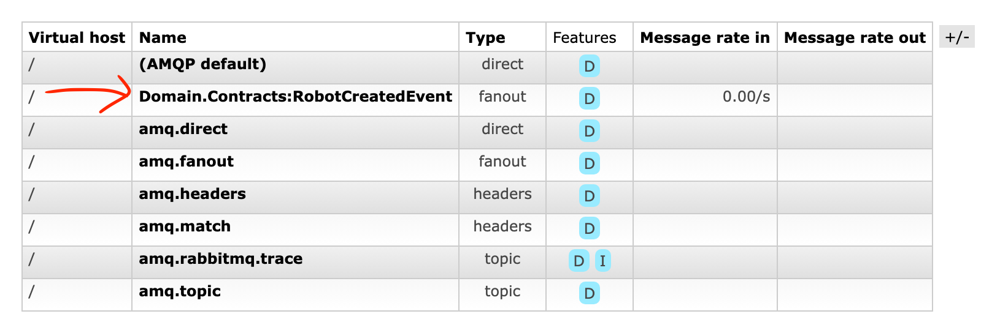

# 04 Publier un `message`

## Mise en place

Pour l'instant le seul code mis en place est dans `Program.cs` :

```cs
builder.Services.AddMassTransit(x =>
{
    x.UsingRabbitMq((context, cfg) =>
    {
        cfg.ConfigureEndpoints(context);
    });
});
```

`ConfigureEndpoints` étant la version automatisé (les valeurs par défaut) de la configuration.




## Publier un `message` : `IPublishEndpoint` 

On injecte un `IPublishEndpoint` pour pouvoir *diffuser* un `message` (`broadcast`, on peut parler aussi d'`event`).

Dans un `endpoint`

```cs
route.MapPost("/", async (Robot robot, RobotRepository repo, IPublishEndpoint publishEndpoint) =>
{
   robot.Id = new Random().Next(10000, 99999);
   await repo.Add(robot);

   await publishEndpoint.Publish(new RobotCreatedEvent {
       RobotId = robot.Id,
       MessageText = $"Robot {robot.Name} created"
   });
   
   return Results.Created($"/robot/{robot.Id}", robot);
});
```

J'utilise un `IPublishEndpoint` pour publier un `événement` ici une classe `RobotCreatedEvent` :

```cs
public class RobotCreatedEvent
{
    public int RobotId { get; set; }
    public string MessageText { get; set; } = string.Empty;
}
```


### `Publish`

Il existe une version utilisant les `generic` et acceptant un `objet anonyme` en argument :

```cs
await publishEndpoint.Publish<RobotCreatedEvent>(new 
{
    RobotId = robot.Id,
    MessageText = $"Robot {robot.Name} created"
});
```

C'est strictement équivalent au code plus haut.

## Conséquence dans `RabbitMQ`

De base voici les `exchanges` par défaut de `RabbitMQ` :



Lorsque je lance l'`api`, je vois qu'un `bus` démarre :

```bash
info: MassTransit[0]
      Bus started: rabbitmq://localhost/
```

Cela ne créé ni `exchange`, ni `queue`.

Par contre l'exécution du `endpoint` avec l'appelle à la méthode `Publish` va créer un `exchange` dans `RabbitMQ` :



On observe que par défaut l'`exchange` prend le nom du `namespace` ainsi que de la `classe` du message `Domain.Contracts:RobotCreatedEvent`, on observe aussi que c'est un `exchange` de diffusion => `fanout` et qu'il est `durable` : `D`.

#### `MassTransit`, s'il n'a pas de `Consumer`, ne créé pas de `queue`.

#### La méthode `Publish` créé un `exchange`.


