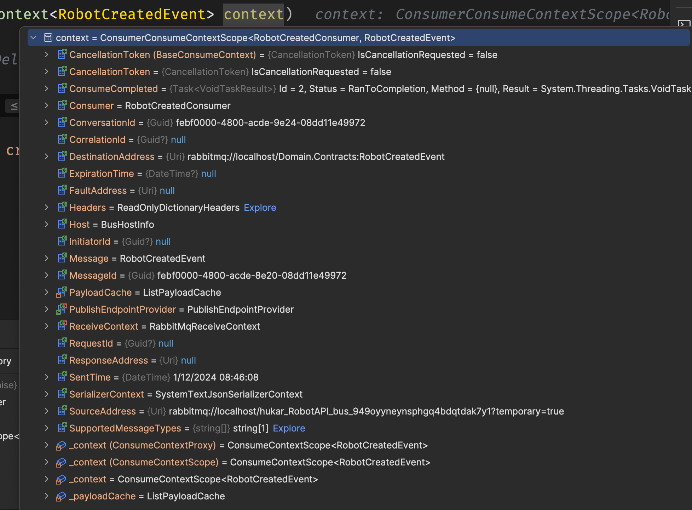
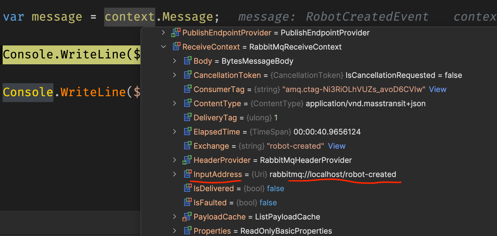
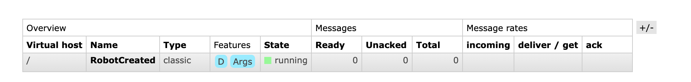
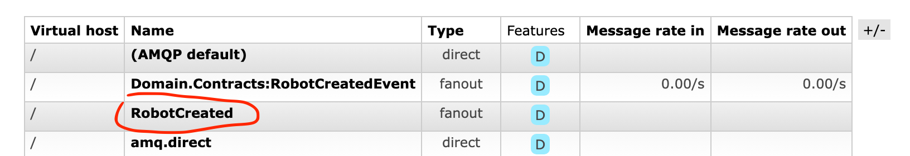
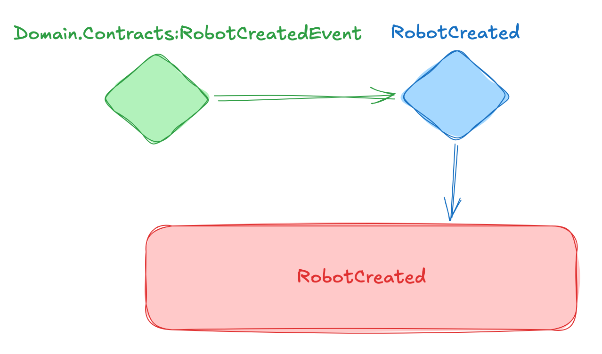
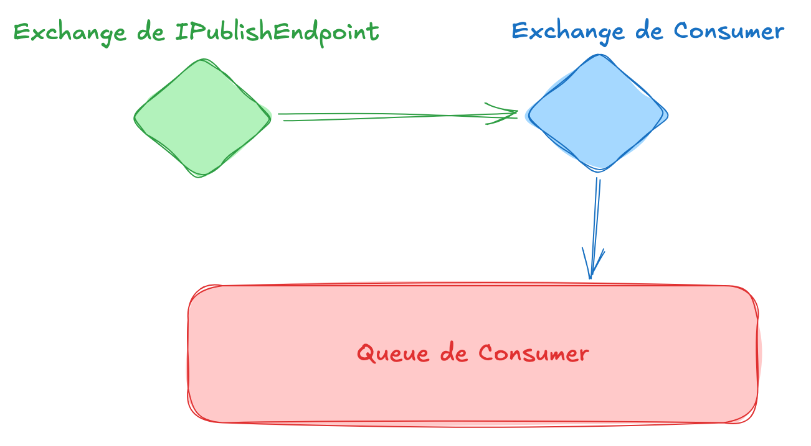

# 05 Le `Consumer`

## Mise en place

> J'utilise un `worker service` pour contenir mes `consumers`.
>
> je simplifie `worker.cs` :
>
> ```cs
> public class Worker(ILogger<Worker> logger) : BackgroundService
> {
>     protected override async Task ExecuteAsync(CancellationToken st)
>     {
>         await Task.Delay(10, st);
>         Console.ReadKey();
>     }
> }
> ```


## Création d'un `Consumer<TMessage>`

Un `consumer` est une `classe` héritant de `IConsumer<TMessage>` :

```cs
public class RobotCreatedConsumer : IConsumer<RobotCreatedEvent>
{
    public async Task Consume(ConsumeContext<RobotCreatedEvent> context)
    {
        await Task.Delay(300);
        
        var message = context.Message;
        
        Console.WriteLine($"a robot {message.RobotId} was created");
    }
}
```

Elle implémente la méthode `Consume` et reçoit le `ConsumeContext<TMessage>`.



On observe le `message` de type `RobotCreatedEvent` ainsi qu'un `Id` généré automatiquement `MessageId`.

### Récupérer l'adresse de l'expéditeur : `ReceiveContext.InputAddress`

```cs
public class RobotCreatedConsumer : IConsumer<RobotCreatedEvent>
{
    public async Task Consume(ConsumeContext<RobotCreatedEvent> context)
    {
        var message = context.Message;

        Console.WriteLine($"Expediteur: {context.ReceiveContext.InputAddress}");
        
        Console.WriteLine($"a robot {message.RobotId} was created");
    }
}
```

```
Expediteur: rabbitmq://localhost/robot-created
a robot 87229 was created
```



`rabbitmq://localhost/robot-created` est l'adresse de la `queue` envoyant le `message`.

## Enregistrement du `Consumer` : `AddConsumer<TConsumer>`

Dans `Program.cs`

Au niveau du `Bus`:

```cs
builder.Services.AddMassTransit(x =>
{
    x.AddConsumer<RobotCreatedConsumer>();
    // ...
```

> ## Autre manière d'enregistrement
>
> ```cs
> x.AddConsumer(typeof(RobotCreatedConsumer));
> ```
>
> On peut utiliser un `scanning` d'une `assembly` si on veut ajouter des `Consumer` en grand nombre :
>
> ```cs
> var entryAssembly = Assembly.GetEntryAssembly();
> 
> x.AddConsumers(entryAssembly).
> ```
>
> Si on veut plusieurs `assemblies` on peut aussi passer un `array` :
>
> ```cs
> x.AddConsumers(params Assembly[] assemblies);
> ```
>
> On remarque le `s` à `AddConsumers`.


## `Topology` dans `RabbitMq`

Dès le démarrage du `Service` une `queue` est créée :



Le nom de la `queue` est le nom de la `class` sans le suffixe `Consumer` si on l'utilise, sinon c'est le nom complet de la `class`.

Un nouvel `exchange` est aussi créé :



On a donc la topologie suivante dans `RabbitMQ` :






## Résultat

Lorsqu'un `Robot` est créé dans le `endpoint`, `publishEndpoint.Publish` envoie un `message` (un `event`) qui est reçu par le `consumer` du `Worker Service`.

``` 
info: MassTransit[0]
      Bus started: rabbitmq://localhost/
a robot 17905 was created
a robot 95823 was created
a robot 31893 was created

```

