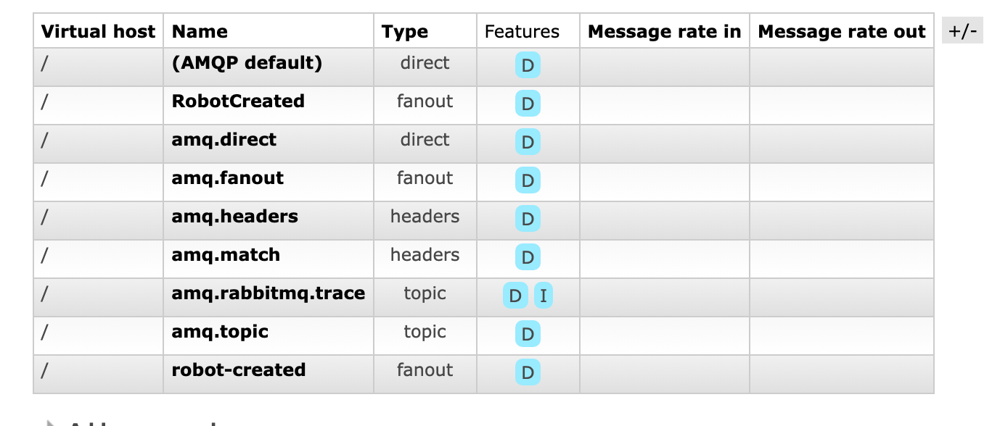
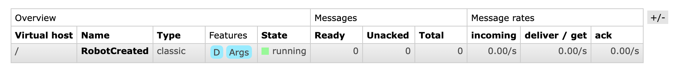
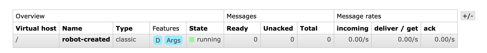
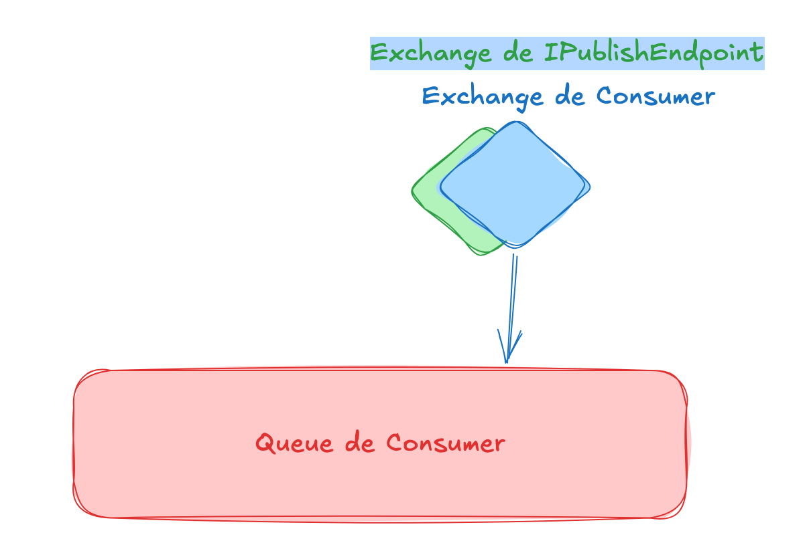
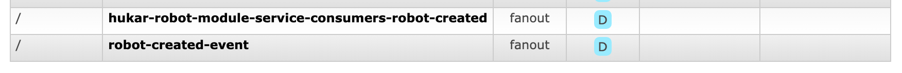
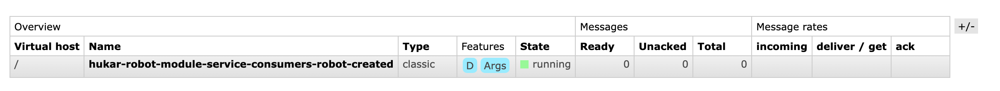
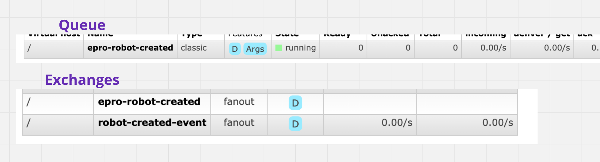

# 06 Nommage et `configuration`

## Contrôler le nommage

Pour l'instant les `exchanges` et les `queues` sont nommées par convention avec les noms utilisés dans `c#`.

On veut modifier ces nommages automatiques.


### Utiliser les `annotations`

Dans la `classe` de contrat, on peut directement imposer le nom du `message` :

```cs
using MassTransit;

namespace Domain.Contracts;

[EntityName("robot-created")]
public class RobotCreatedEvent
{
    public int RobotId { get; set; }
    public string MessageText { get; set; } = string.Empty;
}
```

Cette `annotation` provient du package `Masstransit`, on doit donc l'installer dans le `Domain`.



On voit que seul l'`exchange` créé par le `IPublishEndpoint` a changé de nom en `robot-created`. L'`exchange` créé par le `Consumer` et la `queue` n'ont pas changé de nom.




### Utiliser les options du `Bus`

Changer le nom de la `queue` en `kebab-case`:

```cs
x.SetKebabCaseEndpointNameFormatter();
```



> ## Fusion des `Exchanges`
>
> Comme l'`exchange` créé par `IPublishEndpoint` et celui créé côté `Consumer` ont le même nom : `robot-created`, les deux `exchanges` fusionnent.
>
> 
>
> Ce qui donne la `topologie` suivante :
>
> 

On peut aussi aller plus loin dans la configration avec `SetEndpointNameFormatter` et lui passer un formateur :

```cs
x.SetEndpointNameFormatter(
    new KebabCaseEndpointNameFormatter("hukar", true)
);
```

`true` correspond à `includeNamespace`.





```cs
x.SetEndpointNameFormatter(
    new KebabCaseEndpointNameFormatter("epro", false)
);
```




