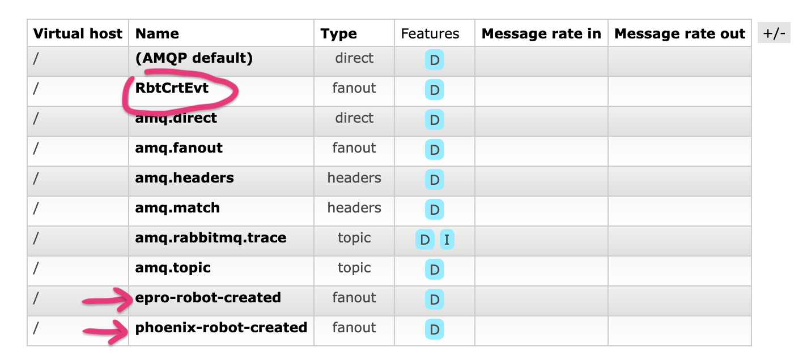
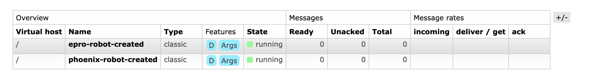
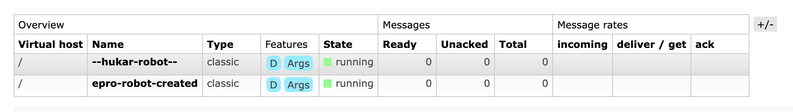

# 07 `Receive Endpoint`

Par défaut un `consumer` consomme les messages de la `queue` dont le nom est défini par la configuration au niveau du `Bus` (fiche `06`).

On veut pouvoir configurer un `Consumer` pour qu'il s'abonne explicitement à une `queue` particulière.

```cs
x.UsingRabbitMq((context, cfg) =>
{
    cfg.ConfigureEndpoints(context);

    cfg.ReceiveEndpoint("epro-robot-created", (ce) =>
    {
        ce.ConfigureConsumer<RobotCreatedConsumer>(context);
    });
});
```


## Configuration sur deux niveau

```cs
    x.SetEndpointNameFormatter(new KebabCaseEndpointNameFormatter("phoenix", false));

x.UsingRabbitMq((context, cfg) =>
{
    cfg.ConfigureEndpoints(context);

    cfg.ReceiveEndpoint("epro-robot-created", (ce) =>
    {
        ce.ConfigureConsumer<RobotCreatedConsumer>(context);
    });
});
```

Si je configure le `Consumer` au niveau du `Bus` et au niveau du `ReceiveEndpoint`, les configurantion semblent cumulative :



En lançant le `Worker Service` on voit que `3 exchanges` sont créés.

`RbtCrtEct` qui vient de l'`annotation` de la classe du `message` :

```cs 
[EntityName("RbtCrtEvt")]
public class RobotCreatedEvent
{
    // ...
```

`epro-robot-created` qui vient de la configuration au niveau du `ReceiveEndpoint` :

```cs
cfg.ReceiveEndpoint("epro-robot-created", (ce) =>
{
    ce.ConfigureConsumer<RobotCreatedConsumer>(context);
});
```

Et `phoenix-robot-created` qui vient de la configuration au niveau du `Bus` :

```cs
x.SetEndpointNameFormatter(
    new KebabCaseEndpointNameFormatter("phoenix", false)
);
```

De même on se retrouve avec `2 queues` créées :



On consomme le `message` envoyé dans les deux `queues` :

```
Expediteur: rabbitmq://localhost/phoenix-robot-created
Expediteur: rabbitmq://localhost/epro-robot-created
a robot 87451 was created
a robot 87451 was created
```

Si en plus on définit le `receive endpoint` dans le `ConsumerDefinition` :

```cs
public class RobotCreatedConsumerDefinition : ConsumerDefinition<RobotCreatedConsumer>
{
    public RobotCreatedConsumerDefinition()
    {
        Endpoint(e =>
        {
            e.Name = "--hukar-robot--";
            e.ConcurrentMessageLimit = 10;
        });
    }
```



On obtient deux `queues` (et par `trois`), une du `ConsumerDefinition` : `--hukar-robot--` et une au niveau du `Receive Endpoint` : `epro-robot-created`. On ne voit plus la `queue` au niveau du `Bus` masquée par celle du `Consumer Definition`.


## Conclusion et résumé

Il vaut mieux choisir de définir le `receive endpoint` à un seul niveau pour éviter des comportement complexes et des `queues` inutiles.

### 3 niveaux

- Au niveau du `Bus` avec `SetEndpointNameFormatter`.
  ```cs
  builder.Services.AddMassTransit(x =>
  {
  	x.SetEndpointNameFormatter(
          new KebabCaseEndpointNameFormatter("epro", false)
      );
      
      // ...
  ```

  

- Au niveau de `RabbitMQ` avec `ReceiveEndpoint`.
  ```cs
  x.UsingRabbitMq((context, cfg) =>
  {
      cfg.ConfigureEndpoints(context);
  
      cfg.ReceiveEndpoint("epro-robot-created", (ce) =>
      {
          ce.ConfigureConsumer<RobotCreatedConsumer>(context);
      });
  });
  ```

  

- Au niveau du `Consumer` dans le constructeur de la classe `ConsumerDefinition`.
  ```cs
  public class RobotCreatedConsumerDefinition : ConsumerDefinition<RobotCreatedConsumer>
  {
      public RobotCreatedConsumerDefinition()
      {
          // EndpointName = "--robot--";
          
          Endpoint(e =>
          {
              e.Name = "--hukar-robot--";
              e.ConcurrentMessageLimit = 10;
          });
      }
  ```

  


