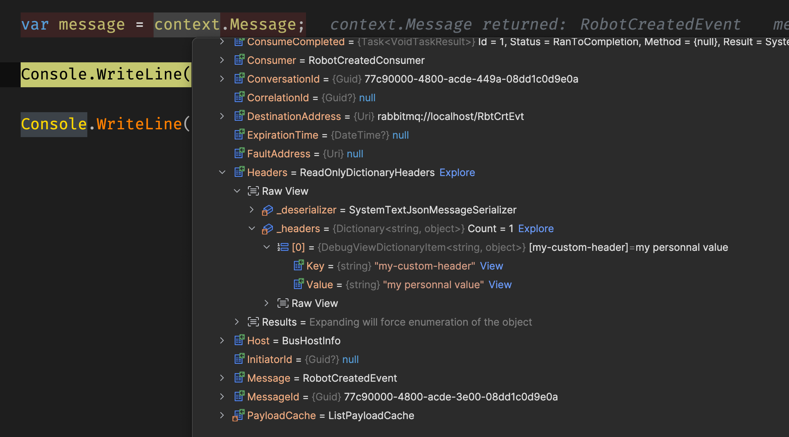

# 08 Les `messages`

## Les `headers` de `message`

On peut ajouter lors de la publication des `headers` à notre message :

`RobotEndpoint.cs`

```cs
app.MapPost("/", async (
    Robot robot, 
    RobotRepository repo, 
    IPublishEndpoint publishEndpoint) =>
{
	// ...
    
	await publishEndpoint.Publish(new RobotCreatedEvent
 	{
        RobotId = robot.Id,
        MessageText = $"Robot {robot.Name} created"
     }, context =>
     {
        context.Headers.Set(
            "my-custom-header", 
            "my personnal value"
        );
 });
```

On récupère le `PublishContext` nommé ici simplement `context` 


à travers duquel on peut ajouter des `headers`.


Dans l'interface `web` de `RabbitMQ`, il est possible de voire ce `header` ajouté.


On remarque que les `Headers` ajoutés se retrouve aussi dans le `payload` du message.

On voit aussi :

- La `destinationAddress` qui est ici l'`exchange` : `RbtCrtEvt`
- Le `messageId`
- Le `expirationTime` ici à `null`
- Le `sentTime`


## Accéder aux `Headers` dans le `Consumer`



Tout comme il y a un `PublishContext`, on a aussi du côté du `Worker Service` un `ConsumeContext<TMessage>` où l'on peut récupérer les headers.

### `API`

`RobotEndpoint.cs`

```cs
await publishEndpoint.Publish(new RobotCreatedEvent
{
	RobotId = robot.Id,
	MessageText = $"Robot {robot.Name} created"
}, context =>
{
	context.Headers.Set(
        "my-custom-header-1", "my personnal value one"
    );
	context.Headers.Set(
        "my-custom-header-2", "my personnal value two"
    );
	context.Headers.Set(
        "my-custom-header-3", "my personnal value three"
    );
	context.Headers.Set(
        "my-custom-header-4", "my personnal value four"
    );
});
```

### `Worker Service`

`RobotConsumer.cs`

```cs
foreach (var header in context.Headers.GetAll())
{
    Console.WriteLine($"{header.Key}: {header.Value}");
}
```

```
my-custom-header-1: my personnal value one
my-custom-header-2: my personnal value two
my-custom-header-3: my personnal value three
my-custom-header-4: my personnal value four
```


## `Message` expiration : `TimeToLive`

Toujours grâce au `PublishContext`, on peut configurer le temps de vie du `message` avec la propriété `TimeToLive` :

```cs
await publishEndpoint.Publish(new RobotCreatedEvent
{
	RobotId = robot.Id,
	MessageText = $"Robot {robot.Name} created"
}, context =>
{
	context.Headers.Set("my-header", "my value");
	context.TimeToLive = TimeSpan.FromSeconds(30);
});
```


On peut voire les `30s` d'expiration assignées.

Le `message` disparait après de la `queue`.

Ce mécanisme est intéressant pour vider la `queue` et éviter un engorgement en cas de problème avec les `Consumers` par exemple.

Une `queue` doit principalement être vide pour bien fonctionner.

