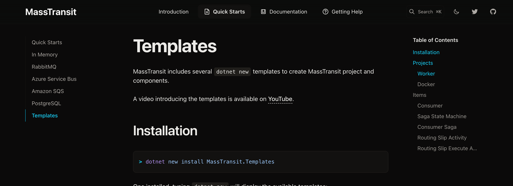

# 08.5 Les `templates` de `MassTransit`



```bash
dotnet new install MassTransit.Templates
```

### `Template` à utiliser :

Un `projet` : `mtworker`

```bash
dotnet new mtworker -o MyWorker
```

Un `item` : `mtconsumer`

```bash
cd MyWorker
dotnet new mtconsumer --name MyMt
```


## `mtworker`

> Avec `MassTransit` il n'ya pas besoin d'utiliser un `Worker` par défaut. On peut donc supprimer ce code dans `Program.cs` :
>
> ```cs
> builder.Services.AddHostedService<Worker>();
> ```
>
> Et la classe `Worker` associée.

Cela consiste en une configuration `InMemory` par défaut de `MassTransit` :

```cs
services.AddMassTransit(x =>
{
    x.SetKebabCaseEndpointNameFormatter();

    // By default, sagas are in-memory, but should be changed to a durable
    // saga repository.
    x.SetInMemorySagaRepositoryProvider();

    var entryAssembly = Assembly.GetEntryAssembly();

    x.AddConsumers(entryAssembly);
    x.AddSagaStateMachines(entryAssembly);
    x.AddSagas(entryAssembly);
    x.AddActivities(entryAssembly);

    x.UsingInMemory((context, cfg) =>
    {
        cfg.ConfigureEndpoints(context);
    });
});
```

Rien de plus, rien de moins.


## `mtconsumer`

À lancer dans un projet.

Créé deux dossiers :

### `Contracts`

> Il est plus intéréssant d'avoir ses `contracts` dans une `class lib`. Séparée et partagée entre les différent acteurs (`Producer` et `Consumer`).

`MyMt.cs`

```cs
public record MyMt
{
    public string Value { get; init; }
}
```


### `Consumers`

`MyMtConsumer`

```cs
public class MyMtConsumer : IConsumer<MyMt>
{
    public Task Consume(ConsumeContext<MyMt> context)
    {
        return Task.CompletedTask;
    }
}
```


`MyMtConsumerDefinition.cs`

```cs
public class MyConsumerDef : ConsumerDefinition<MyMtConsumer>
{
    protected override void ConfigureConsumer(
        IReceiveEndpointConfigurator endpointConfigurator,
        IConsumerConfigurator<MyMtConsumer> consumerConfigurator, 
        IRegistrationContext context
    ) {
        endpointConfigurator.UseMessageRetry(
            r => r.Intervals(500, 1000)
        );

        endpointConfigurator.UseInMemoryOutbox(context);
    }
}
```

> `MassTransit` nous incite de travailler avec `IConsumerDefinition`.