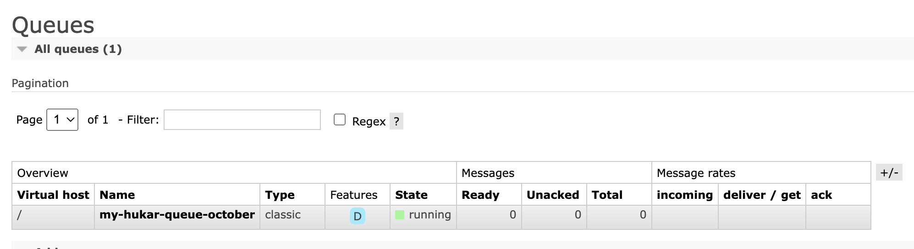
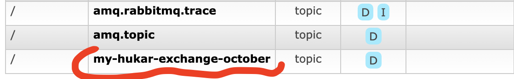
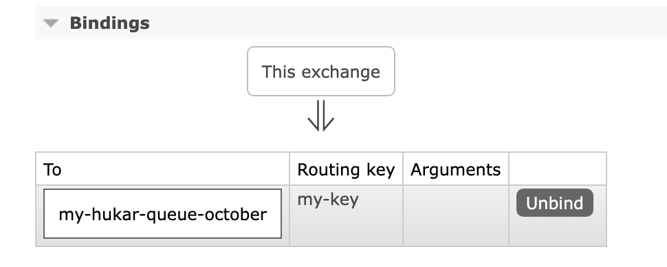

# 03 Créer des `Queue` et des `Exchange`


## Créer une `queue` : `QueueDeclare`

```cs
channel.QueueDeclare(
    queue: "my-hukar-queue-october", 
    durable: true, 
    exclusive: false,
    autoDelete: false,
    arguments: null);
```



>
>
>### `durable` 
>
>Cette file d'attente doit-elle survivre à un redémarrage de `RabbitMQ` ?
>
>### `exclusive` 
>
>L'utilisation de cette file d'attente doit-elle être limitée à la connexion qui l'a déclarée ? Une telle file d'attente sera supprimée lorsque la connexion déclarante se fermera.
>
>### `autoDelete`
>
>Cette file d'attente doit-elle être automatiquement supprimée lorsque son dernier `consommateur` (s'il y en a un) se désabonne ?
>
>#### ! subtilités
>
>SI une `queue` est créé sans qu'elle ai jamais eu un `consumer`, elle ne sera pas détruite à l'arrêt de la connexion l'ayant déclaré. 
>
>Par contre dès qu'un `consumer` s'abonnera et se désabonnera, la `queue` sera supprimée.
>
>### `arguments`
>
>Optionnel ; arguments supplémentaires pour la file d'attente, par exemple `"x-queue-type"`.

## Créer un `Exchange` : `ExchangeDeclare`

```cs
channel.ExchangeDeclare(
    exchange: "my-hukar-exchange-october",
    type: ExchangeType.Topic,
    durable: true,
    autoDelete: false,
    arguments: null
);
```



> utilisation de la classe d'énumération `ExchangeType`.

## Créer un `Binding`

```cs
channel.QueueBind(
    queue: "my-hukar-queue-october",
    exchange: "my-hukar-exchange-october",
    routingKey: "my-key",
    arguments: null
);
```


