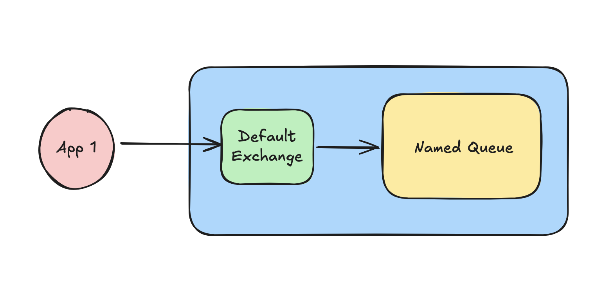
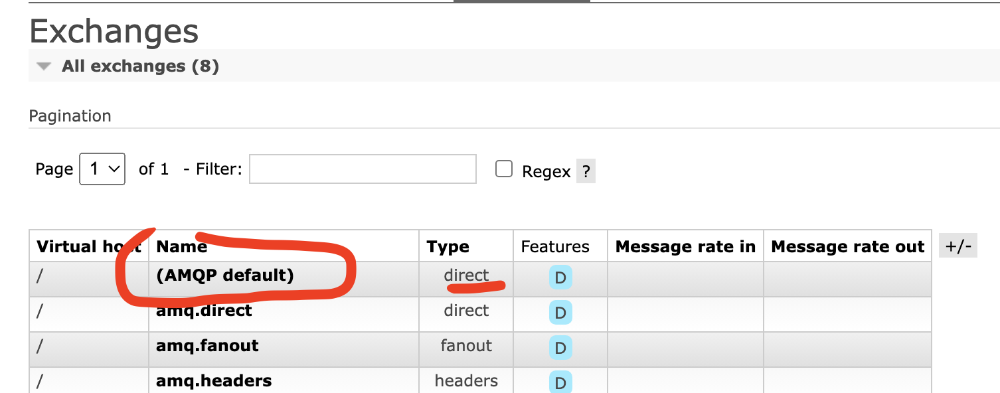

# 04 Utilisation `basic`



Le `default exchange` est de type `direct exchange`.




## Envoyer un message : `BasicPublish`

```cs
IBasicProperties properties = channel.CreateBasicProperties();

properties.Persistent = false;

const string message = "my super message";

byte[] body = Encoding.UTF8.GetBytes(message);

channel.BasicPublish(
    exchange: "",
    routingKey: "m1-s3", // ici le nom de la queue
    basicProperties: properties,
    body: body
);
```

Avec le `default exchange`, le `routing key` est le nom de la `queue` que l'on souhaite contacter.

Aucun `exchange` n'est donné, et aucun `exchange` n'est configuré dans le code.

Le `message` doit être un `tableau d'octets` : `byte[]`.

`IBasicProperties properties` défini des métadonnées liées au `message`.

### `Persistent`

Cette propriété spécifie si le message doit être stocké de manière persistante sur disque par `RabbitMQ`.

- Si `Persistent` est `true`, le message sera stocké sur disque et survivra à un redémarrage de `RabbitMQ`.
- Si `Persistent` est `false`, le message ne sera pas stocké de manière persistante et pourra être perdu en cas de redémarrage ou d'arrêt du `broker` avant sa consommation.

Il existe d'autre métadonnées pour `properties` :

- `Priority` pour la priorité du message.

- `ContentType` pour indiquer le type de contenu du message.

- `CorrelationId`, qui permet de lier un message de réponse à une requête.


## Recevoir le `message` : `BasicConsume`

```cs
var consumer = new EventingBasicConsumer(channel);

consumer.Received += (model, ea) =>
{
    var body = ea.Body.ToArray();
    var message = Encoding.UTF8.GetString(body);

    Console.WriteLine($"Message received: {message}");
};

channel.BasicConsume(
    queue: "m1-s3",
    consumer: consumer,
    autoAck: true
);
```

### `Encoding.UTF8`

Cet `Encoding` possède deux méthodes qui nous intéressent :

`GetBytes(string str)` et `GetString(byte[] bytes)`.

Le `message` est transporté sous la forme d'`un tableau d'octets`.


