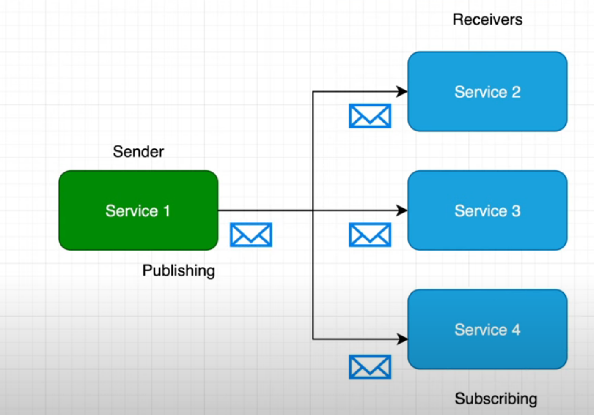

# `Mass Transit`


## Installation

> ```cs
> dotnet add package MassTransit // pas obligatoire car inclus dans ci-dessous
> ```

```cs
dotnet add package MassTransit.RabbitMQ
```


## Pattern 

`Pub/Sub` est un pattern `asynchrone`. Celui qui envoie un `message` ne se soucie pas de qui le reçoit.

Chaque `service` peut souscrire à un ou plusieurs types de `message`.




## Implémentation (dans une `web API`)

Ajouter le service `MassTransit RabbitMQ` :

```cs
builder.Services.AddMassTransit(x =>
{
    x.UsingRabbitMq((context, cfg) =>
    {
        cfg.Host("localhost", "/", h =>
        {
            h.Username("guest");
            h.Password("guest");
        });

        cfg.ConfigureEndpoints(context);
    });
});
```

> Dans une situation de production le `host` doit venir de `Appsettings` et le `Username` et le `Password` sont par exemple des variables d'environnement.


