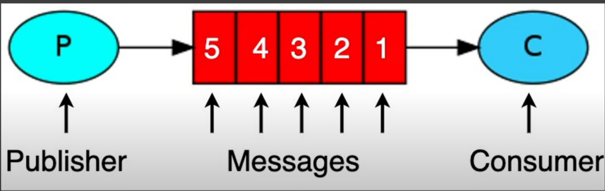
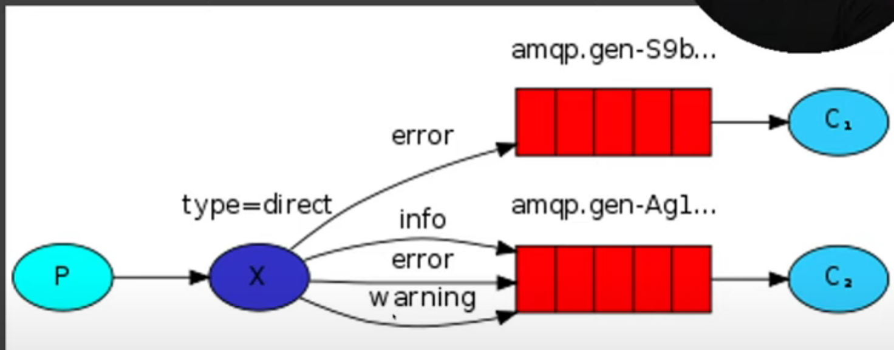
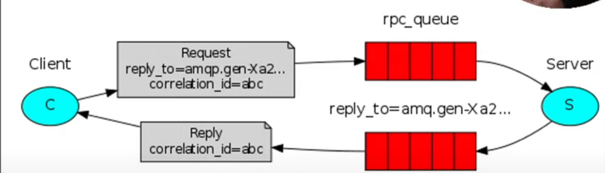
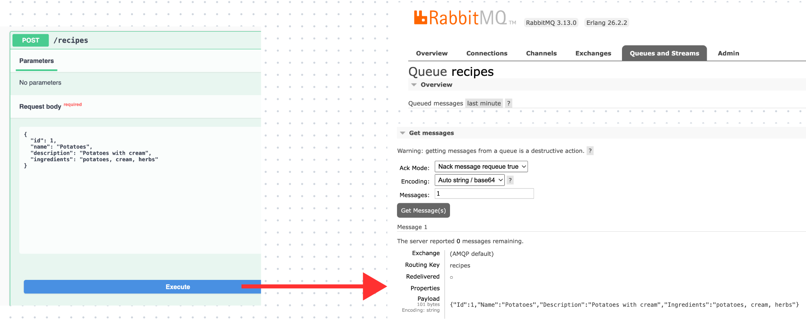
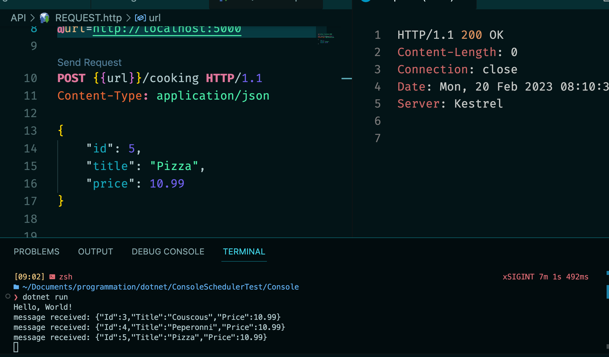

# Message Broker with `RabbitMQ`


## Présentation

`RabbitMQ` est un `Message Broker`, il reçoit et délivre des messages.

On peut le considérer comme un bureau de poste.



Queuq'un qui envoie un message est un `Publisher`.

Suelqu'un qui en reçoit est un `Consumer`.

L'ordre des messages doit être respecté, premier arrivé, premier sorti (`first in first out`:`fifo`).


## Publish/Subscribe

Les `Consumer` ne sont pas intéressés par tous les messages mais seulement par certain type.

C'est avec les `Topic` que chaque service va pouvoir s'abonner (`subscribes`) aux messages qui l'intéresse.



Chaque `queue` n'est concernée que par certain `types`.


## `RPC` Request/Reply Pattern



Dans cette architecture on porte attention à la réponse du `Consumer`.

Le `Producer` est attentif au contenu de la réponse pour savoir s'il doit continuer d'envoyer des messages.


## Création d'un exemple

On créé une solution `RabbitMQExperiment` et dedans on un `producer` : `RabbitProducer` sous la forme d'une `minimal api` et un programme console qui sera `consumer` : `RabbitConsumer`.


## Installation du `nuget` `RabbitMQ.Client` dans l'`API`

```bash
dotnet add package RabbitMQ.Client
```


## `RabbitProducer` : L'`APi`

On créé un dossier `Services` et dedans une interface `IMessageProducer.cs`.

```cs
public interface IMessageProducer
{
    public void SendingMessage<T>(T message);
}
```

Et maintenant on implémente cette interface dans la classe `MessageProducer`.

```cs
using System.Text;
using System.Text.Json;
using RabbitMQ.Client;

public class MessageProducer : IMessageProducer
{
    public void SendingMessage<T>(T message)
    {
        // ON VA D'ABORD CREER UNE CONNEXION A RABBITMQ
        var factory = new ConnectionFactory {
            HostName = "localhost",
            UserName = "guest",
            Password = "guest",
            VirtualHost = "/"
        };

        var conn = factory.CreateConnection();

        using var channel = conn.CreateModel();

        channel.QueueDeclare("recipes", durable: true, exclusive: false);

        var jsonString = JsonSerializer.Serialize(message);
        var body = Encoding.UTF8.GetBytes(jsonString);

        channel.BasicPublish("", "recipes", body: body);
    }
}
```

> #### ! il faut mettre `exclusive` à `false` si on veut utiliser la `queue` dans un autre programme, comme `RabbitConsumer`.

On déclare une `Queue` avec `channel.DeclareQueue` et on envoie un `message` à la `queue` avec `channel.BasicPublish`.

Le `body` envoyé doit être un tableau d'octets (`byte[]`).

### Ajouter le `service`

Dans `Program.cs`

```cs
builder.Services.AddScoped<IMessageProducer, MessageProducer>();
```


### Créer le `Endpoint`

Dans un `endpoint` :

```cs
// In-Memory DB
List<Recipe> recipes = [];

app.MapPost("/recipes", (Recipe recipe, IMessageProducer messageProducer) => { 
    recipes.Add(recipe);
    foreach(var r in recipes) Console.WriteLine(r);
    
    messageProducer.SendingMessage(recipe);
    
    return Results.Ok();
});
```



Dans l'`interface` de `RabbitMQ`, on voie qu'une `queue` a été créée et qu'elle a un total de `1 message`.

> Ici on voie que la `queue` est `Excl` : `exclusive`, cela posait des problèmes de partage entre mes deux programmes, je l'ai mis à `false`.

## Recevoir un `Message` dans un programme `Console` :  `.net`

```cs
using System.Text;
using RabbitMQ.Client;
using RabbitMQ.Client.Events;

var factory = new ConnectionFactory
{
    HostName = "localhost",
    UserName = "user",
    Password = "mypass",
    VirtualHost = "/"
};

var conn = factory.CreateConnection();

using var channel = conn.CreateModel();

channel.QueueDeclare("cooking", durable: true, exclusive: false);

var consumer = new EventingBasicConsumer(channel);

consumer.Received += (model, eventArgs) =>
{
    var body = eventArgs.Body.ToArray();

    var message = Encoding.UTF8.GetString(body);

    Console.WriteLine($"message received: {message}");
};

channel.BasicConsume("cooking", true, consumer);

Console.ReadKey();
```

À chaque fois qu'un message est envoyé dans la `Queue`, il est reçut par le programme `console`: 




