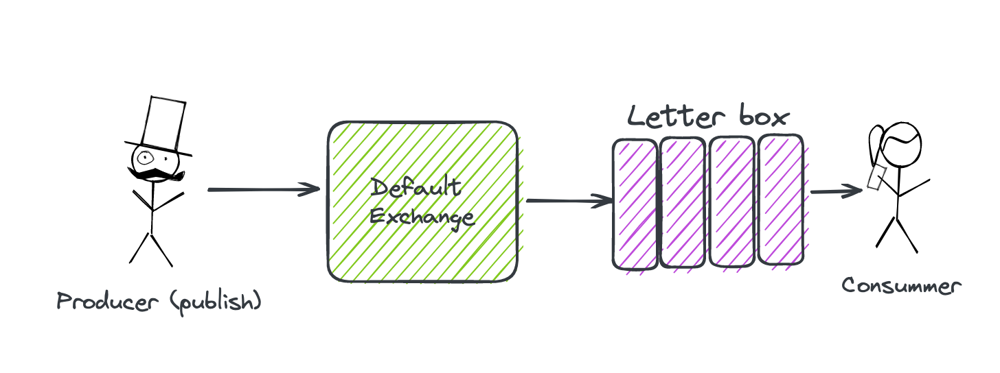

# 01 Introduction

`RabbitMQ` est un `Message Broker` distribué (`courtier en message sur le réseau`).

Cela permet de créer un découplage entre les différentes parties d'un système informatique.

La pluspart des `Message Broker` utilisent une communication `asynchrone` et non un simple pattern `requset/reply`. 

## Terminologie


### `Message Broker`, `Producer` et `Consumer`

`RabbitMQ` est défini comme un `Message Broker` on peut voire cela comme un `Service Postale`.

`RabbitMQ` est responsable de transmettre un `Message` d'un `Producer` (`émetteur`) à un `Consumer` (`destinataire`).

Un `Producer` est quelque chose qui publie (`Publishing`) un `Message` sur `RabbitMQ` (c'est la personne qui poste une lettre).

Une fois le `Message` (la lettre) déposé, il n'y a pas besoin d'attendre une réponse, on nereste pas devant la boîte, c'est une communication `Asynchrone`.

Un call `GET Http` est une communication `synchrone` en comparaison, on doit attendre la réponse sans rien faire.


### `Exchange` et `Queue`

Les mécanismes capablent de transmettre les `messages` sont les `exchanges` et les `queues`.

Les `Exchanges` sont un peu comme le cerveau de `RabbitMQ`, il existe plusieurs types d'`Exchange` et c'est à eux que le `Producer` envoie ses `messages`.

Les `Messages` sont mis dans des `Queues` par les différents `Exchanges` et y reste jusqu'à ce qu'ils soient consommés par les différents destinataires (`Consumer`).

On peut voire les `Exchanges` comme des centres de trie et les `Queues` comme des boîtes au lettre.

Un `Exchange` peut être relié avec plusieurs `Queues` et une `Queue` peut être reliée à plusieurs `Exchanges`, on doit créer des `Bindings` entre les `Exchanges` et les `Queues`.

De même un `Consumer` peut consommer une ou plusieurs `Queues`.


### `Connection` et `Channel`

Chaque `Producer` ou `Consumer` doit ouvrir une `Connection` (`TCP`) vers `RabbitMQ`.

Une `connection` peut elle, avoir plusieurs `channels`. Un `Channel` utilise un `Thread` séparé et est ainsi séparé des autres `Channels`.

Cela isole les messages et préserve les ressources (1 `connection` par `consummer`).

> **ChatGPT**
>
> 1. **Ouverture d'une connexion (Connection)** :
>
>    - Une connexion RabbitMQ est une connexion TCP entre votre application et le serveur RabbitMQ.
>
>    - Une connexion est généralement établie une seule fois au démarrage de l'application et reste ouverte pendant toute la durée de vie de l'application.
>
>    - L'ouverture d'une connexion est une opération relativement coûteuse en termes de ressources, donc vous ne voulez généralement pas ouvrir et fermer des connexions fréquemment.
>
>    - Les connexions sont utilisées pour établir et gérer des canaux.
>
> 2. **Ouverture d'un canal (Channel)** :
>
>    - Un canal RabbitMQ est une "sous-connexion" logique à l'intérieur d'une connexion RabbitMQ.
>
>    - Les canaux sont utilisés pour la plupart des opérations de communication avec RabbitMQ, telles que la publication de messages, la consommation de messages, la déclaration de files d'attente et d'échanges, etc.
>
>    - Contrairement à l'ouverture d'une connexion, l'ouverture d'un canal est une opération légère et peu coûteuse en termes de ressources.
>
>    - Vous pouvez ouvrir plusieurs canaux au sein d'une même connexion pour traiter des opérations concurrentes ou pour séparer logiquement les différentes tâches de votre application.

## Exemple en `c#`



```bash
dotnet add package RabbitMQ.Client
```


### `Producer` (`Console app`)

```cs
using RabbitMQ.Client;

var factory = new ConnectionFactory { HostName = "localhost" };

using var connection = factory.CreateConnection();
using var channel = connection.CreateModel();
```
Alternative
```cs
var factory = new ConnectionFactory();

using var connection = factory.CreateConnection("localhost");
using var channel = connection.CreateModel();
```
```cs

channel.QueueDeclare(
	queue: "letterbox",
    durable: false,
    exclusive: false,
    autoDelete: false,
    arguments: null
);

var message = "This is my first message";

var encodedMessage = Encoding.UTF8.GetBytes(message);

channel.BasicPublish("", "letterbox", null, encodedMessage);

Console.WriteLine($"Published message: {message}");
```

`""` le premier argument représente le `default exchange`.

`ConnectionFactory` a des valeurs par défaut pour le `UserName` et le `Password`:

```cs
public string Password { get; set; } = "guest";
// ...
public string UserName { get; set; } = "guest";
```

On peut bien sûr redéfinir ces valeurs dans la liste d'initialisation:

```cs
var factory = new ConnectionFactory { HostName = "localhost", Password = "huk@r99_", UserName = "hukar" };
```

#### Pour envoyer du `JSON`

```cs
var jsonContent = JsonSerializer.Serialize(new { Name = "Tutoise", Age = 144 });

var body = Encoding.UTF8.GetBytes(jsonContent);

channel.BasicPublish("","FishQueue",false, null, body);
```


### `Consumer` (`Console app`)

```cs
using RabbitMQ.Client;
using RabbitMQ.Client.Events;

var factory = new ConnectionFactory { HostName = "localhost" };

using var connection = factory.CreateConnection();
using var channel = connection.CreateModel();

channel.QueueDeclare(
	queue: "letterbox",
    durable: false,
    exclusive: false,
    autoDelete: false,
    arguments: null
);

var consumer = new EventingBasicConsumer(channel);

consumer.Received += (model, eventArgs) => {
  var body = eventArgs.Body.ToArray();
    var message = Encoding.UTF8.GetString(body);
    Console.WriteLine($"message received: {message}");
};

channel.BasicConsume(queue: "letterbox", autoAck: true, consumer: consumer);

Console.ReadKey();
```

