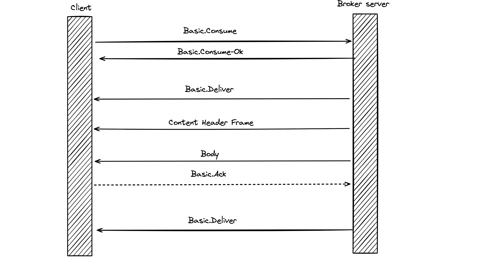

# 02 `AMQP`

`RabbitMQ` utilise la version `0.9.1` du protocole.

La version `1.0` est un protocole complétement différent, utilisable dans `RabbitMQ` via un Pluggin.

## Advanced Message Queuing Protocole

`AMQP` utilise un pattern `Remote Procedure Call` (`RPC`) qui permet à un ordinateur par exemple le `Client` d'exécuter un programme ou un méthode sur un autre ordinateur, le `Broker`.

Cette communication est bi-directionnelle et le `Client` comme le `Broker` peuvent faire tourner un programme ou appeler une méthode l'un sur l'autre.

Tout comme en programmation objet, `AMQP` utilise des commandes définies par une `class` et une `method`.

Par exemple `exchange` est la `class` et `declare` est la `methode`, l'ensemble forme une `command`.

Lorsqu'une `command` est envoyée à un `broker` (`rabbitmq`), elle est contenu dans une structure de données standardisée nommée `frame`.

## `Frames`

Il y a quatre types de `frame`:

- `Method Frame`
- `Content Header Frame`
- `Body Frame`
- `Heartbeat Frame`

`Frame Type 1` correspond à `Method Frame`.

`size` représente la taille du message. Cette valeur exclu le `Frame End` .

`40` est l'`ID` qui précise la `class` ici `exchange`.

`10` est l'`ID` qui précise la `method` ici `declare`.

Plus d'infos dans le document `amqp-xml-doc0-9-1.pdf` téléchargeable sur le site `amqp.org`.

Les arguments sont aussi définis dans la spécification :

Chaque communication commence par une `Method Frame`.

## Communication `Client` `Broker`

### `Connection` negociation

Le `Connection.Tune` contient de nombreuses informations pour le `Client`, le maximum de `Channel`, la taille maximum pour un `Frame`.

La communication entre le `Client` et le `Broker` ( `server` ) pour la négociation de la connection suit un pattern `request/response`, ce n'est pas toujours le cas.

## Déclarer une `Queue`

S'il y a une erreur le `Broker` va fermer le `Channel` d'où est émis cette requête `RPC`.

## Publier un `Message` sur un `Exchange`

`Content Header Frame` va contenir des détails sur la taille du contenu qui va être publié.

Un ou plusieurs `Frame Body` va/vont ensuite être envoyé(s). le nombre de ces `Body` va dépendre de la taille du message ainsi que la taille maximum d'un `Frame` défini lors de la négociation.

## Récupérer un `Message` avec `Get`

Le `Client` peut utiliser `Basic.Get` cette méthode fourni un accès direct au `Message` dans une communication `synchrone`, utilisé dans des applications où synchroniser les fonctionnalités est plus important que les performances.

S'il n'y a pas de `Message` la réponse est `Basic.Get-Empty`.

Le client peut renvoyer un accusé de réception (`acknowledgement`) à moins que l'option `no-acknowledgement` ai été spécifiée dans la méthode `Get`.

Les `Messages` sont envoyés un par un et pour en récupérer un autre il faut recommencer le processus entier avec `Basic.Get`.

## `Consume` les `Messages`

`Basic.Get` n'est pas la meilleur façon de récupérer les `messages` dans `RabbitMQ`, on lui préférera `Basic.Consume`.

Cette méthode demande au serveur de démarrer un `Consumer` qui est une requête éphémère pour les messages d'une `Queue` particulière.

Le `Consumer` vit autant que le `Channel` pour lequel il est déclaré ou jusqu'à ce que le `Client` le supprime.

Le server retourner un `Basic.Deliver` puis le `Content Header Frame` et le `Body`.

Un `Ack` peut être retourné par le `Client`. L'opération se poursuie jusqu'à ce qu'il n'y ai plus de `Messages`, elle reprends à `Basic.Delivier` et non pas à `Basic.Consume`.

