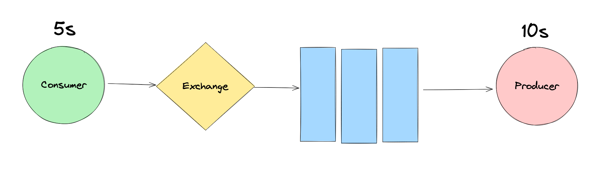
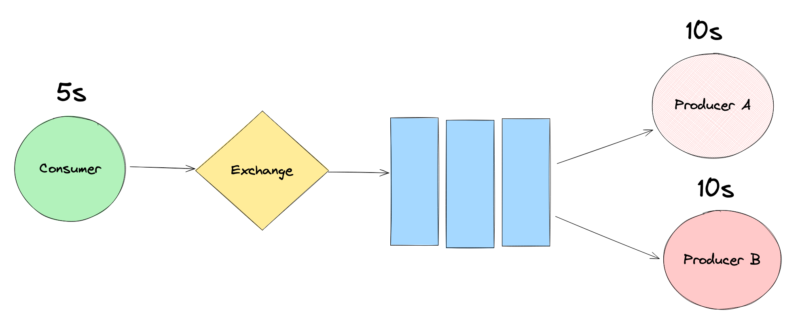
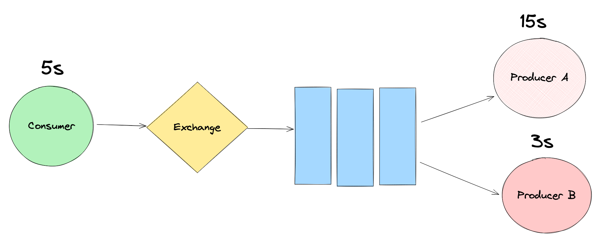
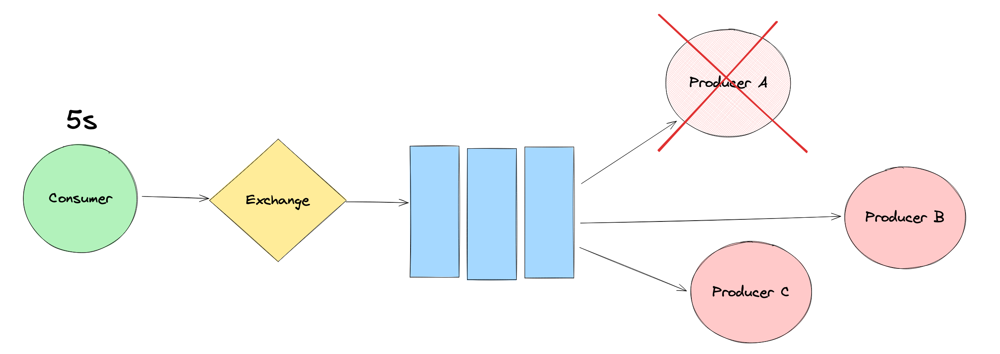
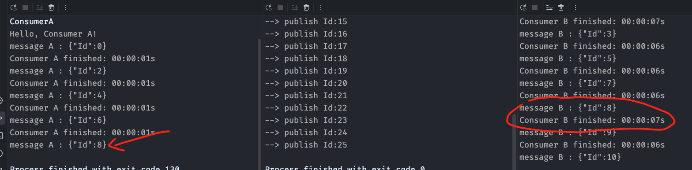
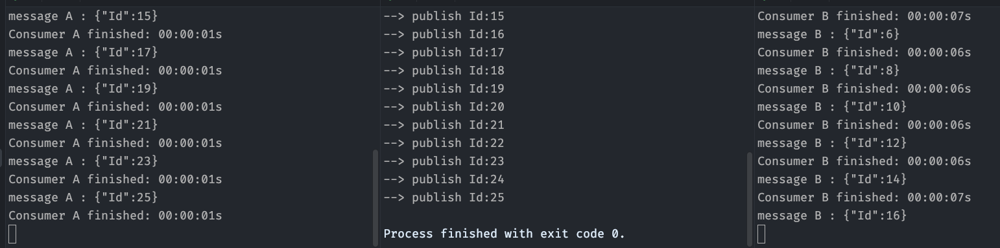
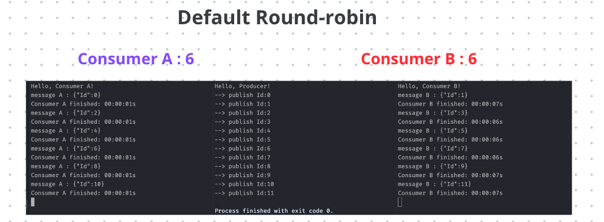
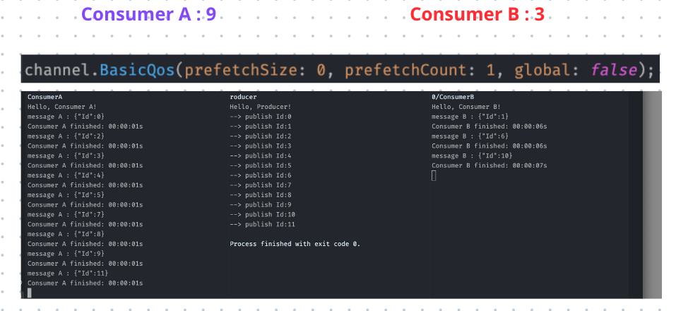

# 02 `Consumers` concurrents

Ce pattern est utilisé pour des tâche assez longue: `image processing`, `machine learning`.

Au lieu d'attendre la fin de la tâche, on envoie celle-ci vers des `Workers` via la `Queue` qui la réalise pour nous.

Pour le `web` cela permet de ne pas bloquer la petite fenêtre d'une communication `HTTP`.

Cela améliore aussi la `scalability` et la `reliability` (fiabilité) du système.


## Le problème

Si un `Producer` envoie une tâche toute les `5s` et que le `Consumer` met `10s` à la réaliser, cela créer une accumulation dans la `Queue` (`backlog`), le `Broker` peut à terme être `Out Of Memory`.



On peut ajouter un nouveau `Producer`:



`rabbitMQ` par défaut gère le système en `Round-Robin`, chacun son tour.

Ce n'est pas l'approche la plus efficace si chaque `Producer` traite le `Message` dans un temps différent le `Producer A` aura `2` message en attente (dans la `Queue`) alors que le `Producer B` en aura `0` :



On doit régler la valeur de `prefetch` à `1` pour que `RabbitMQ` n'envoie pas plus de `1` message par `Worker`.

Ce pattern permet de faire tourner plus de `Worker` si nécessaire (`scalability`) et permet que si l'un crash, il reste toujours au moins un autre `Worker` pour acomplir la tâche (`reliability`).




## `Acknowledgement`

Pour mettre en place manuellement l'accusé de réception on désactive `autoAck` :

```cs
channel.BasicConsume(queue: "concurrentQueue", autoAck: false, consumer: consumer);
```

Si un message n'est pas manuellement accusé de réception, il retournera dans la `Queue` pour être traité par un autre `Consumer`.

Avec `autoAck: true` le message est automatiquement confirmé dès la réception.


### `channel.BasicAck`

Pour confirmer un `Message` manuellement on utilise la méthode `channel.BasicAck` :

```cs
channel.BasicAck(deliveryTag: ea.DeliveryTag, multiple: false);
```

Si un `Consumer` crash sans que l'`acknowledge` ne soit retourné, le `Message` retourne dans la `Queue` et peut-être traité par un autre `Consumer` :



## Round-robin

Par défaut les `Consumer` prennent un message `chacun son tour`. Si le temps de traitement est favorable à un `Consumer`, il se retrouve à attendre pendant que l'autre finit sa charge de travaille (la moitié des `Messages`).



Ici on voit que le `Producer` a finit d'envoyer tous ses `Messages`, le `Consumer A` a finit de traiter la moitié des `Messages` alors qu'il reste encore `4 messages` pour le `Consumer B`.

Malgré tout le `Consumer A` ne lui viendra pas en aide et restera à rien faire jusqu'à ce que `Consumer B` ai traité autant de `Messages` que lui.



## Résolution `prefetch` : `fair distribution`

Dans le `Consumer` on va ajouter ce réglage au `channel` :

```cs
channel.BasicQos(prefetchSize:0, prefetchCount: 1, global: false);
```



Maintenant le `Consumer A` ne reste plus sans rien faire et prend autant de `Message` qu'il peut traiter. Le nombre de `Message` par `Consumer` n'a plus à être identique.

`QoS` : Quality Of Service

> **ChatGPT**
>
> - `prefetchSize`: Cela spécifie la taille maximale (en octets) des messages que le consommateur peut recevoir en avance. Dans ce cas, il est défini sur 0, ce qui signifie qu'il n'y a pas de limite de taille spécifique.
> - `prefetchCount`: Cela spécifie le nombre maximum de messages que le consommateur peut recevoir en avance. Dans ce cas, il est défini sur 1, ce qui signifie que le consommateur ne recevra qu'un seul message à la fois en avance.
> - `global`: Ceci indique si les paramètres de `QoS` doivent être appliqués au canal entier ou à chaque consommateur individuellement. Lorsque `global` est défini sur `false`, cela signifie que les paramètres s'appliquent à chaque consommateur individuellement.
>  
> En résumé, cette ligne de code garantit qu'un seul message est envoyé à un consommateur à la fois et qu'il n'y a pas de limite de taille spécifique pour les messages. Cela peut être utile pour garantir un traitement équitable des messages entre plusieurs consommateurs et éviter qu'un consommateur ne soit surchargé de messages.


## Code

### `Producer`

```cs
var factory = new ConnectionFactory();

using var connection = factory.CreateConnection("localhost");
using var channel = connection.CreateModel();

channel.QueueDeclare(
    "concurrentQueue",
    durable: false,
    exclusive: false,
    autoDelete: false
);

for (var i = 0; i < 12; i++)
{
    var message = new { Id = i };
    
    var messageSerialized = Encoding.UTF8.GetBytes(JsonSerializer.Serialize(message));

    Task.Delay(TimeSpan.FromSeconds(2)).Wait();
    Console.WriteLine($"--> publish Id:{i}");
    channel.BasicPublish("","concurrentQueue", null, messageSerialized);
}
```


### `Consumer`

```cs
var factory = new ConnectionFactory();

using var connection = factory.CreateConnection("localhost");
using var channel = connection.CreateModel();

channel.BasicQos(prefetchSize: 0, prefetchCount: 1, global: false);

var consumer = new EventingBasicConsumer(channel);

var random = new Random();

var n = random.Next(1, 4);

var processingTime = TimeSpan.FromSeconds(random.Next(n, (n+ 3)));
Console.WriteLine($"Processing Time : {processingTime}");

consumer.Received += (_, ea) =>
{
    var message = Encoding.UTF8.GetString(ea.Body.ToArray());
    Console.WriteLine($"message A : {message}");
    
    Task.Delay(processingTime).Wait();
    Console.WriteLine($"Consumer A finished\n");
    
    channel.BasicAck(deliveryTag: ea.DeliveryTag, multiple: false);
};

channel.BasicConsume("concurrentQueue", autoAck: false, consumer);

Console.ReadKey();
```


