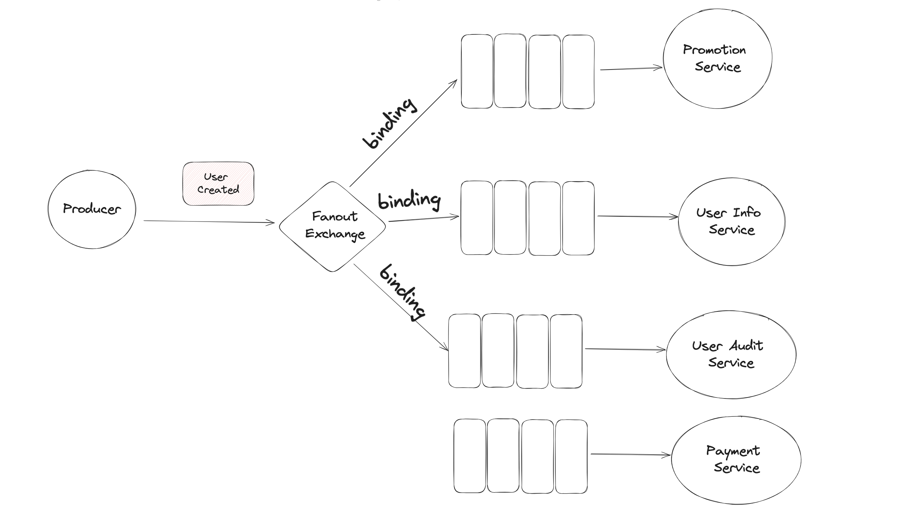
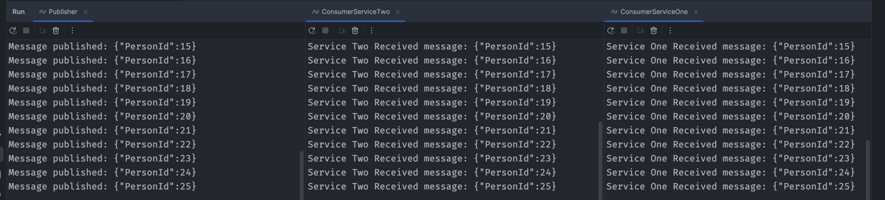
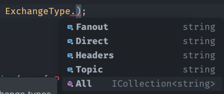
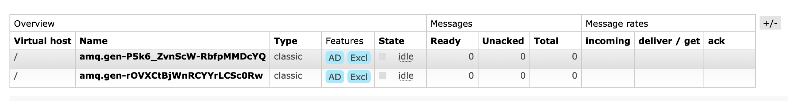
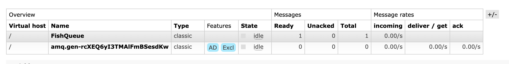

# 03 `Pub/Sub`

Délivrer le même `Message` à plusieurs `Consumer`.

Dans le cas où une personne créé un nouvel acompte, il est possible que plusieurs `Services` soit concerné par cet événement.


## `Fan Out Exchange`



C'est en jouant sur l'`Exchange` que l'on va réaliser ce `pattern Pub/Sub`.

`RabbitMQ` ne stocke pas plusieurs copies du `Message`, il le stocke une seule fois et chaque `Queue` reçoit une référence du `Message`.

Le `Producer` ne s'inquiète pas de savoir combien de `Services` vont recevoir son `Message`, `0` ou `9` peut importe, il envoie son `Message` au `Fanout Exchange` et c'est tout.

C'est le `Fanout Exchange` qui s'occupe de redistribuer le `Message` dans les `Queue` abonnée. Les `Queues` sont `Bindées` à l'`Exchange` qui les intéresse.

Le `Producer` et totalement découplé des `Services`.

C'est au `Queue` de se lier (`Binding`) à l'`Exchange Fanout`.

Les `Queues` dans ce pattern sont des `Queues` temporaire et détruites après consommation des `Messages`.


## Implémentation en `c#`

Chaque service reçoit et traite sa propre copie du `message` à son propre rythme.




### Commun au trois `Projets`

```cs
var factory = new ConnectionFactory();
using var connection = factory.CreateConnection("localhost");
using var channel = connection.CreateModel();
```


### `Publisher`

```cs
channel.ExchangeDeclare(exchange: "user_created", type: ExchangeType.Fanout);

for (var i = 0; i < 26; i++)
{
    var message = JsonSerializer.Serialize(new { PersonId = i});
    var body = Encoding.UTF8.GetBytes(message);
    
    Task.Delay(TimeSpan.FromSeconds(2)).Wait();
    
    channel.BasicPublish(
        exchange: "user_created", 
        routingKey: "", 
        basicProperties: null, 
        body: body
    );
    
    Console.WriteLine("Message published: " + message);
}
```

Le `Producer` ne doit plus déclaré de `Queue` car chaque `Consumer` aura sa propre `Queue`.

On doit cette fois explicitement créer un `Exchange` avec `ExchangeDeclare`. On lui donne un nom et un type.



On publie sur l'`Exchange` déclaré `exchange: "user_created"`, on laisse vide la `routingKey`.


### `Consumer Service`

```cs
var queueName = channel.QueueDeclare().QueueName;

channel.QueueBind(queueName, "user_created", "");

var consumer = new EventingBasicConsumer(channel);

consumer.Received += (model, ea) =>
{
    var body = ea.Body.ToArray();
    var message = Encoding.UTF8.GetString(body);
    Task.Delay(TimeSpan.FromSeconds(1)).Wait();
    Console.WriteLine("Service One Received message: {0}", message);
};

channel.BasicConsume(queue: queueName, autoAck: true, consumer: consumer);
Console.ReadKey();
```

On peut aussi ajouter la déclaration de l'`Exchange` ici dans le cas ou le `Consumer` démarrerait avant le `Producer` :

```cs
channel.ExchangeDeclare(exchange: "user_created", type: ExchangeType.Fanout);
```

`QueueDeclare()` prends les valeurs par défaut suivantes :

```cs
channel.QueueDeclare(
    string queue = "", 
    bool durable = false, 
    bool exclusive = true,
    bool autoDelete = true, 
    IDictionary<string, object> arguments = null
);
```

Si on laisse une chaine vide pour le nom de la `Queue`, `RabbitMQ` va lui en donner un temporaire :



On voit que la `Queue` est exclusive et qu'elle va s'auto-détruire quand le `Consumer` s'éteint.

Si je coupe un process de `Consumer`:

```bash
// ...
Service Two Received message: {"PersonId":25}

Process finished with exit code 130.
```

Je perds immédiatement une `Queue` :



C'est ensuite la responsabilité du `Consumer` d'effectuer un `Binding` de la `Queue` avec l'`Exchange`:

```cs
channel.QueueBind(queue: queueName, exchange: "user_created", routingKey: "");
```


