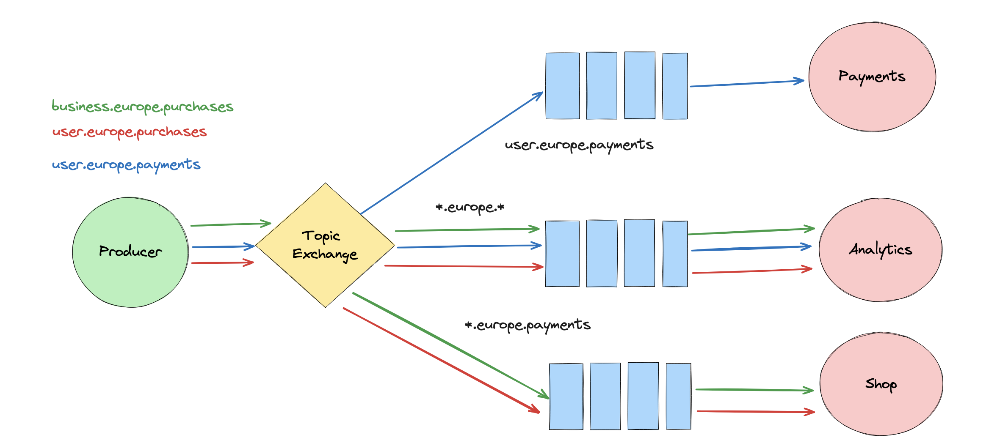

# 04 `Routing`

On veut envoyer un `Message` à différents `Services`.

## Utilisation d'un `Direct Exchange`


Le `Default Exchange` est un `Direct Exchange` sans nom.

Un `Direct Exchange` utilise des `Binding Keys` et des `Routing Keys` pour intelligemment router le `Message`.

Un `Binding` doit être créer entre une `Queue` et un `Exchange`. On doit définir une `Binding Key`.

La `Routing Key` doit correspondre à la `Binding Key` souhaitée.

Une `Queue` peut avoir de multiple `Binding Keys` et plusieurs `Queues` peuvent avoir la même `Binding Key`,  ce qui rend le système très souple.


## Utilisation d'un `Topic Exchange`



La `Routing Key` contient une liste de mot séparés par un point : `user.europe.payment`.

On va utiliser des `Binding keys` pour lier nos `Queues` avec le `Topic Exchange`.

On utilise les `Routing Keys` vu plus haut pour envoyer nos `Messages` au `Topic Exchange`.

On peut utiliser les `Routing Keys` dans leur entiéreté comme avec `Direct Exhange` mais leur force est d'utiliser des `Wildcard`.

- `*` se substitue à un mot : `user.europe.*`, `*.europe.purchases`, `consumer.*.payments`. On peut aussi remplacer plusieurs mot par exemple : `*.europe.*`.

- `#` se substitue à `0` ou plus mots : `user.#`


## Implémentation `Direct Exchange`

### `Code` en commun

```cs
using System.Text;
using RabbitMQ.Client;
using RabbitMQ.Client.Events; // pour les Consumers

var factory = new ConnectionFactory();
using var connection = factory.CreateConnection("localhost");
using var channel = connection.CreateModel();
```


### `DirectProducer`

```cs
channel.ExchangeDeclare(
    exchange: "myroutingexchange",
    ExchangeType.Direct
);

for (var i = 0; i < 26; i++)
{
    Task.Delay(TimeSpan.FromSeconds(1)).Wait();
    var messagePayment = Encoding.UTF8.GetBytes($"Message Payment {i}");
    channel.BasicPublish(
        exchange: "myroutingexchange",
        routingKey: "paymentskey",
        basicProperties: null,
        body: messagePayment
    );
    Console.WriteLine($"Message Payment {i}");
    
    Task.Delay(TimeSpan.FromSeconds(1)).Wait();
    var messagePayment = Encoding.UTF8.GetBytes($"Message Shop {i}");
    channel.BasicPublish(
        exchange: "myroutingexchange",
        routingKey: "shopkey",
        basicProperties: null,
        body: messagePayment
    );
    Console.WriteLine($"Message Shop {i}");
}
```


### `AnalyticsConsumer`

```cs
channel.ExchangeDeclare(
    exchange: "myroutingexchange",
    ExchangeType.Direct
);

var queueName = channel.QueueDeclare().QueueName;

channel.QueueBind(
	queue: queueName,
    exchange: "myroutingexchange",
    routingKey: "paymentskey"
);

channel.QueueBind(
	queue: queueName,
    exchange: "myroutingexchange",
    routingKey: "shopkey"
);

var consumer = new EventingBasicConsumer(channel);

consumer.Received += (_, ea) =>
{
    Task.Delay(TimeSpan.FromSeconds(2)).Wait();
    var body = ea.Body.ToArray();
    var message = Encoding.UTF8.GetString(body);
    Console.WriteLine("Analytics received message: " + message);
};

channel.BasicConsume(
    queue: queueName,
    autoAck: true,
    consumer: consumer
);

Console.ReadKey();
```

Une `Queue` peut avoir plusieurs `Binding`.


### `ShopConsumer`

```cs
channel.ExchangeDeclare("myroutingexchange", ExchangeType.Direct);

var queueName = channel.QueueDeclare().QueueName;

channel.QueueBind(
    queue: queueName,
    exchange: "myroutingexchange",
    routingKey: "shopkey"
);

var consumer = new EventingBasicConsumer(channel);

consumer.Received += (_, ea) =>
{
    Task.Delay(TimeSpan.FromSeconds(2)).Wait();
    var body = ea.Body.ToArray();
    var message = Encoding.UTF8.GetString(body);
    Console.WriteLine("Shop Received message: " + message);
};

channel.BasicConsume(
    queue: queueName,
    autoAck: true,
    consumer: consumer
);

Console.ReadKey();
```


### `PaymentsConsumer`

```cs
channel.ExchangeDeclare(
    exchange: "myroutingexchange",
    ExchangeType.Direct
);

var queueName = channel.QueueDeclare().QueueName;

channel.QueueBind(
	queue: queueName,
    exchange: "myroutingexchange",
    routingKey: "paymentsonly"
);

var consumer = new EventingBasicConsumer(channel);

consumer.Received += (_, ea) =>
{
    Task.Delay(TimeSpan.FromSeconds(2)).Wait();
    var body = ea.Body.ToArray();
    var message = Encoding.UTF8.GetString(body);
    Console.WriteLine("Payments received message: " + message);
};

channel.BasicConsume(
    queue: queueName,
    autoAck: true,
    consumer: consumer
);

Console.ReadKey();
```

On peut voire dans l'intreface de `RabbitMQ` les différents `Binding` pour un `Exchange` :


Au final on obtient un scénario complex où chaque service reçoit ses propres messages et `Analytics Service` par exemple les reçoit tous :

  

On observe que les messages sont dupliqués et non répartis.


## Implémentation `Topic Exchange`

### `Producer`

```cs
channel.ExchangeDeclare("mytopicexchange", ExchangeType.Topic); // <-

for (var i = 0; i < 26; i++)
{
    Task.Delay(TimeSpan.FromSeconds(1)).Wait();
    var messagePayment = Encoding.UTF8.GetBytes($"Message Payment {i}");
    channel.BasicPublish(
        exchange: "mytopicexchange", // <-
        routingKey: "payment.europe.user", // <-
        basicProperties: null,
        body: messagePayment
    );
    Console.WriteLine($"Message Payment Europe User {i}");
    
    Task.Delay(TimeSpan.FromSeconds(1)).Wait();
    var messageShop = Encoding.UTF8.GetBytes($"Message Jacket Europe Shop {i}");
    channel.BasicPublish(
        exchange: "mytopicexchange", // <-
        routingKey: "jacket.europe.shop", // <-
        basicProperties: null,
        body: messageShop
    );
    Console.WriteLine($"Message Shop {i}");
    
}
```


###  `Payments Service`

```cs
channel.ExchangeDeclare("mytopicexchange", ExchangeType.Topic); // <-

var queueName = channel.QueueDeclare().QueueName;

channel.QueueBind(
    queue: queueName,
    exchange: "mytopicexchange", // <-
    routingKey: "payment.#" // <-
);

var consumer = new EventingBasicConsumer(channel);

consumer.Received += (_, ea) =>
{
    Task.Delay(TimeSpan.FromSeconds(2)).Wait();
    var body = ea.Body.ToArray();
    var message = Encoding.UTF8.GetString(body);
    Console.WriteLine("Payments Received message: " + message);
};

channel.BasicConsume(
    queue: queueName,
    autoAck: true,
    consumer: consumer
);

Console.ReadKey();
```

###  

### `Analytics Service` 

```cs
channel.QueueBind(
    queue: queueName,
    exchange: "mytopicexchange", // <-
    routingKey: "*.europe.*" // <-
);
```

Ici d'aikkeurs plus besoin d'avoir deux `Binding` vers l'`Exchange`


###  `Shop service` 

```cs
channel.QueueBind(
    queue: queueName,
    exchange: "mytopicexchange", // <-
    routingKey: "#.shop" // <-
);
```


`Analitics Service` reçoit tous les `Messages` avec un seul `Binding` et le pattern `*.europe.*`.

`Payments Service` reçoit les `Messages` commençant par `payment` avec le pattern de `routing key` suivant `payment.#`.

Enfin avec le pattern `#.shop`, le `Shop Service` reçoit tous les `Message` finissant par `shop`.


