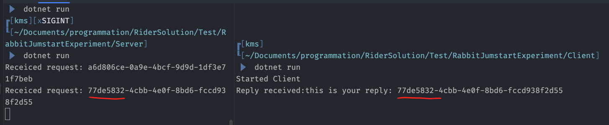

# 05 `Request/Response` pattern

On utilise les termes `Client`/`Server` plutôt que `Producer`/`Consumer` car chaque service est à la fois `Producer` et `Consumer`.

Ce pattern défini une `Queue` pour la réponse envoyée par le `Consumer`.

La réponse est envoyée typiquement par le `Default Exchange`.

C'est le `Client` qui spécifie la `Queue` de réponse via la propriété `replyQueue` du `Message`.

Le problème est de savoir comment le `Client` va pouvoir associer la réponse à une requête particulière envoyée. S'il y a beaucoup de service abonné à la même `Request Queue` il faut un mécanisme d'identification. Un `tag` unique est créé pour chaque `Request`, le `Server` peut réutiliser ce `tag` pour identifier la `Reply`, le `correlation id` est souvent utilisé dans ce but.


## Désavantages

https://www.youtube.com/watch?v=7y2DKiyHg80&ab_channel=MarkRichards

Le service `Client` doit attendre pour avoir sa réponse :


La deuxième conséquence est que les services deviennent fermement couplés :


On doit lui préférer `Async Notification` car les services ne sont plus couplés. `Async Notification` emploie deux `Channel` séparés.


En conclusion le pattern `Request / Reply` ne doit être utilisé que lorsqu'on demande des données en retour pour pouvoir continuer (afficher des données traités des données) à un autre service (`Microservice`) via une `Queue`.

## Propriétés des `Messages`

`AMQP` définit un ensemble de propriété associées au `Message` :

- `Persistent` marque les `Messages` pour une `Queue Durable` à être sauvegardé
- `DeliveryMode` alternative à `Persistent`
- `ContentType` Type MIME de l'encodage, par exemple `application/json` 
- `ReplyTo` désigne la `Queue` de réponse (`Reply`)
- `CorrelationId` utilisé pour corréler les `Requête` et les `Réponse` dans le pattern `RPC`


## Idempotent

Si le `Server` plante après avoir envoyé le `Message` de réponse mais avant d'envoyer l'accusé de réception, la requête sera de nouveau exécutée et le `Client` recevra de nouveau un `Message` de réponse. Le `correlationId` sert au `Client` à détecter le `Message` doublon et idéalement le traitement du `Server` devrait être `idempotent`.


## Fonctionnement


- Au démarage le `Client` créé une `Queue` anonyme (`amq.gen.Xa2...`)
- Pour une requête `RPC` le `Client` ajoute deux `Propriétés` au `Message` : `ReplyTo` et `CorrelationId` (unique pour chaque requête)
- La requête est envoyée à la `RPC Queue`
- Le `Server` attend un `Message` venant de cette `Queue`. Une fois le travaille terminé, il renvoie le résultat sur la `Queue` renseignée par la propriété `ReplyeTo`.
- Le `Client` attends la réponse sur la `Queue` de `callback`, quand celle-ci arrive, il vérifie le `CorrelationId`.


## Implémentation (documentation `RabbitMQ`)

https://www.rabbitmq.com/tutorials/tutorial-six-dotnet

### `Commun`

```cs
using System.Text;
using RabbitMQ.Client;
using RabbitMQ.Client.Events;

var factory = new ConnectionFactory();
using var connection = factory.CreateConnection("localhost");
using var channel = connection.CreateModel();
```


### `Server`

```cs
channel.QueueDeclare(
    queue: "rpc_queue",
    durable: false,
    exclusive: false,
    autoDelete: false
);

channel.BasicQos(prefetchSize: 0, prefetchCount: 1, global: false);

var consumer = new EventingBasicConsumer(channel);

consumer.Received += (_, ea) =>
{
    var properties = ea.BasicProperties;
    
    var code = GenerateCode();
    var body = Encoding.UTF8.GetBytes(code);

    var replyProperties = channel.CreateBasicProperties();

    replyProperties.CorrelationId = properties.CorrelationId;

    channel.BasicPublish(
        exchange: string.Empty,
        routingKey: properties.ReplyTo,
        basicProperties: replyProperties,
        body: body
    );

    Console.WriteLine($"code: {code} is published");
    channel.BasicAck(ea.DeliveryTag, multiple: false);
};

channel.BasicConsume(
    queue: "rpc_queue",
    autoAck: false,
    consumer: consumer
);

string GenerateCode()
{
    var random = new Random();
    var code =
        $"{random.Next(0, 10)}{random.Next(0, 10)}{random.Next(0, 10)}.{random.Next(0, 10)}{random.Next(0, 10)}{random.Next(0, 10)}";

    return code;
}
```

On veut pouvoir créer plusieurs instance de `Server`, pour que la répartition soit optimum, on ajoute cette ligne de code :

```cs 
channel.BasicQos(prefetchSize: 0, prefetchCount: 1, global: false);
```


### `Client`

#### `RPCClient.cs`

```cs
public class RPCClient : IDisposable
{
    
    private const string QUEUE_NAME = "rpc_queue";

    private readonly IConnection connection;
    private readonly IModel channel;
    private readonly string replyQueueName;
    private readonly ConcurrentDictionary<string, TaskCompletionSource<string>> callbackMapper = [];

    public RPCClient()
    {
        var factory = new ConnectionFactory();
        connection = factory.CreateConnection("localhost");
        channel = connection.CreateModel();

        replyQueueName = channel.QueueDeclare().QueueName;

        var consumer = new EventingBasicConsumer(channel);

        consumer.Received += (_, ea) =>
        {
            if (!callbackMapper.TryRemove(ea.BasicProperties.CorrelationId, out var tcs))
                return;
            var body = ea.Body.ToArray();
            var response = Encoding.UTF8.GetString(body);

            Console.WriteLine($"response: {response}");
            tcs.TrySetResult(response);
        };

        channel.BasicConsume(
            queue: replyQueueName,
            autoAck: true,
            consumer: consumer
        );
    }

    public Task<string> CallAsync(string message, CancellationToken token = default)
    {
        IBasicProperties properties = channel.CreateBasicProperties();

        properties.CorrelationId = Guid.NewGuid().ToString();
        properties.ReplyTo = replyQueueName;

        var body = Encoding.UTF8.GetBytes(message);

        Console.WriteLine($"message: {message}");
        var tcs = new TaskCompletionSource<string>();

        callbackMapper.TryAdd(properties.CorrelationId, tcs);

        channel.BasicPublish(
            exchange: string.Empty,
            routingKey: QUEUE_NAME,
            basicProperties: properties,
            body: body
        );

        token.Register(() => callbackMapper.TryRemove(properties.CorrelationId, out _));

        return tcs.Task;
    }


    public void Dispose()
    {
        connection.Close();
    }
}
```

#### `Client/Program.cs`

```cs
using var rpcClient = new RPCClient();


for (int i = 0; i < 26; i++)
{
    Console.WriteLine($"Message sent: numero [{i}]");
    
    Task.Delay(TimeSpan.FromMilliseconds(500)).Wait();
    var response = await rpcClient.CallAsync($"numero [{i}]");
    
    Console.WriteLine($"Received response: {response}\n");
}
```


#### `ConcurrentDictionary`

C'est une implémentation de `IDictionary<TKey, TValue>` qui permet un accès sécurisé à plusieurs `thread` simultanement.

#### `TaskCompletionSource`

C'est une classe qui permet de créer une tâche (`Task`) qui n'est pas liée à une opération asynchrone traditionnelle, mais plutôt à une opération asynchrone personnalisée ou manuelle. Il permet de contrôler manuellement l'état et le résultat d'une tâche.

C'est utile pour rendre une tâche asynchrone lorsque celle-ci ne l'est pas à la base dans `.Net`.


## Implémentation de `JumpStart`

### Client

```cs
using System.Text;
using RabbitMQ.Client;
using RabbitMQ.Client.Events;
```

```cs
var factory = new ConnectionFactory { HostName = "localhots" };

using var conn = factory.CreateConnection();
using var channel = conn.CreateModel();

var replyQueue = channel.QueueDeclare();
var requestQueue = channel.QueueDeclare(queue: "request-queue", exclusive: false);

var consumer = new EventingBasicConsumer(channel);

consumer.Received += (sender, eventArgs) =>
{
    var body = eventArgs.Body.ToArray();
    var message = Encoding.UTF8.GetString(body);
    
    Console.WriteLine($"Reply received:{message}");
};

channel.BasicConsume(queue: replyQueue.QueueName, autoAck: true, consumer: consumer);

var message = "Can I request a reply";
var body = Encoding.UTF8.GetBytes(message);

var properties = channel.CreateBasicProperties();

properties.ReplyeTo = replyQueue.QueueName;
properties.CorrelationId = Guid.NewGuid().Tostring();

channel.BasicPublish("", requestQueue.QueueName, properties, body);

Console.WriteLine($"Sending Request: {properties.CorrelationId}");

Console.ReadKey();
```


### Server

```cs
var factory = new ConnectionFactory() { HostName = "localhost" };

using var conn = factory.CreateConnection();
using var channel = connection.CreateModel();

channel.QueueDeclare(Queue: "request-queue", exclusive: false);

var consumer = new EventingBasicConsumer(channel);

consumer.Received += (model, ea) => {
    Console.WriteLine($"Receiced request: {ea.BasicProperties.CorrelationId}");
    
    var replyMessage = $"this is your reply: {ea.BasicProrties.CorrelationId}";
    
    var body = Encoding.UTF8.GetBytes(replyMessage);
    
    channel.BasicPublish("", ea.BasicProperties.ReplyTo, null, body);
};

channel.BasicConsume(queue: "request-queue", autoAck: true, consumer: consumer);

Console.ReadKey();
```


