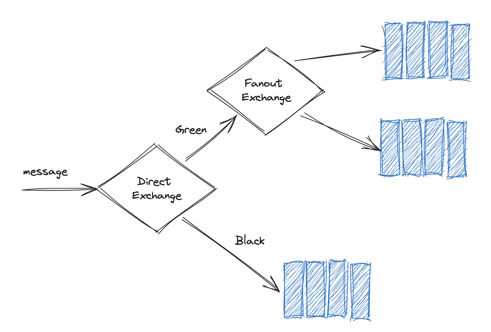
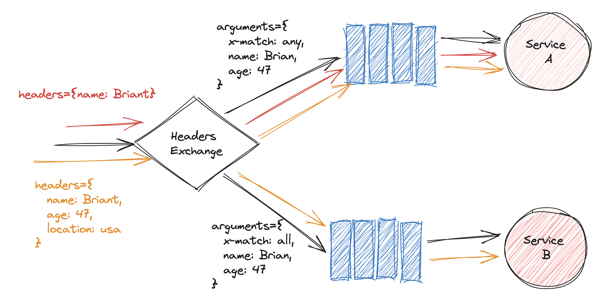
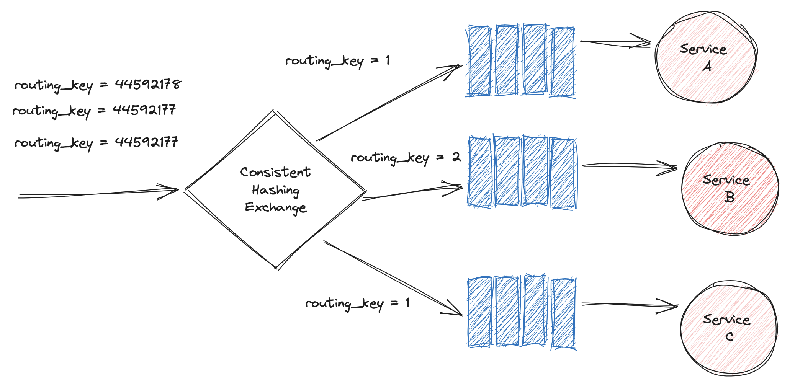

# 06 `Exchange`

Les `Exchanges` peuvent être reliés à des `Queues` mais aussi à d'autre `Exchange`.

On peut utiliser la `Routing Key` pour envoyer un `Message` vers un autre `Exchange`, par exemple un `Fanout Exchange`.

## Le `Headers Exchange`

Il utilise le contenu d'une `Headers Table` pour le routage au lieu d'une `Routing Key`.

Les `Headers` sont passés à la structure de données `Basic Properties`.

Les `Headers` se présente sous la forme d'une liste de paires `key/value`.

Le `Binding` utilise des `arguments` avec `x-match`. `x-match` va définir comment les éléments doivent correspondre, par exemple `x-match: any` (au moins un élément de la liste suivante doit correspondre). À l'inverse `x-match: all` doit faire correspondre tous les arguments.

`all` ne veut pas dire exactement et le message avec un `header` supplémentaire est accepté par la condition `x-match: all`.

## Le `Consistent Hashing Exchange`

`RabbitMQ` a quatre `Exchange` de base :

- `Direct Exchange`
- `Fanout Exchange`
- `Topic Exchange`
- `Headers Exchange`

Il faut installer un `Plugin` pour utiliser `Consistent Hashing Exchange`.

Il sert à distribuer les `Messages` de manière équitable ou non aux différentes `Queues`.

On peut justement vouloir qu'un `Service` disposant d'un meilleur `hardware` et largement plus de  `Messages` que les autres.

Une `Queue` avec une `routing key` égale à `2` recevra `2` fois plus de `Messages`.

C'est à dire qu'elle aura un espace de correspondance du `hash` deux fois plus important.

Un `Message` avec la même `routing_key` en entrant, sera assuré d'être traité par le même `Service`.

