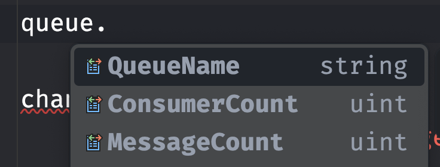

# AA L'`api` du `Client .Net`


## `ConnectionFactory`

```cs
var factory = new ConnectionFactory();

factory.UserName = "guest";
factory.Password = "guest";
factory.HostName = "localhost";

factory.ClientProvidedName = "MyApp:MYModule"; // nom de l'application pour les log de RabbitMQ
```

On peut trouver dans `ConnectionFactory` plein de réglages et de valeurs par défaut par exemple :

```cs
public const ushort DefaultChannelMax = 2047;

public static readonly TimeSpan DefaultConnectionTimeout = TimeSpan.FromSeconds(30);

public const string DefaultPass = "guest";

public const string DefaultUser = "guest";

public const string DefaultVHost = "/";
```

Et bien d'autre ...

### créer une `connection` et un `channel` : `CreateConnection`, `CreateModel`

```cs
var connection = factory.CreateConnection();
var channel = connection.CreateModel();
```


## Déclarer une `Queue`, un `Exchange` : `QueueDeclare`, `ExchangeDeclare`

Cela garantit que l'objet existe, le créant si nécessaire.

```cs
var queue = channel.QueueDeclare(
    queue: "myapp-queue",
    durable: false,
    exclusive: false,
    autoDelete: true
);

channel.ExchangeDeclare(
    exchange: "myapp-exchange",
    type: ExchangeType.Direct
);
```

La création d'un `Exchange` ne renvoie rien.

La création d'une `Queue` renvoie un objet réponse avec quelquse informations :



- le nom de la `Queue`
- le nombre de `Consumer`
- le nombre de `Message`

Il existe une version `Passive` de ces méthodes qui vérifie seulement si un objet existe :

`QueueDeclarePassive`, `ExchangeDeclarePassive`.

### Binding : `QueueBinding`

```cs
channel.QueueBind(
    queue: queue.QueueName,
    exchange: "myapp-exchange",
    routingKey: "myapp-routing-key"
);
```


## Suppression : `QueueDelete`, `QueuePurge`

```cs
channel.QueueDelete(
    queue: "myapp-queue",
    ifUnused: true, // pas de consumer
    ifEmpty: true // pas de message
);
```


### Suppression des messages

```cs
channel.QueuePurge("myapp-queue");
```


## Publier un `Message` : `BasicPublish`

```cs
byte[] body = Encoding.UTF8.GetBytes("Hello Queue");

channel.BasicPublish(
    exchange: "myapp-exchange",
    routingKey: "myapp-routing-key",
    basicProperties: null,
    body: body
);
```


### Propriété des `Messages` : `CreateBasicProperties`

```cs
IBasicProperties properties = channel.CreateBasicProperties();

properties.ContentType = "text/plain";
properties.DeliveryMode = 2; // persistant
properties.CorrelationId = Guid.NewGuid().ToString();
properties.ReplyTo = "reply-queue";
properties.Expiration = "36000000";
```


### `Headers` personnalisés

```cs 
properties.Headers.Add("autor", "Mike");
properties.Headers.Add("Role", "Redactor");
```


## Recevoir des `Messages` : `BasicConsume`

### Créer un `Consumer` : `EventingBasicConsumer`

```cs
var consumer = new EventingBasicConsumer(channel);
```


### Définir une `callback` : `Received`

```cs
consumer.Received += (model, ea) =>
{
    byte[] body = ea.Body.ToArray();

    //...
    channel.BasicAck(ea.DeliveryTag, false);
};
```


### Recevoir les `Messages`

```cs
string consumerTag = channel.BasicConsume(
    queue: queue.QueueName,
    autoAck: false,
    consumer: consumer
);
```

`autoAck: true` renvoie un accusé de réception dès l'arrivé du `Message`.


### Annuler un `Consumer`

```cs
channel.BasicCancel(consumerTag);
```


## Considérations sur la concurrence

Les `channels` ne doivent pas être partagés entre plusieurs `Thread`.

Une instance de `IModel` doit être utilisé sur une même `Thread`.


### Gestion de la concurrence des `Consumer` : `ConsumerDispatchConcurrency`

```cs
factory.ConsumerDispatchConcurrency = 12;
```

Le nombre efficace est celui du nombre de procésseurs (chez moi 6 physiques 12 logiques).