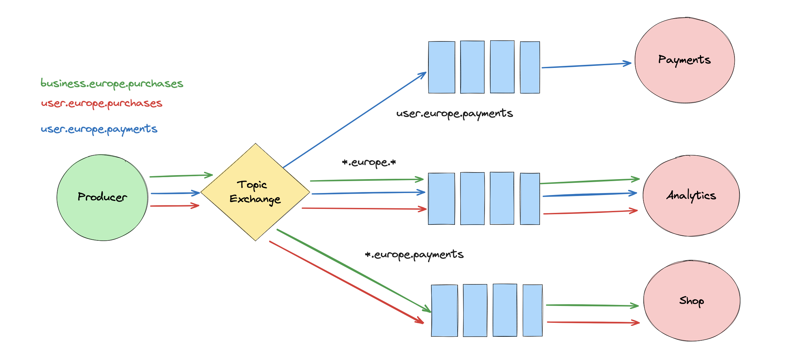
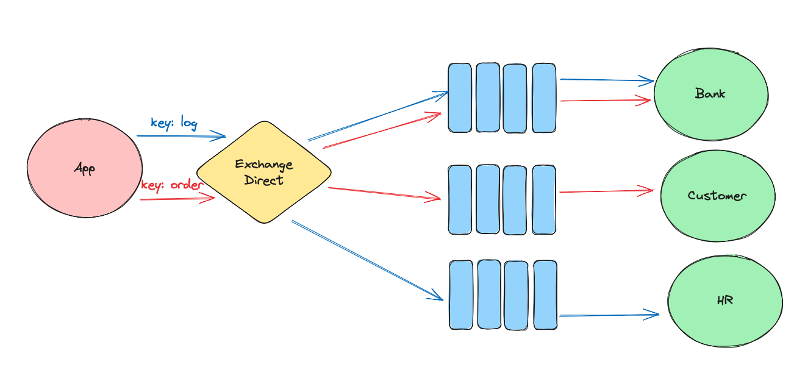

# BB Résumé pour la démo

## Terminologie

`Message Broker` distribué = courtier (intermédiaire) en message sur le réseau.

Communication `asynchrone`.


`Producer` = émetteur, il publie : `Publishing` un `message`.

`Consumer` = destinataire du `message`.

> Une fois le `message` envoyé, on n'attend pas la réponse. (≠ call `HTTP`)

`Exchange` = centre de trie, routeur de `message`. Il existe plusieurs types d'`exchange`.

`Binding` = un lien entre une `queue` et un `exchange`.

Une `queue` peut être `Bindée` à plusieurs `exchanges`.

Un `exchange` peut être `bindé` à plusieurs `queues`.

Un `consumer` peut consommer (s'abonner) à plusieurs `queues`.

Une `connection` = c'est une connexion `TCP` entre l'application et le serveur `RabbitMQ`. Elle reste ouverte pendant toute la durée de vie de l'application.

Les `Channels` = canaux, `thread` séparé pour exécuter une opération. Plusieurs `channels` par `connection` pour séparer logiquement les tâches ou effectuer des opérations concurrentes.


## Exemple simple


### Exo 1

 créer un exemple simple avec deux applications `console`. (30mn)

=> Corrrection Code démo.


## `AMQP` : Advanced Message Queuing Protocole

`RabbitMQ` utilise la version `0.9.1`. (la version `1.0` ets complétement différente)


## `Consumers` concurrents

Cela permet de ne pas bloquer la fenêtre de communication `HTTP`.

Cela améliore la `scalability` et la `reliability` (fiabilité).


Si un `worker` crash, il reste un autre `worker` pour accomplir la tâche.

### Exo 2

Créer un exemple avec un `Producer` et deux `Worker` (Console App)


## Accusé de reception

Avec `autoAck: true`, en cas de problème les `messages` ne sont pas gardés dans la `Queue`.

Si l'accusé de reception manuel n'est pas renvoyé, le message retourne dans la `Queue`.


### Exo 3

Ajouter les accusé de reception manuels


## `Round-robin` : chacun son tour

Les `messages` sont redistribués de manière équitable entre les `workers`.

### Problème

Un `worker` ayant fini reste à attendre.

## Solution : `prefetch`

### Exo 4

On va traiter les messages un par un en configurant le `channel` des `workers` (`consumers`).

Un `channel` peut être configuré grâce à sa méthode `BasicQoS`, Quality of Service.

> ### Remarque :
>
> Si un des `Worker` crash seul un `message` reste bloqué jusqu'à ce que celui-ci s'arrête ou redémarre


## Exchange

- Direct
- Fanout
  

  ```cs
  channel.ExchangeDeclare(exchange: "user_created", type: ExchangeType.Fanout);
  
  var queueName = channel.QueueDeclare().QueueName;
  channel.QueueBind(
      queue: queueName, 
      exchange: "user_created",
      routingKey: ""
  );
  ```
  
- Headers
  

  ```cs
  channel.ExchangeDeclare(exchangeName, ExchangeType.Headers);
  
  var headers = new Dictionary<string, object>
  {
      { "x-match", "any" }, // "all" = tous les en-têtes correspondent
      { "header1", "value1" }, // Remplacez par vos en-têtes et valeurs
      { "header2", "value2" } 
  };
  
  channel.QueueBind(queueName, exchangeName, string.Empty, headers);
  ```

  Pour publier un `message`:
  
  ```csharp
  var properties = channel.CreateBasicProperties();
  properties.Headers = new Dictionary<string, object>
  {
      { "header1", "value1" },
      { "header2", "value2" }
  };
  
  var messageBody = Encoding.UTF8.GetBytes("Votre message ici");
  channel.BasicPublish(
      exchange: "myexchange",
      routingKey: string.Empty,
      basicProperties: properties,
      body: messageBody
  );
  ```
  
- Topic
  
  `user.europe.payment`,  `user.europe.*`, `user.#`, `#.payment`, `user.*.europe`
  `Producer`

  ```cs
  channel.ExchangeDeclare("mytopicexchange", ExchangeType.Topic);
  
  var messagePayment = Encoding.UTF8.GetBytes($"Message Payment {i}");
  channel.BasicPublish(
      exchange: "mytopicexchange", // <-
      routingKey: "payment.europe.user", // <-
      basicProperties: null,
      body: messagePayment
  );
  ```

  `Consumer`

  ```cs
  channel.QueueBind(
      queue: queueName,
      exchange: "mytopicexchange", // <-
      routingKey: "payment.#" // <-
  );
  ```


## `Direct` Exchange

Le `Default Exchange` est un `Direct Exchange`.

### Default

```cs
channel.QueueDeclare(
    queue: "log_queue",
    durable: false,
    exclusive: false,
    autoDelete: true
);

channel.BasicPublish(
    exchange: string.Empty,
    routingKey: "log_queue",
    body: message
);
```

La même chose avec un `exchange` explicite :

```cs
channel.ExchangeDeclare(
    exchange: "log_exchange",
    ExchangeType.Direct
);

channel.QueueDeclare(
    queue: "log_queue",
    durable: false,
    exclusive: false,
    autoDelete: true
);


channel.QueueBind(
    queue: "log_queue",
    exchange: "log_exchange",
    routingKey: "log_queue"
);

channel.BasicPublish(
    exchange: "log_exchange",
    routingKey: "log_queue",
    body: message
);
```


### Exo 5 



Créer le système plus haut.


## `Concurrent` Consumer

On simule un traitement long avec `Thread.Sleep` :

```cs
consumer.Received += (_, ea) =>
{
    var body = ea.Body.ToArray();
    var message = Encoding.UTF8.GetString(body);

    Console.WriteLine($"Start: {message}: {DateTime.Now.Minute}:{DateTime.Now.Second}:{DateTime.Now.Millisecond}");
    
    Thread.Sleep(TimeSpan.FromSeconds(1));

    Console.WriteLine($"Finish: {message}: {DateTime.Now.Minute}:{DateTime.Now.Second}:{DateTime.Now.Millisecond}");
    channel.BasicAck(ea.DeliveryTag, false);
};
```

Si on a 48 `messages`, le Consumer va mettre `48 s` pour tous les traiter.

On peut améliorer cela en gérant la concurrence :

```cs
var coresNumber = Environment.ProcessorCount;
factory.ConsumerDispatchConcurrency = coresNumber;
```

On passe alors à un traitement de `4 s` (`48 / 12`).


## `Async` Consumer

On peut rendre le `EventHandler` asynchrone :

```cs
var consumer = new EventingBasicConsumer(channel);
```

```cs
consumer.Received += async (_, ea) =>
{
    
    var body = ea.Body.ToArray();

    Console.WriteLine($"Start: {DateTime.Now.Minute}:{DateTime.Now.Second}:{DateTime.Now.Millisecond}");
    
    await Task.Run(SimulerTraitementLong);

    var message = Encoding.UTF8.GetString(body);
    
    channel.BasicAck(ea.DeliveryTag, false);
   
    Console.WriteLine($"Finish: {message}: {DateTime.Now.Minute}:{DateTime.Now.Second}:{DateTime.Now.Millisecond}");
};
```

```cs
void SimulerTraitementLong()
{
    Thread.Sleep(TimeSpan.FromSeconds(1));
}
```


### `AsyncEventingBasicConsumer`

On peut aussi utiliser un `AsyncEventingBasicConsumer` :

```cs
factory.DispatchConsumersAsync = true;
```

```cs
var consumer = new AsyncEventingBasicConsumer(channel);
```

Les `messages` sont traités un par un :

```
Start: 25:36:710
Finish: Message 6: 25:37:711
Start: 25:37:711
Finish: Message 7: 25:38:711
Start: 25:38:711
Finish: Message 8: 25:39:713
Start: 25:39:713
Finish: Message 9: 25:40:714
Start: 25:40:714
Finish: Message 10: 25:41:715
Start: 25:41:715
```

Il faut de nouveau définir le nombre de traitements concurrents, celui-ci doit idéalement être égale au nombre de processeur :

```cs
var coresNumber = Environment.ProcessorCount;
factory.ConsumerDispatchConcurrency = coresNumber;
```

> je ne vois aucune différence de performance entre les deux approches. Par sécurité peut-être utiliser la version `async` certainement prévu par les développeur de `RabbitMQ`.
>
> Utilisation pour les opération `I/O`. (call `REST`)

