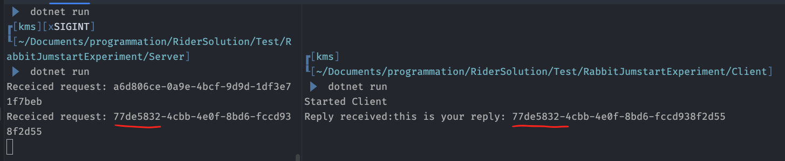

# `Resquest/Response` pattern

On utilise les termes `Client`/`Server` plutôt que `Publisher`/`Consumer`.


## Client

```cs
using System.Text;
using RabbitMQ.Client;
using RabbitMQ.Client.Events;
```

```cs
var factory = new ConnectionFactory { HostName = "localhots" };

using var conn = await factory.CreateConnectionAsync();
using var channel = await conn.CreateChannelAsync();

var replyQueue = await channel.QueueDeclareAsync(queue: "replyQ", exclusive: true);
var requestQueue = await channel.QueueDeclareAsync(queue: "requestQ");

var consumer = new EventingBasicConsumer(channel);

consumer.Received += (sender, eventArgs) =>
{
    var body = eventArgs.Body.ToArray();
    var message = Encoding.UTF8.GetString(body);
    
    Console.WriteLine($"Reply received:{message}");
};

await channel.BasicConsumeAsync(queue: replyQueue.QueueName, autoAck: true, consumer: consumer);

var message = "Can I request a reply";
var body = Encoding.UTF8.GetBytes(message);

await channel.BasicPublishAsync("", requestQueue.QueueName, body);

Console.WriteLine("Started Client");

Console.ReadKey();
```


## Server

```cs
var factory = new ConnectionFactory() { HostName = "localhost" };

using var conn = factory.CreateConnection();
using var channel = connection.CreateModel();

channel.QueueDeclare(Queue: "requestQ", exclusive: false);

var consumer = new EventingBasicConsumer(channel);

consumer.Received += (model, ea) => {
    Console.WriteLine($"Receiced request: {ea.BasicProperties.CorrelationId}");
    
    var replyMessage = $"this is your reply: {ea.BasicProrties.CorrelationId}";
    
    var body = Encoding.UTF8.GetBytes(replyMessage);
    
    channel.BasicPublish("", ea.BasicProperties.ReplyTo, null, body);
};

channel.BasicConsume(queue: "requestQ", autoAck: true, consumer: consumer);

Console.ReadKey();
```


