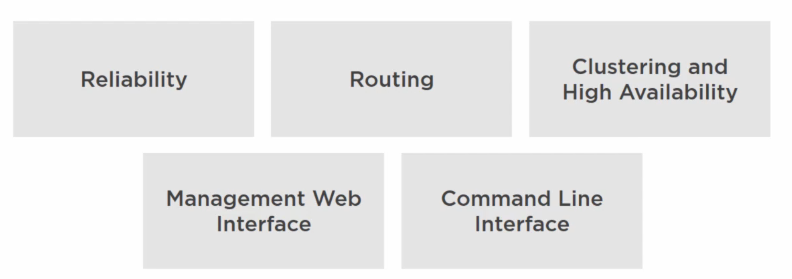

# 01 `RabbitMQ ` par l'exemple

## Introduction

`RabbitMQ` implément le protocole `AMQP` : `Advanced` `Message` `Queueing` `Protocol`.

`RabbitMQ` est programmé en `Erlang`.

`RabbitMQ Server` est un `Message Broker`, c'est à dire qu'il agit comme un coordinateur de `Message`.

## Avantages

- Fiabilité
- Routage et système de `Exchange` (échangeur)
- Haute disponibilité (`Clustering` : Agrégat de serveurs)
- Interface Web
- `CLI` pour création de script
