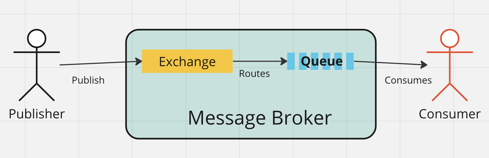
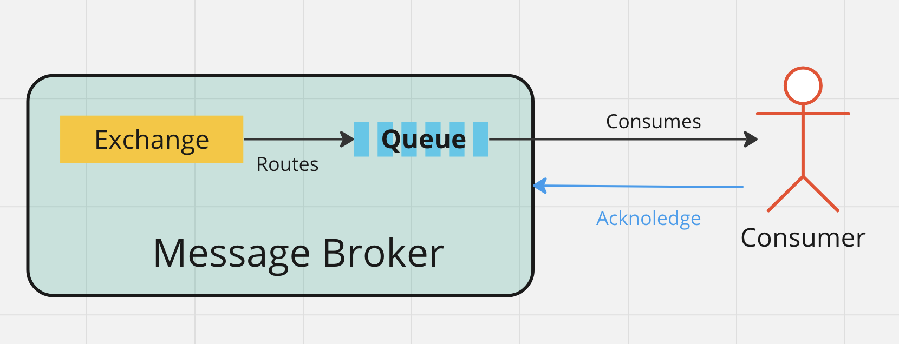

# 02 Advanced Message Queueing Protocol

`RabbitMQ` supporte la version `0.9.1` du protocole.

## `AMQP` Messaging standard

L'`Exchange` est un échangeur qui va router le message vers la bonne `Queue`.

## `Acknowledgement` : accusé de reception

Il peut y avoir un mécanisme d'`acknowledgement`, et le message est retiré de la `queue` si et seulement si le `consumer` renvoie un `acknoledgement`:

