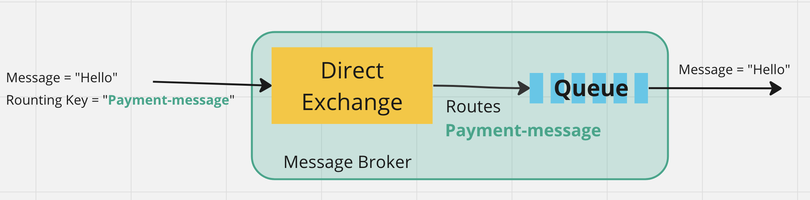
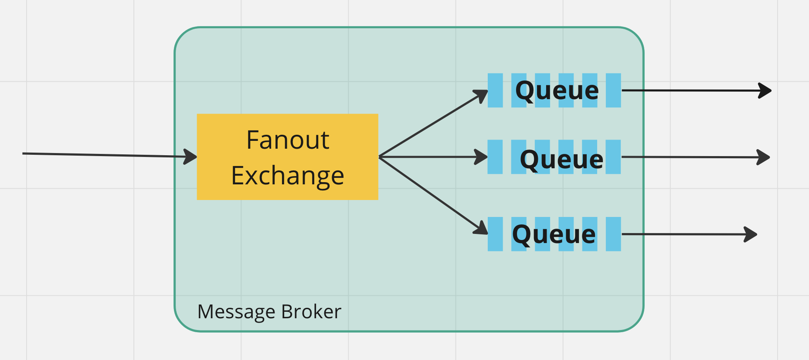
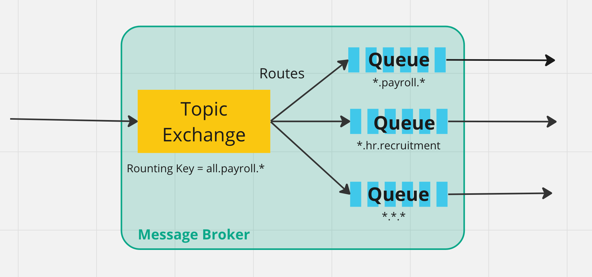
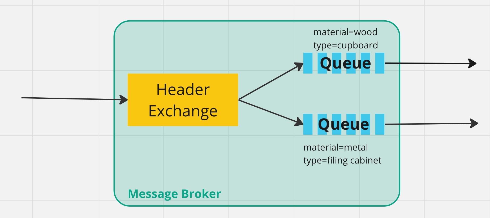

# 03 `Exchanges`

Les différents types d'`Exchanges`:

- `Direct Exchanges`
- `Fanout Exchanges` (`fan out` : disperser - deployer)
- `Topic Exchanges`
- `Header Exchanges`

Les `exchanges` prennent un `message` et le `route` vers les différentes `queues`.

## Attribut des `Exchanges`

- `Name` : le nom de l'`Exchange`
- `Durability` : savoir si le `message` est sauvé sur le `disque` en cas d'extinction du `serveur`.
- `Auto-Delete` : détermine si le `message` est effacé après que les `queues` en aient eu fini avec lui.
- `Arguments` : dépendants du `message-broker`

## `Direct Exchange`

C'est le `Exchange` par défaut. Il n'a pas de nom.

Si on crée une `Queue`, par défaut `RabbitMQ` va l'associer avec cet `Exchange` et le nom de la `Queue` servira de clé de routage (`routing key`).

`Direct Exchange` est idéal si on veut publier un `Message` à juste une seule `Queue`.

La `Direct Queue` distribue des `Messages` à plusieurs `Processus Worker` chacun à leur tour (`round robin manner`).

## `Fanout Exchange` : `Broadcasting`

Un `Fanout Exchange` est un `Exchange` de diffusion, de `Broadcast`.

Les `Routing Key` sont ignorés et le `Message` est envoyé à toutes les `Queues`. 

S'il y a 10 `Queues`, une copie du `Message` est délivrée au 10 `Queues`.

## `Topic Exchange`

Utilise un `pattern` (`Rounting Key`) pour envoyer un `message` à une ou plusieurs `Queues`.

La `Rounting Key` correspond ici à `3 Queues`.

## `Header Exchange`

Le `routage` se fait via les attributs d'un `Header`. C'est la totalité du `Header` qui sert de `Routing Key`.

