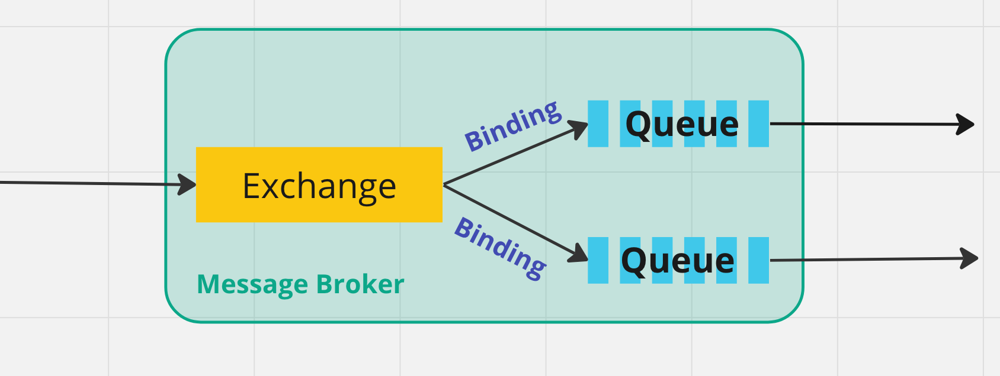
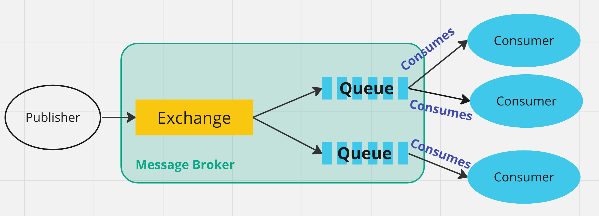
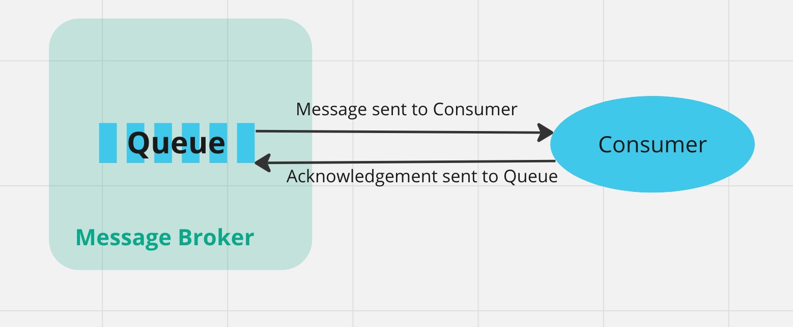
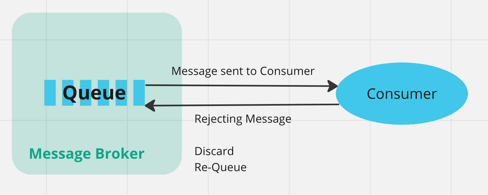

# 04 `Queues`

## Caractéristiques

- `Name` : Le nom de la `Queue`
- `Durable` : Persister la `Queue` sur le `Disque`
- `Exclusive` : Supprimer la `Queue` lorsqu'on n'en a plus besoin
- `Auto Delete` : la `Queue` est supprimée lorsque le `Consumer` se désinscrit (`Unsubscribe`)

## `Bindings`

Un `Exchange` va utiliser la `Rounting Key` pour contacter la bonne `Queue`.

Elle possède des `Queues` qui lui sont liées.

## `Consumer`

Le `Consumer` est l'application consommant la `Queue`.

Il peut y avoir plusieurs `Consumer` pour une même `Queue`.

## Message `Acknowledgements`

Un `Message` est retiré de la `Queue` lorsqu'il est envoyé au `Consumer` ou lorsque le `Consumer` envoie un `Accusé de Reception` (`Acknowledgement`).

## `Rejecting` Messages

Le `Consumer` peut rejeter le `Message`.

Le `Message` est soit retiré (`Discard`) soit remis dans la `Queue` (`Re-Queue`).

Si le `Message` est remis dans la `Queue`, il faut faire attention aux boucles infinies.

