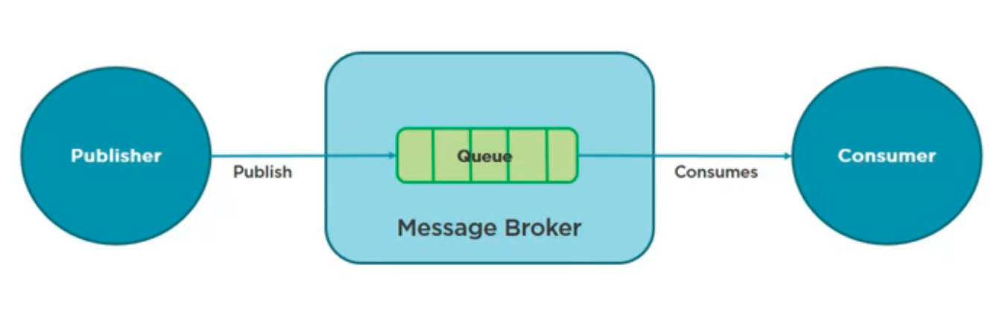
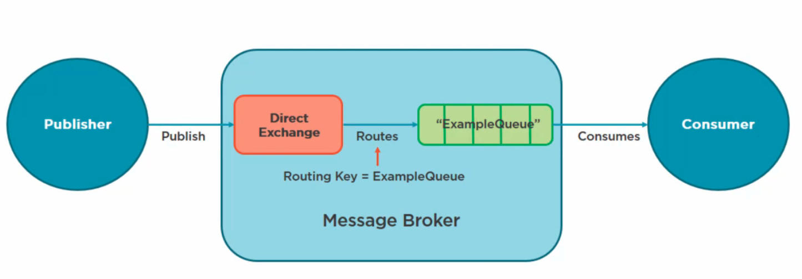

# 06 `Standard Queue`



On peut poster un `message` directement à une `Queue`, sans passer par un `Exchange`, du point de vue du `Client API`, mais sous le capôt, on poste au `Direct Exchange`, l'`Exchange` par défaut.




## Helpers `Serialize / Desserialize`

```cs
public static class SerializerExtensions
{
    public static byte[] Serialize(this object obj)
    {
        var json = JsonSerializer.Serialize(obj);
        return Encoding.ASCII.GetBytes(json);
    }

    public static T? Deserialize<T>(this byte[] arrBytes)
    {
        var json = Encoding.Default.GetString(arrBytes);
        return JsonSerializer.Deserialize<T>(json);
    }

    public static string DeserializeText(this byte[] arrBytes)
        => Encoding.Default.GetString(arrBytes);
}
```


## `ServiceQueue`

Je crée un `service` pour utiliser ma `Queue`:

```cs
public static class ServiceQueue
{
    private static ConnectionFactory? _factory = new ConnectionFactory {
        HostName = "localhost",
        UserName = "guest",
        Password = "guest"
    };
    
    public static void CreateQueue() { ... }
    
    public static void SendMessage(Message message) { ... }
```


## Create `Queue`

```cs
public static void CreateQueue()   
{
    using var connection = _factory.CreateConnection(); 
    using var channel = connection.CreateModel();

    channel.QueueDeclare(
        queue: "ExampleQueue", 
        durable: true, 
        exclusive: false, 
        autoDelete: false, 
        arguments: null);
}
```

Déclarer une `Queue` est `idempotent`, si la `Queue` existe déjà, cela n'a pas d'incidence.

## Send `Message`

```cs
public static void SendMessage(Message message)
{
    using var connection = _factory.CreateConnection(); 
    using var channel = connection.CreateModel();
    
    channel.BasicPublish(
        exchange: string.Empty, 
        routingKey: "ExampleQueue", 
        basicProperties: null, 
        body: message.Serialize());
    Console.WriteLine("Message Sent");
}
```

Comme on utilise l'`Exchange` par défaut, on a pas besoin de le nommer.

Le `Routing Key` est le nom de la `Queue`.


## `Receive` Messages

```cs
public static void Receive()
{
    using var connection = _factory.CreateConnection(); 
    using var channel = connection.CreateModel();
    
    var consumer = new EventingBasicConsumer(channel);
    var msgCount = GetMessageCount(channel, "ExampleQueue");
    
    channel.BasicConsume("ExampleQueue", true, consumer);
    
    var count = 0;
    
    while(count < msgCount)
    {
        var message = consumer.Queue.Dequeue().Body.Deserialize<Message>();
        
        Console.WriteLine($"Receive: {message.Content}");
        count++
    }
}
```

On crée un `consumer` pour lire les `Messages`.


## `GetMessageCount`

```cs
private static uint GetMessageCount(IModel channel, string queueName)
{
    var results = channel.QueueDeclare("ExmapleQueue", true, false, false, null);
    return results.MessageCount;
}
```

`results` est de type `QueueDeclareOk` et représente les infos sur la `Queue`.


