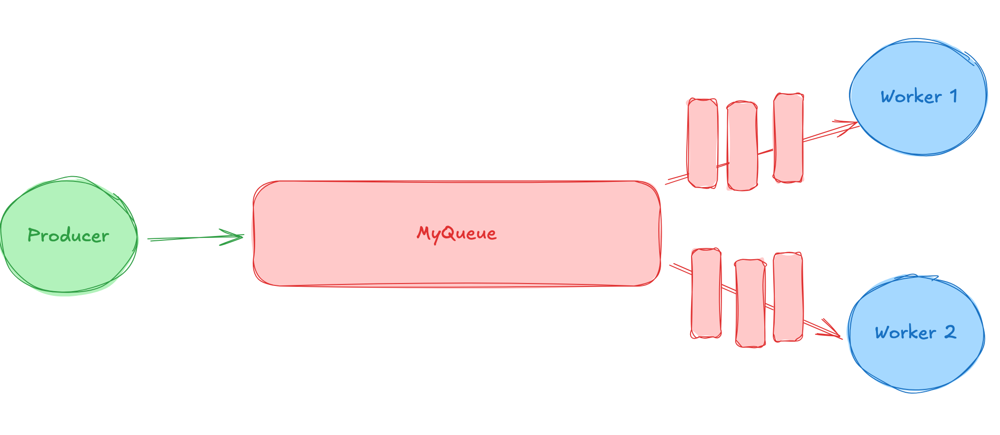
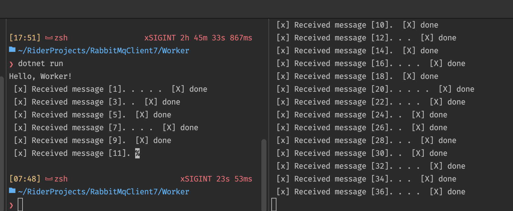
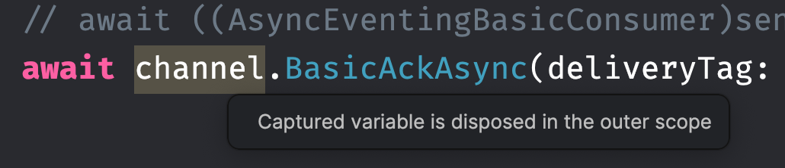
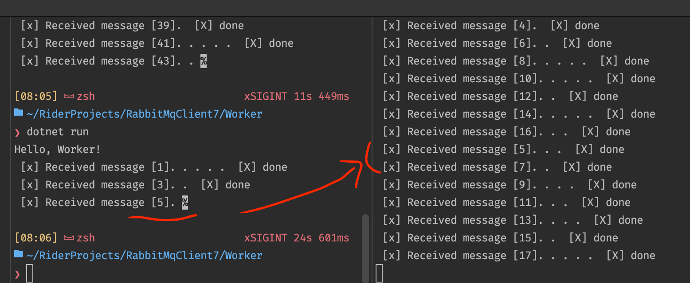
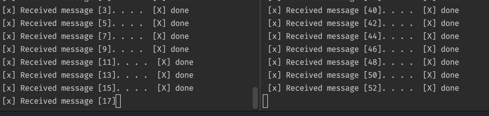
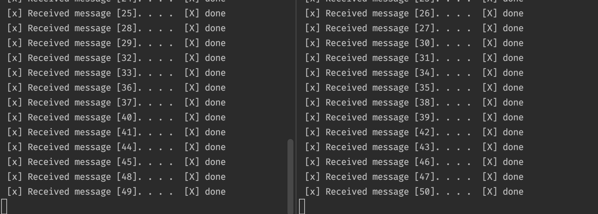

# 02 Work `Queue`

L'idée est de distribuer des tâches lourdes (prennant beaucoup de temps, beaucoup de ressources) à des `workers`.

On encapsule la `Task` à produire dans un `Message` et on l'envoie dans la `Queue`.


## `NewTask`

```cs
var factory = new ConnectionFactory { HostName = "localhost" };

await using var connection = await factory.CreateConnectionAsync();
await using var channel = await  connection.CreateChannelAsync();

await channel.QueueDeclareAsync(queue: "hello", durable: false, exclusive: false);

var numero = 1;

while (Console.ReadKey().Key != ConsoleKey.Q) {
    
    var body = Encoding.UTF8.GetBytes($"message [{numero}]");
    
    await channel.BasicPublishAsync("", "hello_world", false, body);
    numero++;
}
```

`NewTask` lance une tâche simple (un `Message`) chaque fois qu'on l'exécute.


## `Worker`

```cs
var factory = new ConnectionFactory { HostName = "localhost" };

await using var connection = await factory.CreateConnectionAsync();
await using var channel = await connection.CreateChannelAsync();

await channel.QueueDeclareAsync("hello_world", exclusive: false);

var consumer = new AsyncEventingBasicConsumer(channel);

consumer.ReceivedAsync += async (model, ea) => {
    var body = ea.Body.ToArray();
    
    var message = Encoding.UTF8.GetString(body);
    Console.Write($" [x] Received {message}");
    var nbDots = (new Random()).Next(1, 6);

    for (var i = 0; i < nbDots; i++) {
        await Task.Delay(TimeSpan.FromSeconds(1));
        Console.Write(". ");
    }

    Console.WriteLine(" [X] done");
};

await channel.BasicConsumeAsync("hello_world", autoAck: true, consumer);

Console.ReadKey();
```

Ici on va créer un `Consumer` et simuler une tâche plus ou moins longue selon le nombre de point `.` affiché.

` autoAck: true` permet d'effacer le `Message` traité par le `Worker`.

## `Round-Robin` : Chacun son tour



On va lancer deux `Worker` et voir comment les `Messages` seront reçus.

Puis on va déclencher plusieurs fois `NewTask`:

### `Worker 1` 

```bash
 [x] Received message [2]. . . .  [X] done
 [x] Received message [4].  [X] done
 [x] Received message [6].  [X] done
 [x] Received message [8]. .  [X] done
 [x] Received message [10]. . . .  [X] done
 [x] Received message [12]. .  [X] done
 [x] Received message [14]. . . . .  [X] done
 [x] Received message [16]. . .  [X] done
```


### `Worker 2`

```bash
 [x] Received message [1].  [X] done
 [x] Received message [3]. . . .  [X] done
 [x] Received message [5]. . . .  [X] done
 [x] Received message [7]. .  [X] done
 [x] Received message [9]. . .  [X] done
 [x] Received message [11]. . . .  [X] done
 [x] Received message [13]. .  [X] done
 [x] Received message [15].  [X] done

```

On voit que les `Messages` sont repartis de manière équitable entre les deux `Worker`.

#### Le comportement par défaut est `Chacun son tour` : `Round-robin`.


## `Message Acknowledgement` : accusé de reception du `Message`

Si un `Worker` tombe (ou est éteint), on ne veut pas que le `Message` soit perdu.

Pire, si un `Worker` s'éteint, tous les messages qui lui étaient attribués sont perdus.



On aimerai que si un `Worker` meurt, ses tâches soient redistribuée à un autre `Worker`.

Pour le moment quand `RabbitMQ` délivre un `Message`, il le marque immédiatement pour suppression.

Avec le support des `message ack`, `RabbitMQ` sait que s'il ne reçoit pas d'`ack`, il doit remettre le `Message` dans la `Queue` : `Re-Queuing`.

Le `timeout` est de `30 mn` par défaut.

Si un autre `Worker` est disponible, il recevra alors le `Message`.


## `Message Ack` Manuel

`autoAck` était pour l'instant à `true`. On va le passer à `false` et gérer l'`ack` manuellement.

```cs
channel.BasicConsume(
    queue: "HelloHKR", 
    consumer: consumer, 
    autoAck: false);
```

Ajout manuel de l'`ack`:

```cs
consumer.Received += async (sender, ea) => {
{
    // ...

    Console.WriteLine(" [x] Done");
    
    // await ((AsyncEventingBasicConsumer)sender)
    //		.Channel.BasicAckAsync(deliveryTag: ea.DeliveryTag, multiple: false);
    await channel.BasicAckAsync(
        deliveryTag: ea.DeliveryTag,
        multiple: false
    );
};
```

La deuxième syntaxe en commentaire peut aussi être utilisée pour éciter le warning :



Maintenant aucun message ne sera perdu :



Si je coupe brutalement un `Worker` pendant un traitement, le message (ici le `5`) est ré-envoyer à un. autre `Worker` et finalement traité entièrement (jusqu'à l'envoie du `Ack`). Aucun message n'est perdu.


## `Message` Durability

On veut préserver les `Messages` dans le cas où `rabbitMQ` crash ou s'arrête.

### On doit déclarer la `Queue` comme `durable` 

```cs
await channel.QueueDeclareAsync(
    queue: "new_task",
    durable: true,
    autoDelete: false,
    exclusive: false
);
```

> On ne peut pas déclarer deux `Queue` avec le même nom et des paramètres différents.


### On doit marquer les `Messages` comme persistent

```cs
var body = Encoding.UTF8.GetBytes(message);

var properties = new BasicProperties { Persistent = true };

await channel.BasicPublishAsync(
    exchange: "",
    routingKey: "hello_world",
    mandatory: true,
    basicProperties: properties,
    body: body
);
```


## `Fair Dispatch` répartition équitable

Je créé un contrat que j'appelle `TaskNewMessage` :

```cs
public record TaskNewMessage(int ranking, string message);
```

Dans le `Producer` : `NewTask/Program.cs` je génère des messages :

```cs
var message = new TaskNewMessage(numero, $"message [{numero}]");

var messageStr = JsonSerializer.Serialize(message);
var body = Encoding.UTF8.GetBytes(messageStr);
```

Et dans le `Worker` je traite à vitesse différente les messages pair et ceux impair :

```cs
var body = ea.Body.ToArray();
var messageStr = Encoding.UTF8.GetString(body);
var message = JsonSerializer.Deserialize<TaskNewMessage>(messageStr);

Console.Write($" [x] Received {message.message}");

for (var i = 0; i < 4; i++) {
    await Task.Delay(message.ranking % 2 == 0 ? 100 : 1000);
    Console.Write(". ");
}
```



La répartition étant équivalente sur chaque `worker` (même nombre de messages), avec la différence d'exécution, le `Worker` de droite a fini son travail (`message 52`) alors que le `worker` de gauche en est juste à `message 17`. 

### `BasicQosAsync`

On va utiliser cette méthode pour que les messages soient attribués un par un (et non pas que dès qu'il arrive dans la `Queue` on a le Nième message qui est attribué à la Nième Queue), c'est à dire que temps qu'un `Worker` procède un message et n'a pas envoyé son `Ack`, aucun nouveau message ne lui est attribué.

Pour ce faire on utilise `prefetchCount` = `1`, ajouter ce code dans les `Workers` après la déclaration de la `queue` :

```cs
await channel.QueueDeclareAsync(
    queue: "new_task",
    durable: true,
    autoDelete: false,
    exclusive: false
);

await channel.BasicQosAsync(
    prefetchSize: 0,
    prefetchCount: 1,
    global: false
);
```

> Attention au remplissage de la `queue`, surveiller s'il ne faut pas ajouter des `Workers`.



On peut voire que chaque `Worker` reçoit des message `pair` (rapide à traiter) et `impair` (plus long). Les deux `Workers` finissent quasiment en même temps, il ne sont plus en train d'attendre que l'autre finisse.


