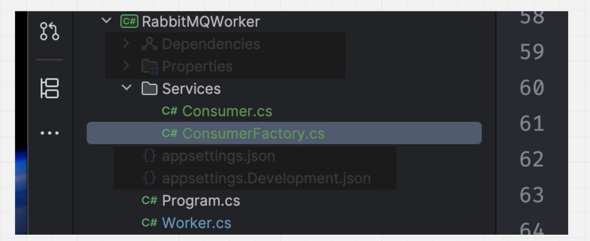

# 04.5 Refactor du `WorkerService` avec `RabbitMQ`

L'idée est de découpler le Service du `consumer rabbitmq` de la partie `Worker` avec `ExecuteAsync`.

On a donc la structure suivante :



## `Program.cs`

```cs
var builder = Host.CreateApplicationBuilder(args);
builder.Services.AddHostedService<Worker>();

var host = builder.Build();
host.Run();
```

Rien d'ajouté.


## `Consumer`

Le `consumer` n'a qu'une méthode utile : `SubscribeAsync` pour s'abonner aux messages de `RabbitMQ`. Il expose aussi `DisposeAsync`.

```cs
using System.Text;
using RabbitMQ.Client;
using RabbitMQ.Client.Events;

namespace RabbitMQWorker.Services;

public class Consumer(IConnection connection, IChannel channel) : IAsyncDisposable
{

    public async Task SubscribeAsync() {
        
        var consumer = new AsyncEventingBasicConsumer(channel);

        consumer.ReceivedAsync += async (sender, ea) => {
            var body = ea.Body.ToArray();

            var message = Encoding.UTF8.GetString(body);

            Thread.Sleep(TimeSpan.FromSeconds(1));

            Console.WriteLine($"receive {message} [X]");

            await ((AsyncEventingBasicConsumer)sender).Channel.BasicAckAsync(ea.DeliveryTag, false);
        };

        await channel.BasicConsumeAsync(
            queue: "web-queue",
            autoAck: false,
            consumer: consumer
        );
    }
    
    public async ValueTask DisposeAsync() {
        
        Console.WriteLine("I'am disposing async correctly ...");
        
        await channel.CloseAsync();
        await channel.DisposeAsync();

        await connection.CloseAsync();
        await connection.DisposeAsync();

        Console.WriteLine("... I'am disposed");
    }
}
```


## `ConsumerFactory`

Une classe `statique` chargée d'instancier un `consumer`, notamment parce que pour créer une `connection` et un `channel` on doit utiliser des méthodes (de `RabbitMQ.Client`) `asynchrone` et qu'un constructuer ne les accepte pas.

On déclare aussi la `queue` dans la factory.

```cs
public static class ConsumerFactory
{
    private static readonly ushort ProcessorCount = (ushort)Environment.ProcessorCount;
    private const int K = 3;

    private static readonly ushort PrefetchCount = (ushort)(ProcessorCount * K);
    
    public static async Task<Consumer> CreateConsumerAsync() {
        
        var factory = new ConnectionFactory
        {
            HostName = "localhost",
            ConsumerDispatchConcurrency = ProcessorCount
        };

        var connection = await factory.CreateConnectionAsync();
        var channel = await connection.CreateChannelAsync();
        
        await channel.QueueDeclareAsync(
            queue: "web-queue",
            durable: true,
            autoDelete: false,
            exclusive: false,
            arguments: null
        );

        await channel.BasicQosAsync(
            prefetchCount: PrefetchCount,
            prefetchSize: 0,
            global: false
        );

        return new Consumer(connection, channel);
    }
}
```


## `Worker.cs`

```cs
public class Worker(ILogger<Worker> logger) : BackgroundService
{
    
    protected override async Task ExecuteAsync(CancellationToken stoppingToken) {

        // Utilisation de la factory pour construire notre consumer
        await using var consumer = await ConsumerFactory.CreateConsumerAsync();

        await consumer.SubscribeAsync();
        
        logger.LogInformation("Worker start at: {time}", DateTimeOffset.Now);

        while (!stoppingToken.IsCancellationRequested) {
            await Task.Delay(3000, stoppingToken);
            logger.LogInformation("Worker is running : {time}", DateTimeOffset.Now);
        }

        logger.LogInformation("Worker stop at : {time}", DateTimeOffset.Now);
    }
    
}
```

Sans les `Logs` :

```cs
public class Worker() : BackgroundService
{
    
    protected override async Task ExecuteAsync(CancellationToken stoppingToken) {

        await using var consumer = await ConsumerFactory.CreateConsumerAsync();

        await consumer.SubscribeAsync();

        while (!stoppingToken.IsCancellationRequested) {
            
            await Task.Delay(3000, stoppingToken);

        }
    }  
}
```

On remarque le `await using` qui disposera proprement le `consumer.

Il n'y a pas d'injection de dépendance mais plutôt un `factory pattern` avec une méthode `static` : `CreateConsumerAsync`.

