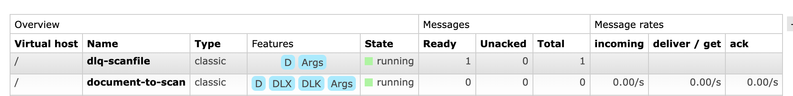
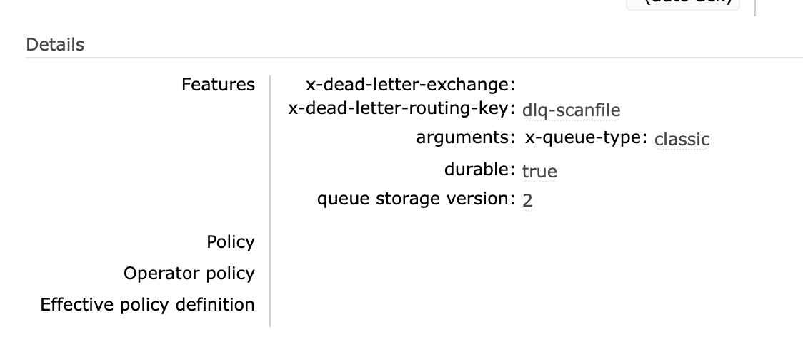

# 06 Dead Letter Queue


## `BasicNackAsync`

Si une erreur se produit plutôt que de renvoyer un `ack`, on renvoie un `nack`.

`nack` peut avoir `requeue` à `true` ou à `false`.

| Méthode                          | Message traité ? | Message réenquêté ? | Message supprimé ? | DLQ possible ?          |
| -------------------------------- | ---------------- | ------------------- | ------------------ | ----------------------- |
| `BasicAck`                       | Oui ✅            | Non ❌               | Oui ✅              | Non ❌                   |
| `BasicNack(..., requeue: true)`  | Non ❌            | Oui ✅               | Non ❌              | Non ❌                   |
| `BasicNack(..., requeue: false)` | Non ❌            | Non ❌               | Oui ✅              | Oui ✅ si DLQ configurée |

> ### ! un `requeue: true` peut provoquer une boucle infinie.

Si une `DLQ` (`Dead Letter Queue`) est configurée, le `message` est renvoyé vers cette dernière.


## `DLQ` configuration

```cs
await _channel.QueueDeclareAsync(
    queue: "dlq-scanfile",
    durable: true,
    autoDelete: false,
    exclusive: false
);

var mainQueueArgs = new Dictionary<string, object?>
{
    { "x-dead-letter-exchange", "" }, 
    { "x-dead-letter-routing-key", "dlq-scanfile" }
};

await _channel.QueueDeclareAsync(
    queue: "document-to-scan",
    durable: true,
    autoDelete: false,
    exclusive: false,
    arguments: mainQueueArgs
);
```

> ### ! on ne peut pas déclaré une `queue` une deuxième fois avec des propriétés en plus ou différentes. Si la `queue` de départ n'avait pas de `dlq`, il faut d'abord la supprimer avant de lui ajouter une `dlq` grâce aux `arguments`.



On voit apparaître les `Features` `DLX` (`Dead Letter Exchange`) et `DLK` (`Dead Letter Routing Key`).




