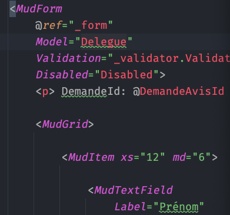
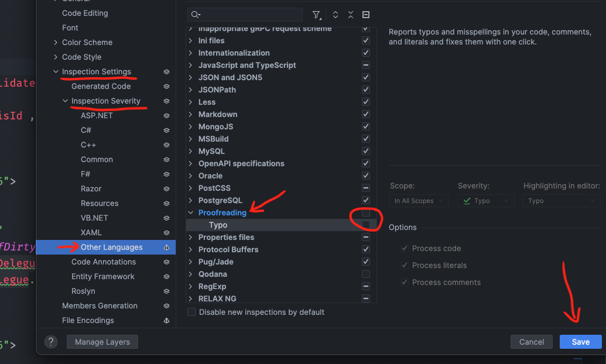

# 01 `Rider` souligne les fautes orthographiques

On a une petite vague verte sur les mots français, car ils ne correspondent pas à l'orthographe anglaise.

Pour les supprimer, dans les settings :

