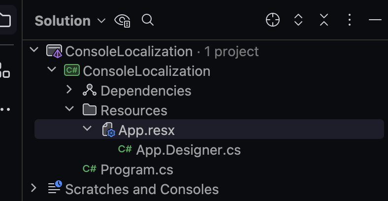
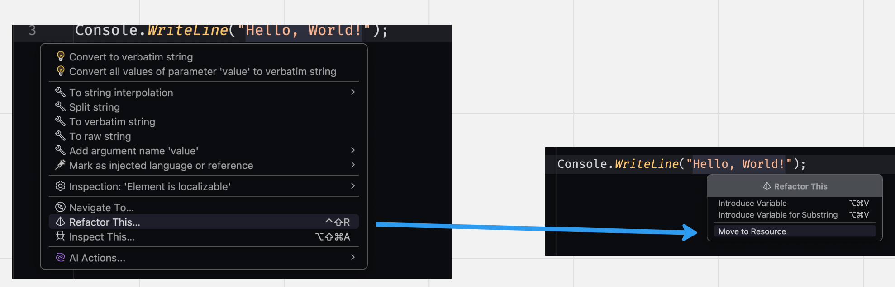
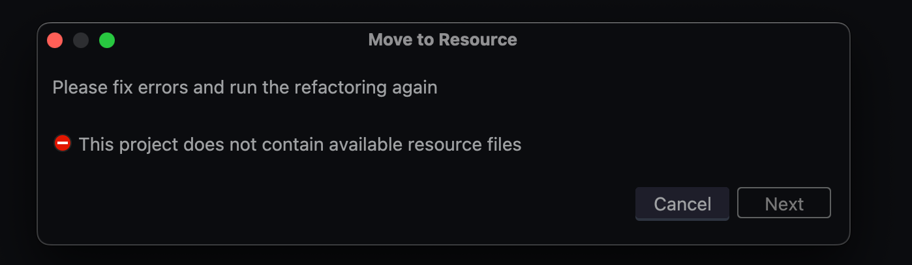
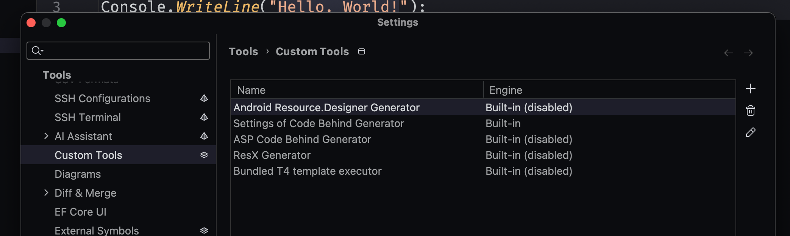
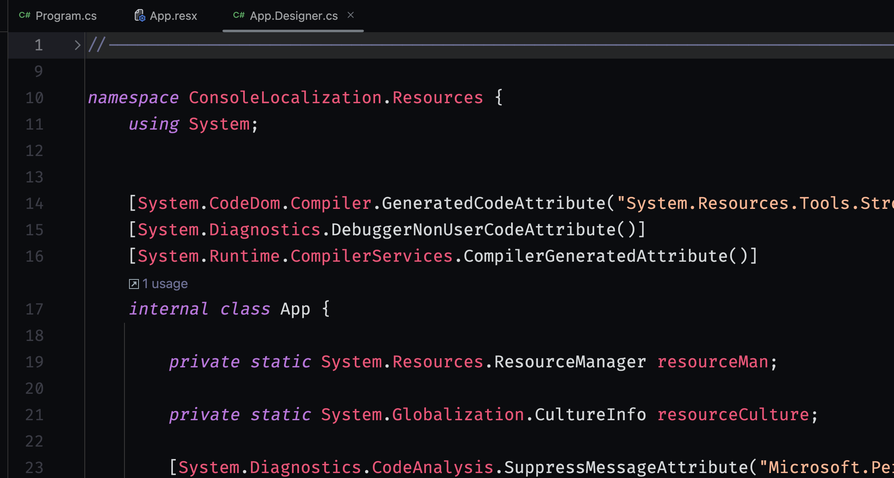
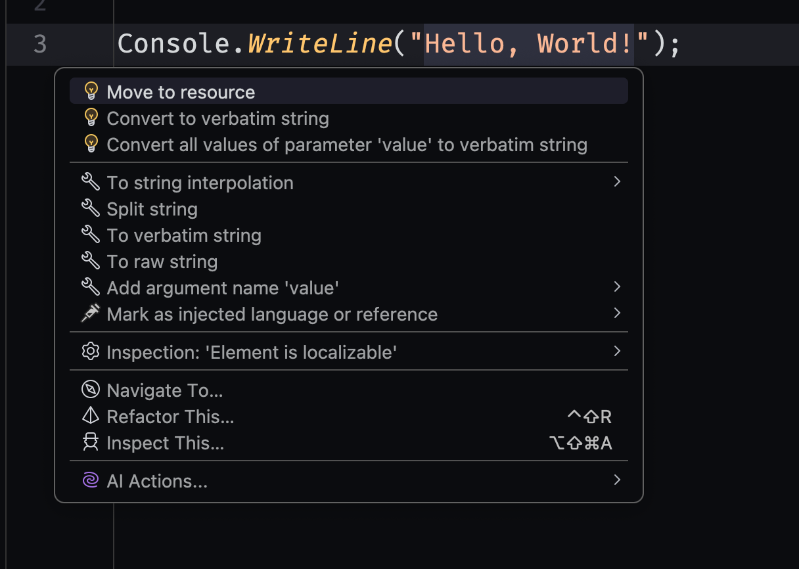
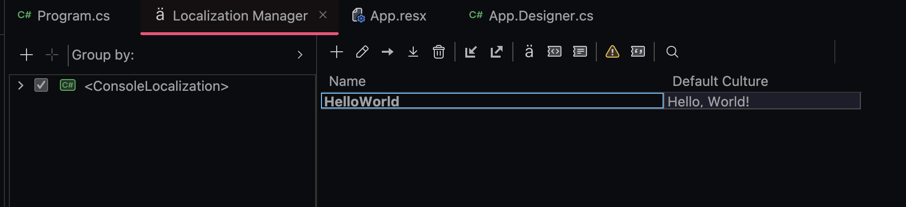

# 02 Problème avec les fichiers `resx` et `designer`


## Création d'une `resource`

Je créé un dossier `Resources` et dedans j'ajoute un fichier `.resx` :



Si je clique sur le fichier `.designer.cs` je constate qu'il est vide.


## Ajout d'une ressource

Dans `Program.cs`, si j'essaye d'ajouter un texte aux `Resources` :



J'obtiens alors l'erreur suivante :




### Correction

On doit aller dans les settings de `Rider`



Et on `enable` `ResX Generator`

Maintenant si j'ajoute un fichier `resx`, j'obtiens bien une classe `.designer.cs`.




## Enregistrer une nouvelle `resource`

Dans les `Context Actions` j'ai maintenant directement la possibilité de transformer une chaîne en nouvelle `resource` :





Et le code modifié :

```cs
Console.WriteLine(App.HelloWorld);
```

