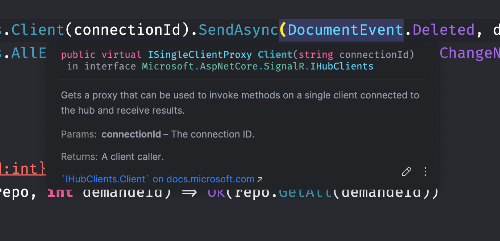
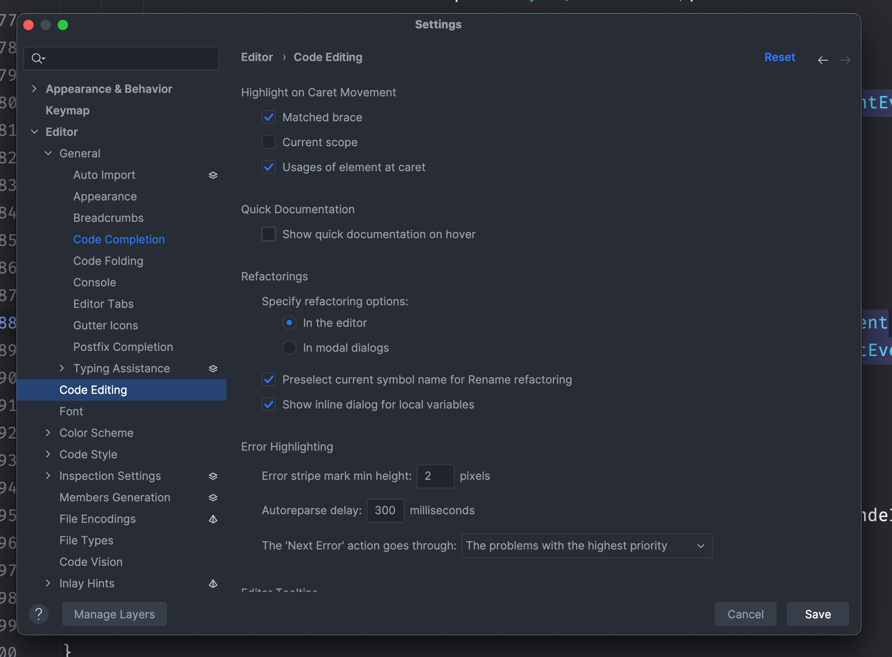
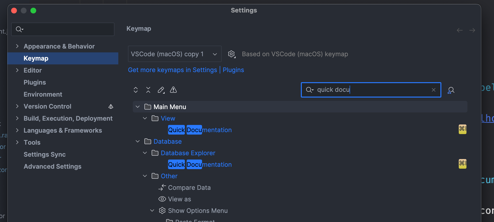

# 03 Quick Documentation

Par défaut, au survol d'un objet ou d'une méthode, un popup de documentation apparaît au survol :

Pour désactiver ce comportement il faut aller :

Editor > Code Editing > Quick Documentation

Et décocher `Show quick documentation on hover`

#### ! Il faut définir un raccourci pour afficher la `quick documentation`

Chez moi c'est `⌘i`.