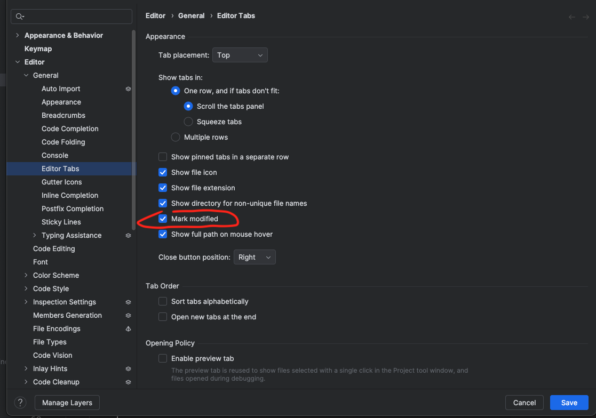
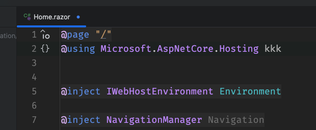

# 05 Marquer qu'un `fichier` est modifié

Pour marquer qu'un fichier a été modifié, on doit activer `Mark modified`.

`Editor> General> Editor Tabs`

On obtient un petit macaron bleu sur le `tab` quand on modifie un fichier.

