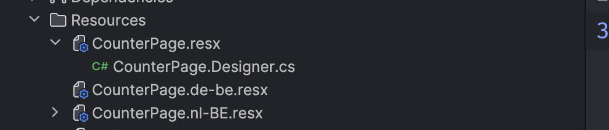
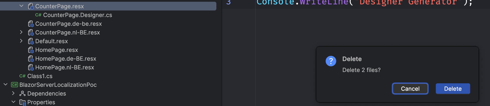
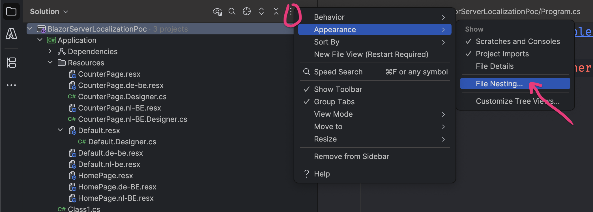
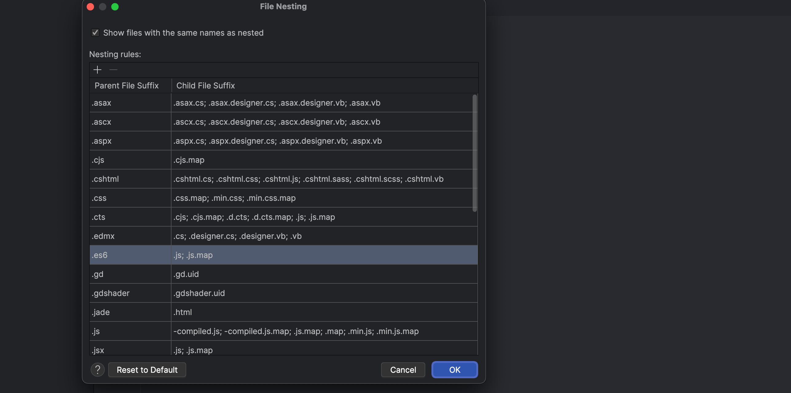

# 06 Imbrication de fichier

L'affichage de `Rider` imbrique certain fichier ensemble, c'est génant si on veut les supprimmer séparément :

#### Ce n'est pas possible !!!

## Solution

Dans le panneau de la solution :

On peut supprimer ou ajouter des règles pour l'imbrication visuelle de certaine extension de fichier :

