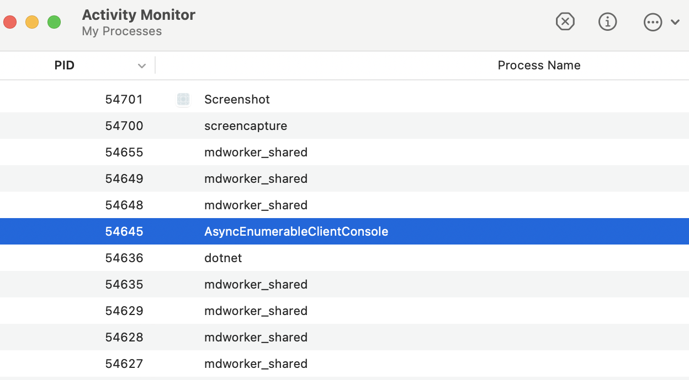
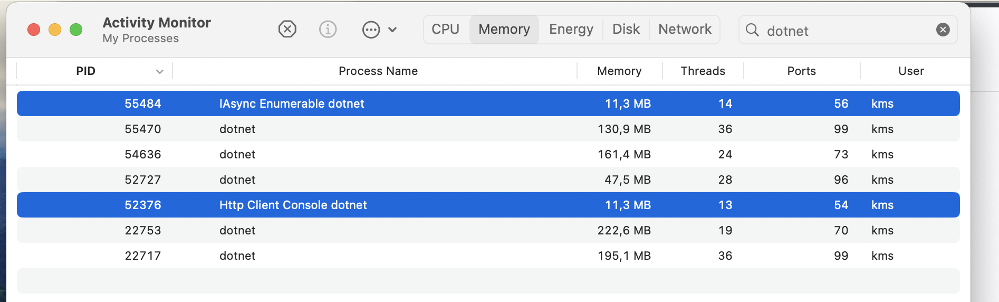

# 05.5 Le fichier `.csproj`

## Supprimer un `warning`

On peut supprimer un ou plusieurs `warning` de compilation avec ce code :

```xml
<Project Sdk="Microsoft.NET.Sdk">
  // ...
  <PropertyGroup Condition=" '$(Configuration)|$(Platform)' == 'Debug|AnyCPU' ">
    <NoWarn>42016,41999,42017</NoWarn>
  </PropertyGroup>
</Project>
```

Dans mon cas avec un `warning` de `MudBlazor` :

```xml
<PropertyGroup>
  <NoWarn>CS8974</NoWarn>
</PropertyGroup>
```

Je l'utilise sans `Condition`.


## Définir une constante dans `.csproj`

```xml
  // ...
  <PropertyGroup>
    <DefineConstants>PIPO</DefineConstants>
  </PropertyGroup>

</Project>
```


## Changer de fichier comme point d'entrée

### `<StartupFile>`

```xml
<Project Sdk="Microsoft.NET.Sdk">

  <PropertyGroup>
  	<OutputType>Exe</OutputType>
    <TargetFramework>net6.0</TargetFramework>
    // ...
    <StartupFile>TaskAndAsync.cs</StartupFile>
  </PropertyGroup>

</Project>
```

De la même manière il existe `<StartupObject>` pour définir la classe de point d'entrée.

Mais comme j'utilise le modèle `top level statement` (pas de classe `Program` et de méthode `Main`), je préfère `<StartupFile>`.


## Retirer un fichier (ou un dossier) de la compilation

### `<Compile Remove="TaskAndAsync.cs" />`

```xml
<Project Sdk="Microsoft.NET.Sdk">

  <PropertyGroup>
    <OutputType>Exe</OutputType>
    <TargetFramework>net6.0</TargetFramework>
    // ...
    <!-- <StartupFile>TaskAndAsync.cs</StartupFile> -->
    
    <StartupFile>CancellationToken.cs</StartupFile>
  </PropertyGroup>
  <ItemGroup>
    <Compile Remove="TaskAndAsync.cs" />
  </ItemGroup>

</Project>
```


## Retirer et ajouter des fichiers à la compilation

### `Remove` et `Include`

```xml
// ...
<StartupFile>FritzAsyncAwait.cs</StartupFile>
</PropertyGroup>
<ItemGroup>
  <Compile Remove="**/*" />
  <Compile Include="FritzAsyncAwait.cs" />
</ItemGroup>
```


## Définir une `variable`

```xml
<PropertyGroup>
  <FileToCompile>FritzAsyncAwait</FileToCompile>
</PropertyGroup>
```

L'utiliser : `$( ... )`

```xml
<StartupFile>$(FileToCompile).cs</StartupFile>
</PropertyGroup>
<ItemGroup>
  <Compile Remove="**/*" />
  <Compile Include="$(FileToCompile).cs" />
</ItemGroup>
```


## `.csproj` pour avoir plusieurs programme `Console` dans le même dossier

```xml
<Project Sdk="Microsoft.NET.Sdk">
    <PropertyGroup>
        <FileToCompile>FritzAsyncAwait</FileToCompile>
    </PropertyGroup>

  <PropertyGroup>
    <OutputType>Exe</OutputType>
    <TargetFramework>net6.0</TargetFramework>
    <RootNamespace>note_book</RootNamespace>
    <ImplicitUsings>enable</ImplicitUsings>
    <Nullable>enable</Nullable>
    <StartupFile>$(FileToCompile).cs</StartupFile>
  </PropertyGroup>
  <ItemGroup>
    <Compile Remove="**/*" />
    <Compile Include="$(FileToCompile).cs" />
  </ItemGroup>
</Project>
```


## Ajouter des `Implicit Using`

```xml
<ItemGroup>
	<Using Include="Microsoft.AspNetCore.Mvc" />
</ItemGroup>
```

Tous les fichiers `.cs` on maintenant accès à cette librairie sans utiliser de `using` dans le code.


## Changer le nom du `Processus`

Uniquement dans un programme `Console`.

Par défaut le nom du `processus` est le même que celui du projet pour un programme `Console` :



Le problème est que ce n'est pas pratique pour observer plusieurs `processus` venant de `.net`. Par défaut les applications `web` apparaissent avec le nom `dotnet` (et ce n'est pas réglable).

Pour obtenir un nom filtrable pour mes applications `.net console`, je modifie leurs `AssemblyName` :

```xml
<PropertyGroup>
    <AssemblyName>IAsync Enumerable dotnet</AssemblyName>
</PropertyGroup>
```

Avec `dotnet` dans le nom je peux les filtrer en même temps que les applications `web` :




