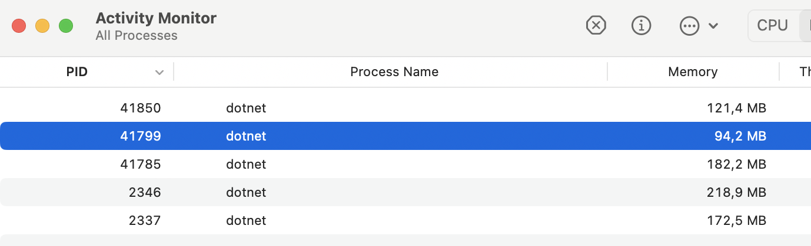

# 21 Upload `File`

## Schéma général


## GET `Web API` -> `HttpClient`

### `API` : `Results.File`

```cs
const string baseUrl = "...";

app.MapGet("/upload", () => File($"{baseUrl}/test-file.pdf"));
```


### `Client` : `GetStreamAsync`

Cette méthode ne lit pas et ne `bufferise` le `body` de la réponse.

> Après test, l'impact mémoire est très faible, l'`api` monte à peine à `100 Mo` :
>
> 

```cs
var client = new HttpClient { BaseAddress = new Uri("http://localhost:5013") };
const string baseUrl = "...";
```
```cs
await using var stream = await client.GetStreamAsync("/upload");

await using var fsWrite = new FileStream(
    $"{baseUrl}/{Guid.NewGuid()}-myfile.pdf",
    FileMode.Create
);

await stream.CopyToAsync(fsWrite);
```

`await using` quand une classe implémente `IDisposableAsync`.


## POST `HttpClient` -> `API`

### `Client` : `StreamContent`

```cs
await using var fsRead = new FileStream(
    $"{baseUrl}/test-file.pdf",
    FileMode.Open
);

using var content = new StreamContent(fsRead);
```

> On peut spécifier le `Content-Type` mais ce n'est pas obligatoire :
>
> ```cs
> content.Headers.ContentType = new MediaTypeHeaderValue("application/octet-stream");
> ```


```cs
var response = await client.PostAsync("/download", content);
```


### `API` : `CopyToAsync`

```cs
app.MapPost("/download", async (Stream stream) =>
{
    await using var fsWrite = new FileStream(
        $"{baseUrl}/UploadedFiles/{Guid.NewGuid()}-myfile.pdf",
        FileMode.Create
    );

    await stream.CopyToAsync(fsWrite);

    return NoContent();
});
```

> ### ! `await using`
>
> Avant de préfixer `var fsWrite = ...` avec `await using`, je perdais systématiquement la fin de mon fichier, le `stream` était coupé un peu trop tôt et cela rendait un fichier corrompu.
>
> L'oubli seul de `await` ne provoque pas de bug, mais autant écrire correctement la disposition des resources `async`.


# Big `File`

## GET `Web API` -> `HttpClient`

Semble fonctionner `out of the box`, pas de problème, le code reste le même.POST `HttpClient` -> `API`

L'envoie d'un fichier de `1Go` génère une erreur explicite :

```
 Microsoft.AspNetCore.Server.Kestrel.Core.BadHttpRequestException: Request body too large. The max request body size is 30000000 bytes.
```


### Configuration de `Kestrel`

Il faut modifier la configuration de `Kestrel` pour accepter un plus gros `body` de requête :

```cs
builder.WebHost.ConfigureKestrel(cfg =>
{
    cfg.Limits.MaxRequestBodySize = 1_200_000_000L;
});

var app = builder.Build();
```

La suite du code reste identique à précédemment.
