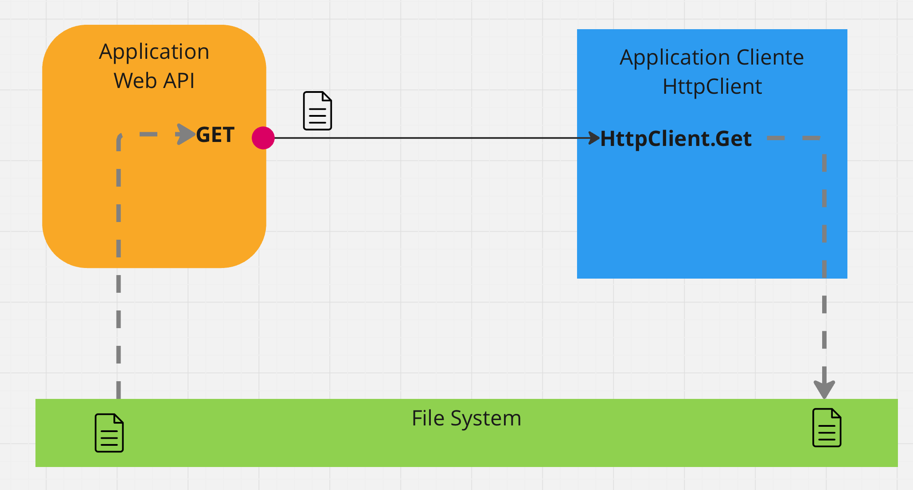
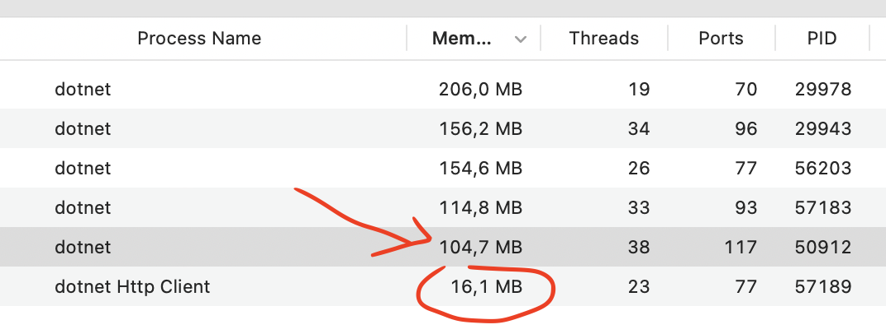
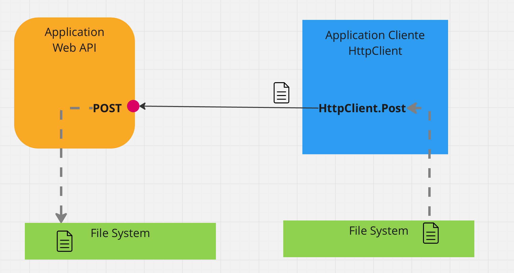
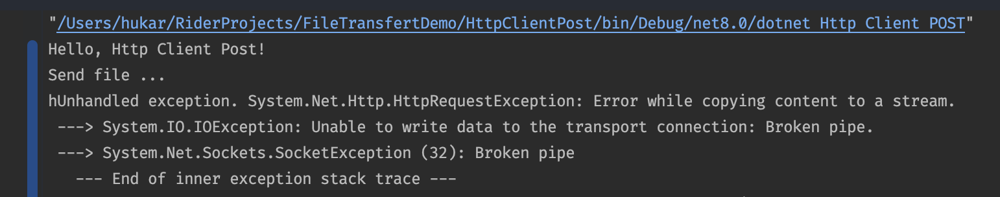
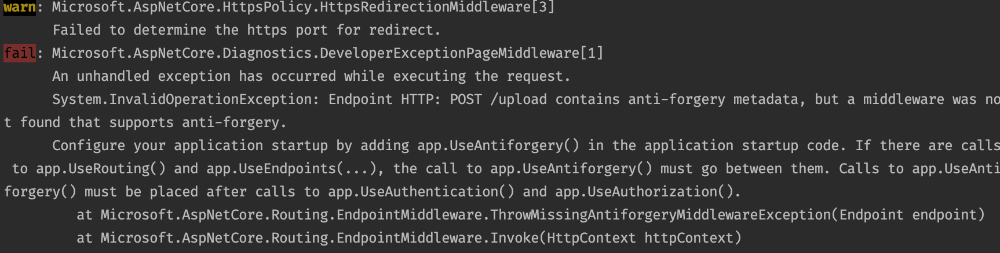

# 21.5 Upload `File`

## `GET`:`Download` file from `API`

On va ici télécharger des fichier en récupérant le plus de méta-données.



## Utilisation de `GetAsync` et gestion de l'occupation Mémoire

On utilise `GetAsync` plutôt que `GetStreamAsync` pour pouvoir extraire du `content` le nom du fichier ainsi que le type `MIME`.

> ??? Je ne pense pas que ce soit possible avec `GetStreamAsync` qui renvoie directement un `stream` sans l'accès aux `headers` ???

De base on a le code suivant :

```cs
using var response = await client.GetAsync("/download");
```

Observation de la mémoire :


Le fichier est mis en cache côté `client`. Après trois fichiers on arrive dangereusement à `3Go` :


## Solution : `HttpCompletionOption`

On va dire à l'application que la requête est `done` à la fin de l'envoie des `Headers`, ainsi celle-ci ne sera pas mise en cache entièrement :

```cs
using var response = await client.GetAsync("/download", HttpCompletionOption.ResponseHeadersRead);
```



Seul les `headers` sont mis en `cache`, après trois téléchargements le poids mémoire n'a pas bougé. L'`API` (`PID: 50912`) reste aussi légère en mémoire.

### Code complet `Client` avec `GetAsync`

```cs
const string basePath = "/Users/hukar/RiderProjects/FileTransfertDemo";
var client = new HttpClient { BaseAddress = new Uri("http://localhost:5182") };

using var response = await client.GetAsync("/download", HttpCompletionOption.ResponseHeadersRead);
// using var response = await client.GetAsync("/download");

var filename = response.Content.Headers.ContentDisposition?.FileName ?? "unknow.txt";
var mimeType = response.Content.Headers.ContentType;

await using var fsWrite = new FileStream(
    $"{basePath}/files-uploaded/{TimeNow()}-{filename}",
    FileMode.Create
);

Console.WriteLine($"Start copy, type: {mimeType}");
Console.ReadKey();

await response.Content.CopyToAsync(fsWrite);

Console.WriteLine("Copy is done");

string TimeNow() => DateTime.Now.ToString("HH'h'mm'mn'ss's'");

```

On récupère le nom du fichier grâce à `response.Content.Headers.ContentDisposition.FileName`.

On récupère le `MIME Type` avec `response.Content.Headers.ContentType`.

Ce ne serait pas possible en utilisant `GetStreamAsync`.


### Code `API`

```cs
app.MapGet("/download", () =>
    File(
        $"{basePath}/files/{fileName}",
        mimeType,
        fileName
    ));
```

`Results.File` a un `overload` prenant le `Content Type` et le nom du fichier.


## `POST`:`Upload` file to `API`



Pour ce faire on doit simuler un formulaire `HTTP` `multipart/form-data`. Pour ce faire il existe une classe `MultipartFormDataContent` qui rempli correctement les `headers` de la requête et formate le `body`.

### `Http Client`

```cs
const string basePath = "/Users/hukar/RiderProjects/FileTransfertDemo";
const string fileName = "3601-bigfile.txt";
var client = new HttpClient { BaseAddress = new Uri("http://localhost:5182") };
```

```cs
var content = new MultipartFormDataContent();

await using var fsRead = new FileStream(
    $"{basePath}/files/{fileName}",
    FileMode.Open
);

var fileStream = new StreamContent(fsRead);

content.Add(fileStream, "file", fileName);

using var response = await client.PostAsync("/upload", content);
```

### `API`

```cs
app.MapPost("/upload", (IFormFile file) =>
{
    await using var fsWrite = new FileStream(
        $"/Users/hukar/RiderProjects/FileTransfertDemo/files-uploaded/{file.Name}",
        FileMode.Create
    );

    await file.CopyToAsync(fsWrite);

    return NoContent();
});
```

À ce stade on obtient une erreur :



Malgré que l'`exception` est lancée côté `client`, c'est le réglage de `multipartBodyLengthLimit` côté `API` qui est en cause.

Il vaut mieux régler cette valeur `endpoint` par `endpoint` :

```cs
app.MapPost("/upload", (IFormFile file) =>
{
    // ...
})
.WithFormOptions(multipartBodyLengthLimit: 2_000_000_000L);
```

Cette fois l'erreur est côté `API` :



Le `endpoint` n'est pas protégé contre la falsification de formulaire, un `antiforgery token` devrait être passé.

Pour cet exemple je me contente de désactiver la protection contre la falsification :

```cs
app.MapPost("/upload", (IFormFile file) =>
{
    // ...
})
.WithFormOptions(multipartBodyLengthLimit: 2_000_000_000L)
.DisableAntiforgery();
```

Il faut aussi configurer `Kestrel` :

```cs
builder.WebHost.ConfigureKestrel(cfg =>
{
    cfg.Limits.MaxRequestBodySize = 1_200_000_000L;
});
```

L'empreinte mémoire semble correcte.
